# خواننده تلگرام

<!-- TOP_NAV START -->

<!-- TOP_NAV END -->

<!-- MSG START -->

---
📅 بروزرسانی: 1405/02/24 11:51
---

## VahidOOnLine — post 240068

  <a href="telegram/content/VahidOOnLine_240068_1778746867.mp4" target="_blank">🎬 Download video</a>

سازمان دریانوردی تجاری بریتانیا اعلام کرد یک کشتی در سواحل امارات و در نزدیکی تنگه هرمز دچار حادثه شده است.
بر اساس این گزارش، افرادی «غیرمجاز» کنترل این کشتی را در دست گرفته‌اند و شناور اکنون به‌سمت آب‌های سرزمینی ایران در حرکت است. این نهاد دریایی بریتانیا اعلام کرد کشتی در فاصله ۳۸ مایلی سواحل فجیره قرار داشته است.
‌🏁 🇬🇧 ManotoTV

🤖 @VahidOOnLine

## VahidOOnLine — post 240067

  <a href="telegram/content/VahidOOnLine_240067_1778746867.mp4" target="_blank">🎬 Download video</a>

⭕️عراقچی: تنگه هرمز برای همه کشتی‌های تجاری باز است اما باید با نیروی دریایی ما همکاری کنند

♦️عباس عراقچی، وزیر امور خارجه جمهوری اسلامی روز پنجشنبه ۲۴ اردیبهشت در حاشیه نشست وزرای خارجه کشورهای عضو بریکس گفت: «جمهوری اسلامی ایران هیچ مانعی در تنگه هرمز ایجاد نکرده و این گذرگاه دریایی همچنان برای کشتی‌های تجاری باز است.»

عراقچی حمله و محاصره دریایی آمریکا را عامل بروز مشکل در تنگه هرمز توصیف کرد و گفت: «تنگه هرمز برای همه کشتی‌های تجاری باز است و کشتی‌های تجاری باید برای عبور از تنگه با نیروهای دریایی جمهوری اسلامی ایران همکاری کنند.»

تنگه هرمز یکی از مهم‌ترین مسیرهای انتقال انرژی جهان به شمار می‌رود و تنش‌های اخیر میان آمریکا و اسرائیل با جمهوری اسلامی ایران، نگرانی‌ها درباره امنیت کشتیرانی و صادرات انرژی را افزایش داده است.
‌🇸🇦 Indypersian

🤖 @VahidOOnLine

## VahidOOnLine — post 240066

  

♦️سانائه تاکایچی، نخست‌ وزیر ژاپن پنجشنبه ۲۴ اردیبهشت با انتشار بیانیه‌ای اعلام کرد یک کشتی ژاپنی که در خلیج فارس متوقف شده بود، با موفقیت از تنگه هرمز عبور کرده و اکنون در مسیر بازگشت به ژاپن است.

به گفته تاکایچی، چهار خدمه ژاپنی در این کشتی حضور دارند.
تاکایچی با اشاره به عبور یک کشتی دیگر مرتبط با ژاپن در نهم اردیبهشت ماه، عبور اخیر را «تحولی مثبت» به‌ویژه از منظر حفاظت از شهروندان ژاپنی توصیف کرد.

نخست‌وزیر ژاپن یادآور شد، برای عبور این کشتی با مسعود پزشکیان «رایزنی مستقیم» داشته و وزیر خارجه و سفارت این کشور در تهران نیز هماهنگی‌های دیپلماتیک انجام داده‌اند.

به گفته او، با خروج این کشتی، تعداد کشتی‌های مرتبط با ژاپن که همچنان در خلیج فارس باقی مانده‌اند به ۳۹ عدد رسیده است و در یکی از آن‌ها سه خدمه ژاپنی حضور دارند.

تاکایچی در این پیام با یادآوری «فشار شدید» بر خدمه کشتی‌ها و نگرانی خانواده‌های آنان، از کارکنان دریایی و شرکت‌های کشتیرانی قدردانی کرد.

او تاکید کرد دولت ژاپن به تلاش‌های دیپلماتیک برای عبور هرچه سریع‌تر همه کشتی‌ها، از جمله کشتی‌های مرتبط با ژاپن، از تنگه هرمز ادامه خواهد داد.
‌🇸🇦 Indypersian

🤖 @VahidOOnLine

## VahidOOnLine — post 240065

  

عباس عراقچی، وزیر خارجه جمهوری اسلامی، گفت زمان آن رسیده است که «رفتار سلطه‌گرانه آمریکا به زباله‌دان تاریخ سپرده شود». او تاکید کرد هیچ‌گونه راه‌حل نظامی برای موضوعات مربوط به ایران وجود ندارد.

عراقچی گفت: «زمان آن رسیده که رفتار سلطه‌گرانه آمریکا را به زباله‌دان تاریخ بسپاریم.» او افزود: «هیچ‌گونه راه‌حل نظامی برای هر موضوعی که به ایران مربوط باشد، وجود ندارد. ما هرگز در برابر هیچ فشار یا تهدیدی سر خم نمی‌کنیم.»

وزیر خارجه جمهوری اسلامی همچنین اظهار داشت: «هرچند نیروهای مسلح ما آماده‌اند پاسخی کوبنده و ویرانگر به متجاوزان خارجی بدهند، اما مردم ما صلح‌طلب بوده و خواهان جنگ نیستند.»

او در ادامه از کشورهای عضو بریکس و دیگر اعضای جامعه بین‌المللی خواست آنچه را نقض حقوق بین‌الملل از سوی ایالات متحده و اسرائیل خواند، به‌صراحت محکوم کنند.
‌🏁 🇬🇧 IranintlTV

🤖 @VahidOOnLine

## VahidOOnLine — post 240064

  <a href="telegram/content/VahidOOnLine_240064_1778746872.mp4" target="_blank">🎬 Download video</a>

پلیس بریتانیا اعلام کرد دومین فرد در چارچوب تحقیقات ضدتروریسم درباره آتش‌سوزی در یک کنیسه در شرق لندن متهم شده است.
براساس اعلام پلیس، یک مرد ۳۱ ساله در ارتباط با این حمله بازداشت و تفهیم اتهام شده و تحقیقات درباره انگیزه و جزئیات حادثه ادامه دارد.
‌🏁 🇬🇧 ManotoTV

🤖 @VahidOOnLine

## VahidOOnLine — post 240063

  

طبق اطلاعات رسیده به ایران‌اینترنشنال، پرهام محرابی، نوجوان ۱۸ ساله اهل مشهد، شامگاه ۱۸ دی‌ماه ۱۴۰۴ در جریان اعتراضات بلوار هفت‌تیر، کنار پل هفت‌تیر ، در حالی‌که در کنار پدرش حضور داشت، با شلیک مستقیم ماموران سرکوبگر کشته شد. پدر او که لحظه اصابت گلوله را از نزدیک دیده بود، پیکر بی‌جان فرزندش را در آغوش گرفت و صدها متر حمل کرد تا به خودرویشان برسد و سپس او را به خانه منتقل کرد.

بر اساس اطلاعات رسیده به ایران‌اینترنشنال، پدر پرهام آن شب همراه فرزندش در محل اعتراضات حضور داشت و از فاصله‌ای نزدیک شاهد تیر خوردن او بود. او پس از اصابت گلوله، پیکر فرزندش را در آغوش گرفت و مسافتی طولانی حمل کرد تا به خودرو برسد و سپس مستقیما او را به خانه منتقل کرد. خانواده روز بعد برای دفن پیکر اقدام کردند اما به گفته منابع آگاه، ماموران امنیتی از پدر او تعهد کتبی گرفتند که اعلام کند فرزندش توسط «اغتشاشگران» کشته شده است و تهدید کردند در غیر این صورت اجازه دفن صادر نخواهد شد.

به گفته خانواده و اطرافیان، پرهام نوجوانی آرام، مهربان و محبوب بود و رابطه نزدیکی با پدر و مادرش داشت. خانواده‌اش می‌گویند.
‌🏁 🇬🇧 IranintlTV

🤖 @VahidOOnLine

## VahidOOnLine — post 240062

  

عباس عراقچی گفت جمهوری اسلامی هیچ مانعی در تنگه هرمز ایجاد نکرده و این آمریکا است که محاصره ایجاد کرده است.

او گفت: «ما هیچ مانعی در تنگه هرمز ایجاد نکرده‌ایم، این آمریکاست که محاصره ایجاد کرده است.»

عراقچی همچنین تاکید کرد: «تنگه هرمز برای تمامی کشتی‌های تجاری باز است، اما آنها باید با نیروهای دریایی ما همکاری کنند.»
‌🏁 🇬🇧 IranintlTV

🤖 @VahidOOnLine

## VahidOOnLine — post 240061

  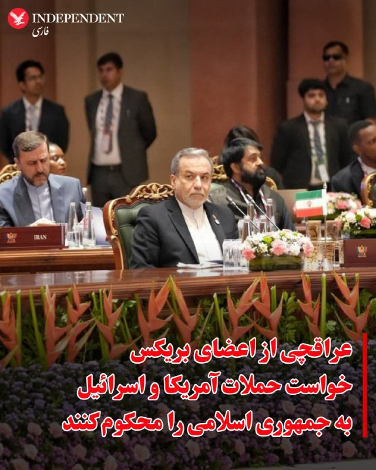

♦️عباس عراقچی، وزیر امور خارجه جمهوری اسلامی روز پنجشنبه ۲۴ اردیبهشت از «کشورهای عضو بریکس و همه اعضای مسئول جامعه بین‌المللی» خواست تا حمله آمریکا و اسرائیل به ایران را محکوم کنند.

عراقچی که برای شرکت در اجلاس وزاری امور خارجه بریکس به هند سفر کرده است، گفت جامعه جهانی باید «اقدامات عملی برای متوقف کردن جنگ» علیه جمهوری اسلامی را ایران را در دستور کار قرار دهد.

این سخنان در حالی بیان می‌شود که دونالد ترامپ، رئیس جمهوری ایالات متحده سه روز پیش گفته بود «آتش‌بس به دستگاه تنفس مصنوعی» وصل است و پیش از سفر به چین هشدار داده بود که جمهوری اسلامی ایران یا توافق با آمریکا را می‌پذیرد یا کاملا نابود خواهد شد.
‌🇸🇦 Indypersian

🤖 @VahidOOnLine

## VahidOOnLine — post 240060

  

♦️سازمان عملیات تجارت دریایی بریتانیا صبح پنجشنبه ۲۴ اردیبهشت گزارش کرد افراد «غیرمجاز» یک کشتی را در ۳۸ مایلی بندر فجیره تصرف کردند و در حال حاضر در حال انتقال آن به سوی آب‌های سرزمینی ایران هستند.
براساس این گزارش کشتی ربوده شده لنگر انداخته و متوقف بوده است.

هنوز مقام‌های جمهوری اسلامی و امارات متحده عربی واکنشی به این خبر نشان نداده‌اند.
‌🇸🇦 Indypersian

🤖 @VahidOOnLine

## VahidOOnLine — post 240059

  

مرکز عملیات تجارت دریایی بریتانیا اعلام کرد گزارشی از یک حادثه دریایی در فاصله ۳۸ مایل دریایی در شمال‌شرق فجیره، امارات متحده عربی، دریافت کرده است. این نهاد اعلام کرد این کشتی در حالی که در لنگرگاه قرار داشته، به دست افراد غیرمجاز تصرف شده و اکنون به سوی آب‌های سرزمینی ایران در حرکت است.
‌🏁 🇬🇧 IranintlTV

🤖 @VahidOOnLine

## VahidOOnLine — post 240058

  

وزارت دفاع اسرائیل اعلام کرد با یکی از شرکت‌های زیرمجموعه شرکت دفاعی البیت قراردادی برای توسعه «قابلیت برد افزوده» جنگنده اف-۳۵آی امضا کرده است. ارزش این قرارداد ۳۴ میلیون دلار اعلام شده است.

بر اساس اعلام این وزارتخانه، این قرارداد با شرکت سایکلون منعقد شده و شامل «توسعه و یکپارچه‌سازی مخازن سوخت خارجی» بر پایه طرحی است که پیش‌تر برای جنگنده اف-۱۶ طراحی شده بود.

وزارت دفاع اسرائیل اعلام کرد این قابلیت جدید قرار است برد عملیاتی هواپیما را افزایش دهد، وابستگی به سوخت‌گیری هوایی را کاهش دهد و انعطاف‌پذیری عملیاتی در ماموریت‌های برد بلند را تقویت کند.
‌🏁 🇬🇧 IranintlTV

🤖 @VahidOOnLine

## VahidOOnLine — post 240057

  <a href="telegram/content/VahidOOnLine_240057_1778746877.mp4" target="_blank">🎬 Download video</a>

همزمان با آغاز نشست وزیران خارجه کشورهای عضو بریکس در دهلی‌نو، عباس عراقچی، وزیر خارجه ایران، از اعضای این گروه و «همه کشورهای مسئول جامعه جهانی» خواست حملات آمریکا و اسرائیل علیه ایران را به‌صراحت محکوم کنند.
خبرگزاری رویترز گزارش داد جنگ ایران و اسرائیل بر نشست دو روزه بریکس در هند سایه انداخته و اختلاف‌ها میان اعضا، رسیدن به موضعی مشترک و صدور بیانیه نهایی را دشوار کرده است. ایران از هند، رئیس دوره‌ای بریکس، خواسته از این نشست برای ایجاد اجماع علیه واشینگتن و تل‌آویو استفاده کند
‌🏁 🇬🇧 ManotoTV

🤖 @VahidOOnLine

## VahidOOnLine — post 240056

  <a href="telegram/content/VahidOOnLine_240056_1778746877.mp4" target="_blank">🎬 Download video</a>

رسانه‌های وابسته به قوه قضاییه جمهوری اسلامی گزارش دادند با دستور مقام قضایی در استان همدان، اموال ۴۷ نفر که به «جاسوسی» و «همکاری با رژیم اسرائیل» متهم شده‌اند، توقیف شده است.
براساس این گزارش‌ها، این افراد در کشورهای مختلف از جمله بریتانیا، آلمان، آمریکا، ترکیه، عراق و سوئیس اقامت دارند و مقام‌های قضایی جمهوری اسلامی اعلام کرده‌اند پرونده آن‌ها در حال بررسی است. به گفته رسانه میزان، اموال توقیف‌شده قرار است برای «بازسازی اماکن آسیب‌دیده از جنگ» هزینه شود.
‌🏁 🇬🇧 ManotoTV

🤖 @VahidOOnLine

## VahidOOnLine — post 240055

  <a href="telegram/content/VahidOOnLine_240055_1778746878.mp4" target="_blank">🎬 Download video</a>

دونالد ترامپ، رئیس‌جمهوری آمریکا، در دیدار با شی جین‌پینگ در پکن، این نشست را «بسیار مهم» توصیف کرد و گفت توجه گسترده‌ای در آمریکا و جهان به این دیدار وجود دارد.
ترامپ با اشاره به اهمیت این مذاکرات گفت برخی این نشست را «بزرگ‌ترین دیدار تاریخ» می‌دانند و تاکید کرد مردم آمریکا تقریبا درباره موضوع دیگری صحبت نمی‌کنند. او همچنین حضور در کنار شی جین‌پینگ را «باعث افتخار» دانست و ابراز امیدواری کرد روابط میان آمریکا و چین «بهتر از هر زمان دیگری» شود.
‌🏁 🇬🇧 ManotoTV

🤖 @VahidOOnLine

## VahidOOnLine — post 240054

  <a href="telegram/content/VahidOOnLine_240054_1778746879.mp4" target="_blank">🎬 Download video</a>

دونالد ترامپ و شی جین‌پینگ، روسای جمهوری آمریکا و چین، در پکن دیدار کردند؛ دیداری که با مراسمی گسترده و تشریفات پرزرق‌وبرق همراه بود و صبح پنج‌شنبه با حضور هیات‌های بلندپایه دو کشور برگزار شد.
ترامپ در سخنان آغازین خود این دیدار را «باعث افتخار» توصیف کرد و گفت:
«رئیس‌جمهوری شی، بسیار سپاسگزارم. چنین استقبالی کمتر دیده‌ام. بیش از همه تحت تأثیر کودکان قرار گرفتم؛ شاد و فوق‌العاده بودند. ارتش چین قدرتمند بود، اما آن کودکان چیزهای زیادی را نمایندگی می‌کنند.»
‌🏁 🇬🇧 ManotoTV

🤖 @VahidOOnLine

## VahidOOnLine — post 240053

  <a href="telegram/content/VahidOOnLine_240053_1778746881.mp4" target="_blank">🎬 Download video</a>

دونالد ترامپ، رئیس‌جمهوری آمریکا، صبح پنج‌شنبه در جریان سفر خود به پکن همراه با شی جین‌پینگ، رئیس‌جمهوری چین، در مراسم رسمی استقبال و رژه نیروهای نظامی این کشور شرکت کرد.
این مراسم در مقابل ساختمان «تالار بزرگ خلق» برگزار شد و دو رهبر ضمن بازدید از یگان‌های نظامی، شاهد اجرای مراسم سان و رژه نیروهای ارتش چین بودند.
‌🏁 🇬🇧 ManotoTV

🤖 @VahidOOnLine

## VahidOOnLine — post 240052

  

♦️یونهاپ، خبرگزاری دولتی کره جنوبی، روز چهارشنبه ۲۴ اردیبهشت به نقل از یکی از مقام‌های امنیتی این کشور گزارش کرد که بررسی‌های سئول نشان می‌دهد که به احتمال بسیار زیاد جمهوری اسلامی ایران مسئول حمله به کشتی باری این کشور در تنگه هرمز بوده است.

سفارت جمهوری اسلامی در سئول هفته گذشته هرگونه حمله جمهوری اسلامی به کشتی باری کره جنوبی در تنگه هرمز را رد کرده بود.

 وزارت خارجه کره‌جنوبی روز یکشنبه اعلام کرده بود که کشتی باری متعلق به این کشور که  روز ۱۴ اردیبهشت در تنگه هرمز دچار حادثه شده بود،  هدف حمله «هواگردهای ناشناس» قرار گرفته است.
پارک ایل، سخنگوی وزارت خارجه کره‌جنوبی، در یک نشست خبری گفت دو هواگرد ناشناس بخش بیرونی مخزن تعادل سمت چپ در قسمت عقب کشتی «اچ‌ام‌ام نامو» را با فاصله حدود یک دقیقه هدف قرار دادند که در پی آن آتش و دود ایجاد شد.
‌🇸🇦 Indypersian

🤖 @VahidOOnLine

## VahidOOnLine — post 240051

  

حسین نوری همدانی، مرجع تقلید حامی حکومت، با صدور فتوایی پرداخت وجوهات شرعی مقلدان علی خامنه‌ای به مجتبی خامنه‌ای را مجاز اعلام کرد و او را «فقیهی جامع‌الشرایط» خواند.

او در این فتوا نوشت: «با توجه به اینکه وجوهات شرعی در نهایت در مسیر اعتلای حوزه‌های علمیه و اداره امور طلاب مصرف می‌گردد، و با عنایت به شناخت موجود نسبت به او به عنوان فقیهی جامع‌الشرایط، ان‌شاء‌الله پرداخت وجوهات شرعی مقلدین رهبر شهید به معظم‌له موجب برائت ذمه خواهد بود.»
‌🏁 🇬🇧 IranintlTV

🤖 @VahidOOnLine

## VahidOOnLine — post 240050

  

حسین نوری همدانی، مرجع تقلید حامی حکومت، با صدور فتوایی پرداخت وجوهات شرعی مقلدان علی خامنه‌ای به مجتبی خامنه‌ای را مجاز اعلام کرد و او را «فقیهی جامع‌الشرایط» خواند.

او در این فتوا نوشت: «با توجه به اینکه وجوهات شرعی در نهایت در مسیر اعتلای حوزه‌های علمیه و اداره امور طلاب مصرف می‌گردد، و با عنایت به شناخت موجود نسبت به او به عنوان فقیهی جامع‌الشرایط، ان‌شاء‌الله پرداخت وجوهات شرعی مقلدین رهبر شهید به معظم‌له موجب برائت ذمه خواهد بود.»
‌🏁 🇬🇧 IranintlTV

🤖 @VahidOOnLine

## VahidOOnLine — post 240049

  

رسانه‌های دولتی چین گزارش دادند دونالد ترامپ و شی جین‌پینگ در جریان گفت‌وگوهای خود در پکن درباره «وضعیت خاورمیانه» و جنگ اوکراین تبادل نظر کردند.

خبرگزاری دولتی شین‌هوا اعلام کرد دو رهبر درباره مسائل مهم بین‌المللی و منطقه‌ای، از جمله وضعیت خاورمیانه، دیدگاه‌های خود را مطرح کردند. موضوع جنگ اوکراین نیز در این گفت‌وگوها بررسی شد.

این دیدار در حالی برگزار شد که گمانه‌زنی‌هایی درباره تلاش احتمالی ترامپ برای جلب همکاری چین در موضوع جنگ آمریکا و اسرائیل علیه جمهوری اسلامی مطرح است.
‌🏁 🇬🇧 IranintlTV

🤖 @VahidOOnLine

## WithYashar — post 11186

تسنیم: کیفرخواست زیباکلام و مدیرمسئول خبرگزاری آنا صادر شد ممنوعیت زیباکلام از انجام هرگونه فعالیت رسانه‌ای به مدت سه ماه صادر شده
@withyashar

## WithYashar — post 11185

  

دقایقی پیش زمین‌لرزه‌ای بسیار شدید ۵ ریشتری در عمق ۸ کیلومتری بردسیر کرمان را لرزاند
@withyashar

## WithYashar — post 11184

نتانیاهو در دادگاه حظور پیدا کرد و گفت: «فیک نیوزها گفتند من به بیماری لاعلاجی مبتلا هستم - این یک صنعت دروغگویی تمام‌عیار است»
@withyashar

## WithYashar — post 11183

تاج : در جریان آهنگی که معین برای تیم ملی در جام جهنی ۲۰۲۶ می خواند هستیم @withyashar

## WithYashar — post 11182

اتاق جنگ با شما : زمین لرزه خیلی شدید کرمان یک دقیقه پیش
@withyashar

## WithYashar — post 11181

  <a href="telegram/content/WithYashar_11181_1778746886.mp4" target="_blank">🎬 Download video</a>

تصویربرداری عجیب یا اسکن ۳۶۰ ایلان ماسک از موقعیت با گوشی خودش
@withyashar

## WithYashar — post 11180

  <a href="telegram/content/WithYashar_11180_1778746888.mp4" target="_blank">🎬 Download video</a>

صحنه ای زیبا در چین که کودکان به ترامپ و شی خوشامد میگویند
@withyashar

## WithYashar — post 11179

  <a href="telegram/content/WithYashar_11179_1778746890.mp4" target="_blank">🎬 Download video</a>

خبرنگار: آقای رئیس‌جمهور، مذاکرات چطور بود؟

ترامپ : عالی بود. چین زیباست.

خبرنگار: دربارهٔ تایوان هم صحبت کردید؟

ترامپ: (پاسخی نداد)
@withyashar

## FoxNewsTwitter — post 341701

  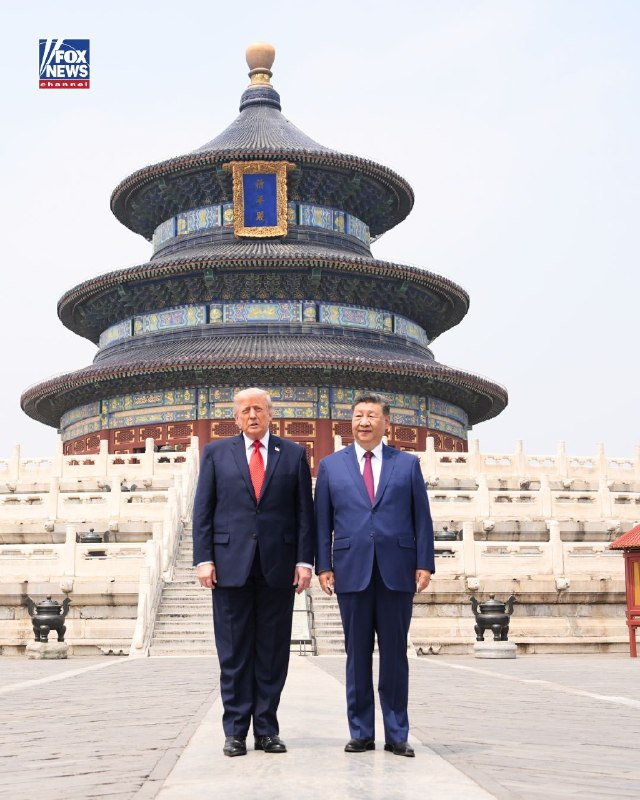

Fox News (Twitter/X)

NEW: President Trump and President Xi Jinping tour the Temple of Heaven after their meeting at the Great Hall of the People in Beijing.

## pm_afshaa — post 90712

🔴رویترز: آمریکا و چین توافق کردن هیچ کشوری نباید عوارض از تنگه هرمز بگیره

💧 Rainbet.com the #1 Non-KYC Crypto Casino & Sportsbook @rainbetcom

😁 @Pm_Afshaa

## DEJradio — post 4623

  <a href="telegram/content/DEJradio_4623_1778746893.mp4" target="_blank">🎬 Download video</a>

🛩️
🔥 در واکنش به حملات جمهوری اسلامی به تاسیسات نفتی امارات، نیروی هوایی این کشور تأسیسات نفتی جزیره لاوان را هدف قرار داد. در اثر این حمله مخازن و لوله‌ها آسیب دید و نفت به دریا نشت کرد. اکنون سواحل جزیره مارو (شیدور) در استان هرمزگان آلوده به نفت شده است.

این جزیره کوچک غیرمسکونی زیستگاه انواع پرندگان و خزندگان است. اما نفت سراسر سواحل این جزایر را پوشانده و فاجعه زیست‌محیطی شدیدی را دقیقا در فصل لانه‌گزینی و تخم‌گذاری لاک‌پشت‌های پوزه عقابی و پرندگان مهاجر ایجاد کرده است.

#امارات #جزیره_لاوان
@DEJradio

## IranIntlTV — post 337129

  

🔻امیرمهدی علوی، سخنگوی فدراسیون فوتبال، درباره آخرین وضعیت صدور ویزا برای کاروان اعزامی ایران به جام‌جهانی گفت: «کارهای اداری ویزا را در امارات انجام دادیم و حالا منتظر پاسخ هستیم. با این حال، در صورت صادر نشدن ویزا برای برخی بازیکنان، اعضای کادر فنی گزینه‌های مختلفی دارند و بازیکنان جایگزین پیش‌بینی شده‌اند.»

🔹او همچنین به جلسه رییس فدراسیون فوتبال با مقامات فیفا اشاره کرد و گفت: «در ۴۸ ساعت آینده جلسه رییس فدراسیون با مقامات فیفا در ترکیه برگزار می‌شود و درباره ۱۰ مورد از خواسته‌های ما صحبت خواهیم کرد که نخستین مورد آن، بحث صدور ویزا است.»

🔹در فاصله کمتر از یک ماه تا آغاز جام‌جهانی، تیم ایران همچنان درگیر دریافت ویزای آمریکا است و این موضوع به بحرانی برای کادر فنی تبدیل شده است. احتمال دارد برای برخی اعضای کاروان ایران به دلیل سوابق فعالیت یا ارتباط با سپاه پاسداران، ویزا صادر نشود.
@iranintltvsport

## IranIntlTV — post 337128

  <a href="telegram/content/IranIntlTV_337128_1778746897.mp4" target="_blank">🎬 Download video</a>

وضعیت بحرانی دارو، به‌ویژه گرانی و کمبود داروهای خاص در ایران، تشدید شده است. ایلنا، خبرگزاری کار ایران، گزارش داد کمبود برخی داروهای سرطان و افزایش شدید قیمت آن‌ها، روند درمان بیماران مبتلا به سرطان را با مشکلات جدی روبه‌رو کرده است.

گفت‌وگو با بابک خطی، پزشک و متخصص کودکان
@iranintltv

## IranIntlTV — post 337127

  <a href="telegram/content/IranIntlTV_337127_1778746899.mp4" target="_blank">🎬 Download video</a>

شی جین‌پینگ، رهبر چین، پنج‌شنبه پس از نشست کلیدی خود با دونالد ترامپ، رییس‌جمهوری آمریکا، از «بازتعریف» روابط دوجانبه سخن گفت. او افزود دو طرف توافق کرده‌اند ایجاد یک رابطه سازنده و از نظر راهبردی باثبات، جهت‌گیری روابط دوجانبه را در سه سال آینده و فراتر از آن مشخص خواهد کرد. منابع رسمی دولت چین همچنین اعلام کردند شی و ترامپ «در مورد خا‌ورمیانه هم تبادل نظر کرده‌اند».

توماج طاهباز، خبرنگار ایران‌اینترنشنال، گزارش می‌دهد
@iranintltv

## IranIntlTV — post 337126

  

عباس عراقچی، وزیر خارجه جمهوری اسلامی، گفت زمان آن رسیده است که «رفتار سلطه‌گرانه آمریکا به زباله‌دان تاریخ سپرده شود». او تاکید کرد هیچ‌گونه راه‌حل نظامی برای موضوعات مربوط به ایران وجود ندارد.

عراقچی گفت: «زمان آن رسیده که رفتار سلطه‌گرانه آمریکا را به زباله‌دان تاریخ بسپاریم.» او افزود: «هیچ‌گونه راه‌حل نظامی برای هر موضوعی که به ایران مربوط باشد، وجود ندارد. ما هرگز در برابر هیچ فشار یا تهدیدی سر خم نمی‌کنیم.»

وزیر خارجه جمهوری اسلامی همچنین اظهار داشت: «هرچند نیروهای مسلح ما آماده‌اند پاسخی کوبنده و ویرانگر به متجاوزان خارجی بدهند، اما مردم ما صلح‌طلب بوده و خواهان جنگ نیستند.»

او در ادامه از کشورهای عضو بریکس و دیگر اعضای جامعه بین‌المللی خواست آنچه را نقض حقوق بین‌الملل از سوی ایالات متحده و اسرائیل خواند، به‌صراحت محکوم کنند.
https://iranintl.com/202605149950

## IranIntlTV — post 337125

  

طبق اطلاعات رسیده به ایران‌اینترنشنال، پرهام محرابی، نوجوان ۱۸ ساله اهل مشهد، شامگاه ۱۸ دی‌ماه ۱۴۰۴ در جریان اعتراضات بلوار هفت‌تیر، کنار پل هفت‌تیر ، در حالی‌که در کنار پدرش حضور داشت، با شلیک مستقیم ماموران سرکوبگر کشته شد. پدر او که لحظه اصابت گلوله را از نزدیک دیده بود، پیکر بی‌جان فرزندش را در آغوش گرفت و صدها متر حمل کرد تا به خودرویشان برسد و سپس او را به خانه منتقل کرد.

بر اساس اطلاعات رسیده به ایران‌اینترنشنال، پدر پرهام آن شب همراه فرزندش در محل اعتراضات حضور داشت و از فاصله‌ای نزدیک شاهد تیر خوردن او بود. او پس از اصابت گلوله، پیکر فرزندش را در آغوش گرفت و مسافتی طولانی حمل کرد تا به خودرو برسد و سپس مستقیما او را به خانه منتقل کرد. خانواده روز بعد برای دفن پیکر اقدام کردند اما به گفته منابع آگاه، ماموران امنیتی از پدر او تعهد کتبی گرفتند که اعلام کند فرزندش توسط «اغتشاشگران» کشته شده است و تهدید کردند در غیر این صورت اجازه دفن صادر نخواهد شد.

به گفته خانواده و اطرافیان، پرهام نوجوانی آرام، مهربان و محبوب بود و رابطه نزدیکی با پدر و مادرش داشت. خانواده‌اش می‌گویند.
https://iranintl.com/202605140

## IranIntlTV — post 337124

  

عباس عراقچی گفت جمهوری اسلامی هیچ مانعی در تنگه هرمز ایجاد نکرده و این آمریکا است که محاصره ایجاد کرده است.

او گفت: «ما هیچ مانعی در تنگه هرمز ایجاد نکرده‌ایم، این آمریکاست که محاصره ایجاد کرده است.»

عراقچی همچنین تاکید کرد: «تنگه هرمز برای تمامی کشتی‌های تجاری باز است، اما آنها باید با نیروهای دریایی ما همکاری کنند.»
https://iranintl.com/202605149350

## IranIntlTV — post 337123

  

مرکز عملیات تجارت دریایی بریتانیا اعلام کرد گزارشی از یک حادثه دریایی در فاصله ۳۸ مایل دریایی در شمال‌شرق فجیره، امارات متحده عربی، دریافت کرده است. این نهاد اعلام کرد این کشتی در حالی که در لنگرگاه قرار داشته، به دست افراد غیرمجاز تصرف شده و اکنون به سوی آب‌های سرزمینی ایران در حرکت است.
https://iranintl.com/202605141129

## IranIntlTV — post 337122

  

وزارت دفاع اسرائیل اعلام کرد با یکی از شرکت‌های زیرمجموعه شرکت دفاعی البیت قراردادی برای توسعه «قابلیت برد افزوده» جنگنده اف-۳۵آی امضا کرده است. ارزش این قرارداد ۳۴ میلیون دلار اعلام شده است.

بر اساس اعلام این وزارتخانه، این قرارداد با شرکت سایکلون منعقد شده و شامل «توسعه و یکپارچه‌سازی مخازن سوخت خارجی» بر پایه طرحی است که پیش‌تر برای جنگنده اف-۱۶ طراحی شده بود.

وزارت دفاع اسرائیل اعلام کرد این قابلیت جدید قرار است برد عملیاتی هواپیما را افزایش دهد، وابستگی به سوخت‌گیری هوایی را کاهش دهد و انعطاف‌پذیری عملیاتی در ماموریت‌های برد بلند را تقویت کند.
https://iranintl.com/202605141756

## IranIntlTV — post 337121

  

🔻معین، خواننده سرشناس موسیقی پاپ، با انتشار پستی در صفحه رسمی خود در اینستاگرام، اظهارات مهدی تاج، رییس فدراسیون فوتبال، درباره خواندن ترانه برای تیم ملی را تکذیب کرد.

🔹معین در این رابطه نوشت: «اخیرا خبرهایی درباره اجرای من برای تیم فوتبال در جام جهانی منتشر شده که صحت ندارد.»

🔹او همچنین با تاکید بر همبستگی با مردم اضافه کرد: «عشق من به مردم و سرزمینم همیشه واقعی بوده، اما صدای من زمانی معنا دارد که دل مردم آرام باشد و حال ایران خوب باشد.»

🔹این واکنش در حالی مطرح شد که در مراسم بدرقه تیم ملی در شامگاه چهارشنبه ۲۳ اردیبهشت، مهدی تاج تایید کرد که معین در حال آماده‌سازی قطعه‌ای برای تیم ملی است. او در این مراسم گفت: «ما دخالتی در ترانه معین نکرده‌ایم، اما در جریان آن هستیم.»
@iranintltvsport

## IranIntlTV — post 337120

  

حسین نوری همدانی، مرجع تقلید حامی حکومت، با صدور فتوایی پرداخت وجوهات شرعی مقلدان علی خامنه‌ای به مجتبی خامنه‌ای را مجاز اعلام کرد و او را «فقیهی جامع‌الشرایط» خواند.

او در این فتوا نوشت: «با توجه به اینکه وجوهات شرعی در نهایت در مسیر اعتلای حوزه‌های علمیه و اداره امور طلاب مصرف می‌گردد، و با عنایت به شناخت موجود نسبت به او به عنوان فقیهی جامع‌الشرایط، ان‌شاء‌الله پرداخت وجوهات شرعی مقلدین رهبر شهید به معظم‌له موجب برائت ذمه خواهد بود.»
https://iranintl.com/202605149707

## IranIntlTV — post 337118

  <a href="telegram/content/IranIntlTV_337118_1778746906.mp4" target="_blank">🎬 Download video</a>

وزارت خارجه امارات گزارش‌ها درباره سفر بنیامین نتانیاهو به این کشور را تکذیب کرد. چهارشنبه دفتر نخست‌وزیری اسرائیل اعلام کرده بود نتانیاهو در جریان عملیات «غرش شیران» به‌صورت محرمانه به امارات سفر کرده و با محمد بن زاید آل نهیان، رییس امارات، دیدار داشته است.

گفت‌وگو با منشه امیر، کارشناس امور خاورمیانه
@iranintltv

## IranIntlTV — post 337117

  <a href="telegram/content/IranIntlTV_337117_1778746909.mp4" target="_blank">🎬 Download video</a>

امید معماریان، تحلیل‌گر سیاسی، درباره دیدار دونالد ترامپ و شی جین‌پینگ گفت: «ممکن است چین برای کمک به حل مساله جنگ ایران، بخواهد در حوزه‌های دیگر از آمریکا امتیاز بگیرد.»
@iranintltv

## IranIntlTV — post 337116

  <a href="telegram/content/IranIntlTV_337116_1778746911.mp4" target="_blank">🎬 Download video</a>

جاویدنامان انقلاب ملی ایرانیان
«سینا کاظمی» جوان ۲۲ ساله، ۱۸ دی‌ماه در منطقه تهرانپارس تهران با شلیک مستقیم نیروهای سرکوب خامنه‌ای کشته شد. نامش در حافظه‌ این سرزمین می‌ماند و یادش چراغ راه آزادی‌خواهان است.
@iranintltv

## IranIntlTV — post 337115

  

رسانه‌های دولتی چین گزارش دادند دونالد ترامپ و شی جین‌پینگ در جریان گفت‌وگوهای خود در پکن درباره «وضعیت خاورمیانه» و جنگ اوکراین تبادل نظر کردند.

خبرگزاری دولتی شین‌هوا اعلام کرد دو رهبر درباره مسائل مهم بین‌المللی و منطقه‌ای، از جمله وضعیت خاورمیانه، دیدگاه‌های خود را مطرح کردند. موضوع جنگ اوکراین نیز در این گفت‌وگوها بررسی شد.

این دیدار در حالی برگزار شد که گمانه‌زنی‌هایی درباره تلاش احتمالی ترامپ برای جلب همکاری چین در موضوع جنگ آمریکا و اسرائیل علیه جمهوری اسلامی مطرح است.
https://iranintl.com/202605147700

## IranIntlTV — post 337114

  <a href="telegram/content/IranIntlTV_337114_1778746913.mp4" target="_blank">🎬 Download video</a>

یک شرکت بریتانیایی اعلام کرد با کمک هوش مصنوعی، برای ربات‌ها یک «مغز» طراحی کرده که به آن‌ها امکان می‌دهد مانند انسان حرکت کنند و وظایف صنعتی انجام دهند.

گزارش فرزیا ثابتی، خبرنگار ایران‌اینترنشنال
@iranintltv

## IranIntlTV — post 337113

  <a href="telegram/content/IranIntlTV_337113_1778746915.mp4" target="_blank">🎬 Download video</a>

وزارت ارتباطات جمهوری اسلامی اعلام کرد برنامه‌ریزی برای اجرای طرحی موسوم به «ساماندهی دستفروشان آنلاین» را آغاز کرده است. به گفته این وزارتخانه، در صورت فراهم شدن زیرساخت‌ها این طرح می‌تواند «موانع حضور کسب‌وکارهای خانگی در اقتصاد دیجیتال را کاهش دهد».

گفت‌وگو با مهدی صارمی‌فر، روزنامه‌نگار علم و تکنولوژی
@iranintltv

## IranIntlTV — post 337112

  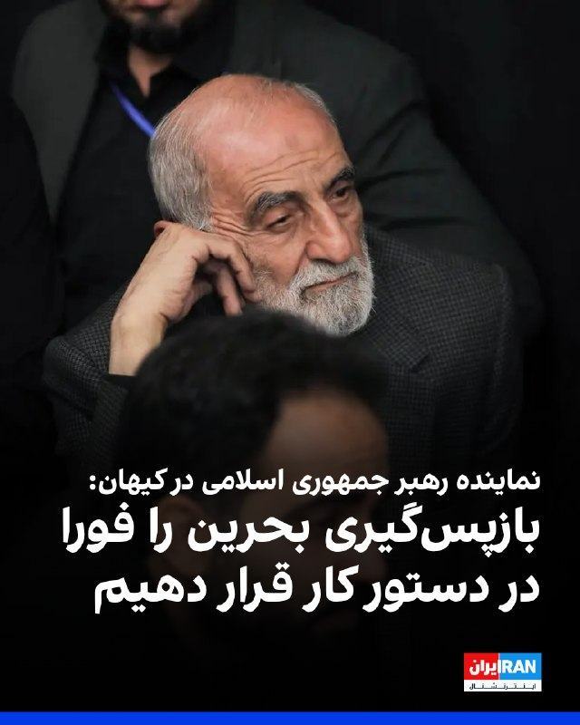

حسین شریعتمداری، نماینده رهبر جمهوری اسلامی در روزنامه کیهان، در یادداشتی با اشاره به جدایی بحرین از ایران، خواستار اقدام جمهوری اسلامی برای بازپس‌گیری فوری این کشور شد.

او نوشت: «آیا در این واقعیت که بحرین کماکان بخشی از سرزمین ایران است، کمترین تردیدی هست؟ اگر تردیدی نیست که نیست، چرا برای بازپس‌گیری آن اقدامی نمی‌شود؟»

شریعتمداری در ادامه افزود: «انتظار آن است و انتظاری شایسته و بایسته نیز هست که جمهوری اسلامی، سازوکار قانونی بازپس‌گیری بحرین را در دستور کار فوری خود قرار دهد.»

او همچنین نوشت: «چرا باید بخشی از سرزمین ایران اسلامی نه فقط در اختیار بیگانگان باشد، بلکه به پایگاه آمریکا و اسرائیل تبدیل شود؟»
https://iranintl.com/202605149606

## IranIntlTV — post 337111

  <a href="telegram/content/IranIntlTV_337111_1778746917.mp4" target="_blank">🎬 Download video</a>

شهرام خلدی، پژوهش‌گر تاریخ خاورمیانه و روابط بین‌الملل، گفت سفر ترامپ به پکن فرصت مناسبی است تا رییس‌جمهوری چین از بحران ایران به‌عنوان یک کارت برنده برای دستیابی به اهداف اقتصادی بزرگ‌تر و اعمال فشار بر ایالات متحده استفاده کند.
@iranintltv

## IranIntlTV — post 337110

  <a href="telegram/content/IranIntlTV_337110_1778746920.mp4" target="_blank">🎬 Download video</a>

میزان، رسانه قوه قضاییه جمهوری اسلامی، گزارش داد حکم اعدام محمد عباسی، شهروند ۵۵ ساله و از بازداشت‌شدگان اعتراضات دی‌ماه ۱۴۰۴، چهارشنبه به اتهام «محاربه» اجرا شد. بر اساس گزارش نهادهای حقوق بشری، اعترافات مربوط به اتهام «قتل یکی از سرهنگ‌های نیروی انتظامی» در اعتراضات ملارد، تحت شکنجه و با تهدید به تعرض به دختر او گرفته شده بود.

گفت‌وگو با پگاه بنی‌هاشمی، پژوهش‌گر ارشد حقوق
@iranintltv

## IranIntlTV — post 337109

  <a href="telegram/content/IranIntlTV_337109_1778746922.mp4" target="_blank">🎬 Download video</a>

دونالد ترامپ، رییس‌جمهوری ایالات متحده، با ابراز خرسندی از سفر به چین و ادای احترام به اقدامات شی جین‌پینگ گفت واشینگتن و پکن همواره چالش‌ها و اختلافات خود را در سریع‌ترین زمان و با حسن نیت حل کرده‌اند.
@iranintltv

## ManotoTV — post 105432

  <a href="telegram/content/ManotoTV_105432_1778746923.mp4" target="_blank">🎬 Download video</a>

سازمان دریانوردی تجاری بریتانیا اعلام کرد یک کشتی در سواحل امارات و در نزدیکی تنگه هرمز دچار حادثه شده است.
بر اساس این گزارش، افرادی «غیرمجاز» کنترل این کشتی را در دست گرفته‌اند و شناور اکنون به‌سمت آب‌های سرزمینی ایران در حرکت است. این نهاد دریایی بریتانیا اعلام کرد کشتی در فاصله ۳۸ مایلی سواحل فجیره قرار داشته است.

## ManotoTV — post 105431

  <a href="telegram/content/ManotoTV_105431_1778746924.mp4" target="_blank">🎬 Download video</a>

پلیس بریتانیا اعلام کرد دومین فرد در چارچوب تحقیقات ضدتروریسم درباره آتش‌سوزی در یک کنیسه در شرق لندن متهم شده است.
براساس اعلام پلیس، یک مرد ۳۱ ساله در ارتباط با این حمله بازداشت و تفهیم اتهام شده و تحقیقات درباره انگیزه و جزئیات حادثه ادامه دارد.

## ManotoTV — post 105430

  <a href="telegram/content/ManotoTV_105430_1778746925.mp4" target="_blank">🎬 Download video</a>

همزمان با آغاز نشست وزیران خارجه کشورهای عضو بریکس در دهلی‌نو، عباس عراقچی، وزیر خارجه ایران، از اعضای این گروه و «همه کشورهای مسئول جامعه جهانی» خواست حملات آمریکا و اسرائیل علیه ایران را به‌صراحت محکوم کنند.
خبرگزاری رویترز گزارش داد جنگ ایران و اسرائیل بر نشست دو روزه بریکس در هند سایه انداخته و اختلاف‌ها میان اعضا، رسیدن به موضعی مشترک و صدور بیانیه نهایی را دشوار کرده است. ایران از هند، رئیس دوره‌ای بریکس، خواسته از این نشست برای ایجاد اجماع علیه واشینگتن و تل‌آویو استفاده کند

## ManotoTV — post 105428

  <a href="telegram/content/ManotoTV_105428_1778746925.mp4" target="_blank">🎬 Download video</a>

رسانه‌های وابسته به قوه قضاییه جمهوری اسلامی گزارش دادند با دستور مقام قضایی در استان همدان، اموال ۴۷ نفر که به «جاسوسی» و «همکاری با رژیم اسرائیل» متهم شده‌اند، توقیف شده است.
براساس این گزارش‌ها، این افراد در کشورهای مختلف از جمله بریتانیا، آلمان، آمریکا، ترکیه، عراق و سوئیس اقامت دارند و مقام‌های قضایی جمهوری اسلامی اعلام کرده‌اند پرونده آن‌ها در حال بررسی است. به گفته رسانه میزان، اموال توقیف‌شده قرار است برای «بازسازی اماکن آسیب‌دیده از جنگ» هزینه شود.

## ManotoTV — post 105427

  <a href="telegram/content/ManotoTV_105427_1778746926.mp4" target="_blank">🎬 Download video</a>

دونالد ترامپ، رئیس‌جمهوری آمریکا، در دیدار با شی جین‌پینگ در پکن، این نشست را «بسیار مهم» توصیف کرد و گفت توجه گسترده‌ای در آمریکا و جهان به این دیدار وجود دارد.
ترامپ با اشاره به اهمیت این مذاکرات گفت برخی این نشست را «بزرگ‌ترین دیدار تاریخ» می‌دانند و تاکید کرد مردم آمریکا تقریبا درباره موضوع دیگری صحبت نمی‌کنند. او همچنین حضور در کنار شی جین‌پینگ را «باعث افتخار» دانست و ابراز امیدواری کرد روابط میان آمریکا و چین «بهتر از هر زمان دیگری» شود.

## ManotoTV — post 105426

  <a href="telegram/content/ManotoTV_105426_1778746927.mp4" target="_blank">🎬 Download video</a>

دونالد ترامپ و شی جین‌پینگ، روسای جمهوری آمریکا و چین، در پکن دیدار کردند؛ دیداری که با مراسمی گسترده و تشریفات پرزرق‌وبرق همراه بود و صبح پنج‌شنبه با حضور هیات‌های بلندپایه دو کشور برگزار شد.
ترامپ در سخنان آغازین خود این دیدار را «باعث افتخار» توصیف کرد و گفت:
«رئیس‌جمهوری شی، بسیار سپاسگزارم. چنین استقبالی کمتر دیده‌ام. بیش از همه تحت تأثیر کودکان قرار گرفتم؛ شاد و فوق‌العاده بودند. ارتش چین قدرتمند بود، اما آن کودکان چیزهای زیادی را نمایندگی می‌کنند.»

## ManotoTV — post 105425

  <a href="telegram/content/ManotoTV_105425_1778746929.mp4" target="_blank">🎬 Download video</a>

دونالد ترامپ، رئیس‌جمهوری آمریکا، صبح پنج‌شنبه در جریان سفر خود به پکن همراه با شی جین‌پینگ، رئیس‌جمهوری چین، در مراسم رسمی استقبال و رژه نیروهای نظامی این کشور شرکت کرد.
این مراسم در مقابل ساختمان «تالار بزرگ خلق» برگزار شد و دو رهبر ضمن بازدید از یگان‌های نظامی، شاهد اجرای مراسم سان و رژه نیروهای ارتش چین بودند.

## FarsiVOA — post 217704

  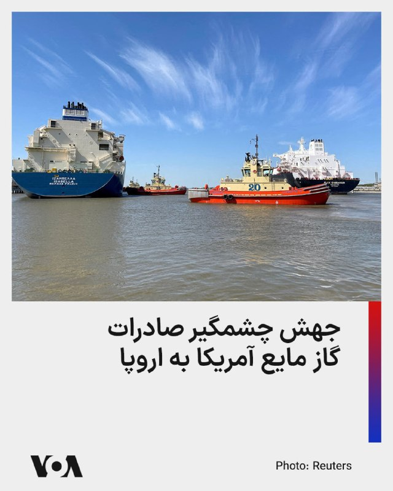

مؤسسه اقتصاد انرژی و تحلیل مالی می‌گوید آمریکا در سه ماهه ابتدایی امسال سهمی ۲۹ درصدی در تأمین گاز مایع اتحادیه اروپا داشته و در مجموع طی پنج سال گذشته، صادرات ال‌ان‌جی آمریکا به این اتحادیه چهار برابر شده است.

انتظار می‌رود آمریکا در سال جاری جایگاه نروژ به عنوان بزرگترین تأمین‌کننده کل گاز اروپا (گاز طبیعی و مایع) را بگیرد.

این گزارش می‌افزاید با توجه به تحریم‌های روسیه و هدف قرار گرفتن بخشی از تأسیسات گاز مایع قطر توسط جمهوری اسلامی، احتمالاً سهم آمریکا در واردات ال‌ان‌جی اتحادیه اروپا تا سال ۲۰۲۸ به حدود ۸۰ درصد برسد. هم‌اکنون سهم آمریکا در واردات ال‌ان‌جی آلمان، کرواسی و بریتانیا بالای ۸۰ درصد است.
@FarsiVOA

## FarsiVOA — post 217703

🔺سئول: بعید است کسی جز حکومت ایران پشت حمله به کشتی کره جنوبی باشد

▪️یک مقام ارشد کره جنوبی اعلام کرد احتمال این‌که نهادی غیر از حکومت ایران مسئول حمله به یک کشتی باری کره‌جنوبی در نزدیکی تنگه هرمز بوده باشد، پایین است.

▪️این مقام ارشد روز پنج‌شنبه ۲۴ اردیبهشت به خبرنگاران گفت که کره‌جنوبی در حال بررسی اطلاعاتی است که آمریکا درباره حمله ۴ مه علیه کشتی «نامو» متعلق به شرکت کشتیرانی کره‌جنوبی اچ‌ام‌ام به اشتراک گذاشته است.

▪️در جریان این حمله کشتی دچار آتش‌سوزی شد و خسارتی به بخش پایینی بدنه کشتی وارد آمد.

▪️جمهوری اسلامی پیش‌تر مسئولیت این حمله را که شامل برخوردی شدید به بدنه کشتی بود، رد کرده است.

⬇️ بیشتر بخوانید:
https://ir.voanews.com/a/8149917.html

## FarsiVOA — post 217702

  

در اقدامی در سرکوب شهروندان منتقد و نقض حقوق مدنی ایرانیان، دستگاه قضایی جمهوری اسلامی از توقیف اموال ۴۷ شهروند در استان همدان با ادعای «خیانت به وطن» و «همکاری با دشمن» خبر داد.

دادگستری استان همدان، روز ۱۶ اردیبهشت، تعداد این شهروندان را ۴۰ نفر عنوان کرده بود و به نظر می‌رسد در همین مدت کوتاه، اموال هفت شهروند دیگر نیز توقیف شده است.

دستگاه قضایی جمهوری اسلامی اعلام کرد که ۴۱ نفر از این شهروندان هم‌اکنون ساکن خارج کشور هستند.

روز چهارشنبه ۲۳ اردیبهشت، نیز رئیس کل دادگستری هرمزگان از توقیف اموال ۲۴ نفر از ایرانیان خارج از کشور خبر داده بود. اقدامی که رئیس قوه قضائیه از آن دفاع کرده و مدعی است دستگاه قضایی مأمور شده تا اموال «همکاران و همراهان دشمن» را شناسایی، توقیف و مصادره کند.
@FarsiVOA

## FarsiVOA — post 217701

🔺جمهوری اسلامی محمد عباسی یکی دیگر از معترضان دی ماه را اعدام کرده است

▪️جمهوری اسلامی محمد عباسی، از بازدشت‌شدگان اعتراضات دی ماه ۱۴۰۴ را که به قتل یکی از عوامل حکومت در ملارد متهم شده بود، اعدام کرد.

▪️دستگاه قضایی مدعی است که شاهین دهقانی، از نیروهای انتظامی ۱۷ دی ماه ۱۴۰۴ و در شهرستان ملارد کشته شده، و این قتل را به محمد عباسی و دخترش منتسب می‌کند، اما تصاویر پخش شده در دادگاه دخالت محمد و فاطمه عباسی، را اثبات نمی‌کند.

▪️فاطمه عباسی، در همین پرونده به ۲۵ سال زندان محکوم شده است.

▪️جمهوری اسلامی از آغاز جنگ با آمریکا و اسرائیل، دستکم ۳۳ تن را به بهانه حضور در اعتراضات، عضویت در گروه‌های مخالف یا «همکاری با دشمن»، اعدام کرده است.

⬇️ بیشتر بخوانید:
https://ir.voanews.com/a/8149915.html

## FarsiVOA — post 217699

  

شی جین‌پینگ، رئیس‌جمهور چین، در جریان گفت‌وگو با دونالد ترامپ، رئیس‌جمهور آمریکا گفت که روابط اقتصادی بین دو کشور «ماهیتی دوجانبه، سودمند و برد-برد» دارد.

به گزارش خبرگزاری دولتی چین، شینهوا، شی پنجشنبه گفت: «دیروز، تیم‌های اقتصادی و تجاری ما نتایجی به‌طور کلی متوازن و مثبت تولید کردند. این خبر خوبی برای مردم دو کشور و جهان است.»

رئیس‌جمهور چین افزود که واقعیت‌ها بارها نشان داده‌اند در جنگ‌های تجاری هیچ برنده‌ای وجود ندارد و از هر دو طرف خواست تا به‌طور مشترک شتاب مثبتی را که با تلاش فراوان ایجاد کرده‌اند حفظ کنند.

او گفت: «در مواردی که اختلافات و اصطکاک‌ها وجود دارد، مشورت برابر تنها انتخاب درست است.»

همچنین بر اساس ویدیویی که از ابتدای مذاکرات منتشر شد، شی گفت: «همواره بر این باور بوده‌ام که منافع مشترک میان چین و ایالات متحده بر اختلافات ما می‌چربد؛ موفقیت هر کشور فرصتی برای کشور دیگر است و یک رابطه پایدار چین و آمریکا برای جهان یک موهبت است. همکاری به سود هر دو طرف است، در حالی که تقابل به هر دو طرف آسیب می‌زند.»
@FarsiVOA

## FarsiVOA — post 217698

  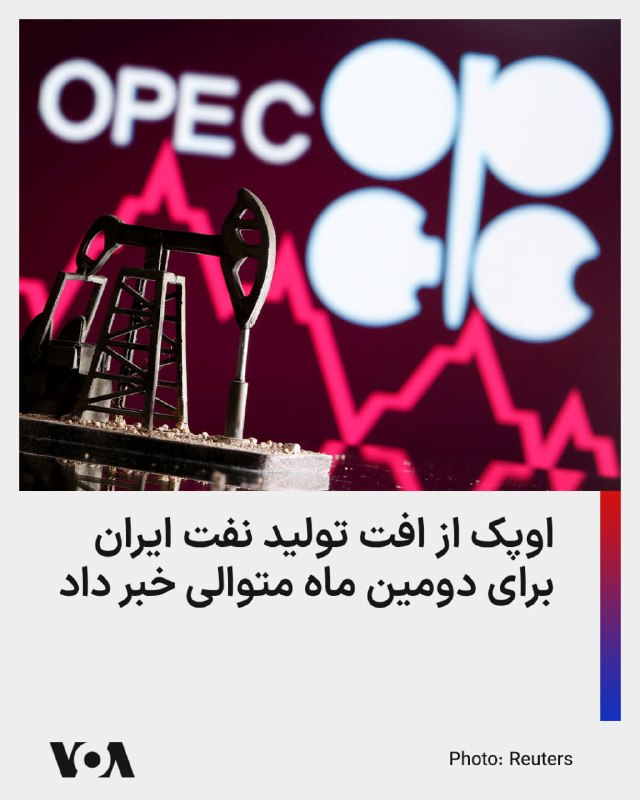

🔺اوپک از افت تولید نفت ایران برای دومین ماه متوالی خبر داد

▪️سازمان کشورهای صادرکننده نفت، اوپک، از افت تولید نفت ایران برای دومین ماه متوالی خبر داد.

▪️تولید روزانه نفت ایران در ماه آوریل نسبت به ماه مارس حدود ۲۱۲ هزار بشکه و نسبت به ماه فوریه، قبل از جنگ، حدود ۳۸۷ هزار بشکه کاهش داشته است. ایران در ماه گذشته روزانه ۲ میلیون و ۸۵۴ هزار بشکه تولید نفت داشته است.

▪️با توجه به پر شدن مخازن ذخیره نفت ایران به خاطر محاصره دریایی آمریکا، انتظار می‌رود شتاب افت تولید نفت ایران در ماه جاری افزایش یابد.

▪️مصرف داخلی نفت خام ایران حدود ۱.۷ میلیون بشکه است و در صورت ناتوانی جمهوری اسلامی در صادرات نفت، تولید نفت خام به همین سطح کاهش خواهد یافت.

⬇️ بیشتر بخوانید:
https://ir.voanews.com/a/8149916.html

## FarsiVOA — post 217697

🔺ترامپ به شی: روابط آمریکا با چین «بهتر از همیشه» خواهد بود

▪️دونالد ترامپ، رئیس‌جمهور ایالات متحده، روز پنج‌شنبه ۲۴ اردیبهشت در پکن و پشت میز گفت‌وگو با همتای چینی خود، شی جین‌پینگ، اعلام کرد که روابط کشورش با چین «بهتر از همیشه» خواهد بود.

▪️ترامپ روز چهارشنبه برای سفری سه‌روزه وارد پایتخت چین شد. این نخستین سفر او به چین از سال ۲۰۱۷ تاکنون است.

▪️این سفر در ابتدا برای اواخر ماه مارس برنامه‌ریزی شده بود، اما به دلیل جنگ آمریکا و اسرائیل علیه جمهوری اسلامی به تعویق افتاد.

▪️هدف نشست شی و ترامپ دستیابی به توافق‌هایی درباره محصولات کشاورزی و هواپیماها، و همچنین حفظ آتش‌بس شکننده در جنگ تجاری میان دو اقتصاد بزرگ جهان است.

⬇️ بیشتر بخوانید:
https://ir.voanews.com/a/8149914.html

## DW_Farsi — post 124675

  

🔶 محمد عباسی، از بازداشت‌شدگان اعتراضات دی‌ماه، اعدام شد

به گزارش خبرگزاری میزان، وابسته قوه قضائیه جمهوری اسلامی، حکم اعدام محمد عباسی که از بازداشت‌شدگان اعتراضات دی ماه ۱۴۰۴ بود، به اجرا در آمد.
قوه قضائیه او را به "قتل" یک نظامی در جریان اعتراضات متهم کرده و از اعمال "قصاص" سخن گفته است. طبق اعلام این نهاد، اجرای حکم اعدام محمد عباسی با تایید نهایی دیوان عالی جمهوری اسلامی و به تقاضای اولیاء دم انجام شده است.

دیوان عالی همچنین حکم ۲۵ سال حبس فاطمه عباسی، دختر محمد عباسی را که در بند زنان زندان اوین در حبس به سر می‌برد، تایید کرد.

محمد عباسی اواخر دی ماه سال گذشته به اتهام "مشارکت در کشتن" یک مأمور حکومتی در ملارد بازداشت و از سوی دادگاه انقلاب به ریاست ابوالقاسم صلواتی به اعدام محکوم شده بود. این حکم هفتم اردیبهشت ماه سال جاری در شعبه ۳۹ دیوان عالی کشور تأیید شد.

هرانا، ارگان خبری مجموعه فعالان حقوق بشر ایران به نقل از یک منبع آگاه نزدیک به خانواده این زندانی سیاسی گزارش داد: «مسئولان زندان قزلحصار کرج از خانواده محمد عباسی خواستند که برای ملاقات با وی به زندان مراجعه کنند. اما پس از حضور خانواده در زندان، این امکان از نزدیکان او سلب شد. پس از خروج خانواده عباسی از زندان، آنها در تماسی تلفنی از اجرای حکم اعدام محمد عباسی مطلع شدند.»

به نوشته هرانا ابهامات و شبهات متعددی درباره روند رسیدگی و محتوای پرونده محمد عباسی و دخترش فاطمه وجود داشته، اما وکلای مستقل به دلیل محرومیت از دسترسی به پرونده امکان بررسی و پیگیری موثر آن را نداشته‌اند.

@dw_farsi

## DW_Farsi — post 124674

🔶 آغاز دیدار شی و ترامپ در سایه جنگ ایران

دیدار رسمی دونالد ترامپ، رئیس جمهور آمریکا و شی جین‌پینگ، همتای چینی او پنجشنبه ۱۴ مه (۲۴ اردیبهشت) آغاز شد. به گزارش رسانه‌های خبری شروع ملاقات و گفت‌وگوی رهبران ایالات متحده و چین دیدار با سخنان متقابل دوستانه همراه بود.

ترامپ پس از استقبال و تشریفات رسمی، رئیس جمهور چین را مورد ستایش قرار داد. شی نیز ابراز اطمینان کرد که نقاط مشترک پکن و واشنگتن بیشتر از موارد اختلاف بین دو کشور است. او تأکید کرد که موفقیت هر یک از دو کشور در عین حال فرصتی برای دیگری است.

چین و آمریکا که بزرگ‌ترین قدرت‌های اقتصادی جهان محسوب می‌شوند، در نزاعی تجاری به سر می‌برند.

ترامپ که در سال گذشته میلادی چین را به وضع تعرفه‌های تجاری سنگین تهدید کرده بود، در آغاز گفت‌وگوهای خود با شی در پکن از "آینده مشترک درخشان" دو کشور سخن گفت.

او همتای چینی را خود را "شخصیتی فوق‌العاده" خواند و خطاب به شی افزود: «گاهی خوششان نمی‌آید که من چنین چیزی بگویم، اما با وجود این، این نکته را بیان می‌کنم چون عین حقیقت است: دوستی با شما افتخار است.»

@dw_farsi

## DW_Farsi — post 124673

  

🔶 امارات متحده خبر سفر نتانیاهو به این کشور را تکذیب کرد

وزارت امور خارجه امارات متحده عربی اخبار و گزارش‌های مربوط به سفر بنیامین نتانیاهو به این کشور در حین جنگ آمریکا و اسرائیل با جمهوری اسلامی را تکذیب کرد.

در بیانیه این وزارتخانه در این رابطه منتشر شد، آماده است: «امارات متحده عربی گزارش‌های منتشرشده درباره سفر نخست‌وزير اسرائيل يا استقبال از يک هيات نظامی اسرائيلی را تکذيب می‌کند.»

این وزارتخانه تأکید کرده که روابط امارات و اسرائیل "علنی و بر پایه پیمان ابراهیم" است و از این رو تمامی سفرها و دیدارهای رسمی به شکل شفاف اعلام شده و انجام می‌گیرند".

دفتر بنیامین نتانیاهو چهارشنبه ۱۳ مه (۲۳ اردیبهشت) اعلام کرده بود، نخست وزیر اسرائیل در جریان جنگ ایران به‌طور محرمانه به امارات سفر کرده و با محمد بن زاید، رئیس امارات، دیدار داشته است. به گفته دفتر نتانیاهو این سفر به "یک دستاورد تاریخی" در روابط دو طرف منجر شده است.

پیش از آن وال استریت ژورنال در گزارشی نوشته بود دیوید بارنیا، رئیس موساد، نیز دست‌کم دو بار در ماه‌های مارس و آوریل به امارات سفر کرد تا درباره روند جنگ با ایران و هماهنگی‌های امنیتی با مقام‌های این کشور گفت‌وگو کند.

@dw_farsi

## DW_Farsi — post 124672

  

🔶 ابراز امیدواری روبیو به فشار بیشتر پکن بر تهران

مارکو روبیو اعلام کرد ایالات متحده به پشتیبانی بیشتر چین در راه یافتن راه‌حلی برای تنگه هرمز امیدوار است. وزیر خارجه آمریکا تصریح کرد: «ما امیدواریم چین را متقاعد کنیم که نقشی فعالانه‌تر برای متقاعد کردن ایران بازی کند تا تهران از آنچه در حال حاضر در خلیج فارس انجام می‌دهد و در تلاش برای انجام آن است، فاصله بگیرد.»

روبیو که دونالد ترامپ را در سفر به چین همراهی می‌کند، این اظهارات را در گفت‌وگو با شبکه فاکس نیوز که در هواپیمای "ایرفورس وان" انجام شد، ابراز کرد.

وزیر خارجه ایالات متحده در این گفت‌وگو تأکید کرد که رفع وضعیت کنونی حاکم در تنگه هرمز به دلایل مختلف به نفع چین است. با این حال از آنجایی که کشتی‌های چینی نیز در آب‌های خلیج فارس گرفتار شده‌اند. او افزود، اقتصاد چین بر محور صادرات فعالیت می‌کند و از فشارهای اقتصادی ناشی از بحران تنگه هرمز رنج می‌برد، زیرا کشورهای دیگر بر اثر این بحران کالاهای کمتری از چین خریداری می‌کنند.

اظهارات روبیو در تضاد با سخنان ترامپ قرار دارد. رئیس جمهور آمریکا در آغاز سفرش به پکن در پاسخ به این پرسش که آیا همتای چینی او، شی می‌تواند در جنگ ایران یاری‌دهنده باشد، گفت بود: «گمان می‌کنم، ما در مورد ایران به هیچ کمکی نیاز نداریم.»

@dw_farsi

## Persian_Trend_Official — post 14108

💢زلزله ای در کرمان رخ داده است 🫆:Tony 📌 @persian_trend_official پرشین ترند | متفاوت‌ترین کانال نظامی

## Persian_Trend_Official — post 14107

💢زلزله ای در کرمان رخ داده است

🫆:Tony

📌 @persian_trend_official
پرشین ترند | متفاوت‌ترین کانال نظامی

## Persian_Trend_Official — post 14106

  

🔴 روسیه یکی از سنگین‌ترین حملات خود را علیه اوکراین انجام داد

💢گزارش‌ها حاکی است روسیه طی ۲۴ ساعت گذشته یکی از بزرگ‌ترین حملات هوایی خود از آغاز جنگ را علیه اوکراین انجام داده است.

💢بر اساس اطلاعات منتشرشده:

▪️ بیش از ۱۴۰۰ پهپاد در این حمله استفاده شده است
▪️ همچنین بیش از ۵۰ موشک به‌سمت اهداف مختلف شلیک شده‌اند
▪️ موج نخست حملات مناطق غربی اوکراین را هدف قرار داد
▪️ سپس حملات به سمت کی‌یف گسترش یافت

🫆:Tony

📌 @persian_trend_official
پرشین ترند | متفاوت‌ترین کانال نظامی

## Persian_Trend_Official — post 14105

  <a href="telegram/content/Persian_Trend_Official_14105_1778746936.mp4" target="_blank">🎬 Download video</a>

⭕️ اتوبوس تیم ملی فوتبال رو با شعار مرگ بر آمریکا بدرقه کردن تا بره آمریکا...

پ.ن: چی بگم والا...

📝 Nick

📌 @persian_trend_official
پرشین ترند | متفاوت‌ترین کانال نظامی

## Persian_Trend_Official — post 14104

  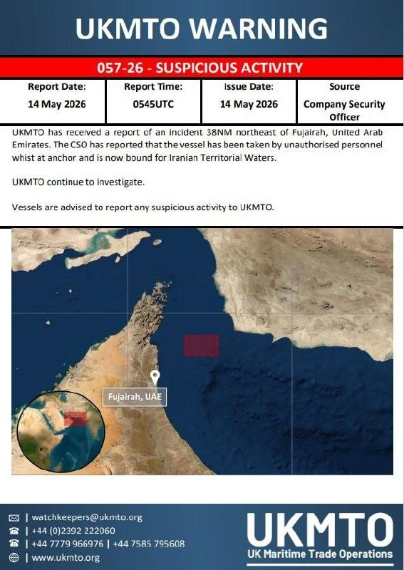

🔴 گزارش‌ها از توقیف یک شناور در نزدیکی فجیره توسط ایران

💢برخی گزارش‌ها حاکی است یک فروند شناور در فاصله حدود ۳۸ مایل دریایی از بندر فجیره امارات توسط نیروهای ایرانی توقیف شده و در حال حرکت به‌سمت آب‌های سرزمینی ایران است.

🫆:Tony

📌 @persian_trend_official
پرشین ترند | متفاوت‌ترین کانال نظامی

## Persian_Trend_Official — post 14103

⭕️ وزیر آموزش‌ و پرورش:

امتحانات نهایی ۲ هفته بعد از عادی شدن شرایط و پایان جنگ برگزار خواهند شد. ضمن اینکه در استان‌ها تصمیم‌گیری دربارۀ نحوۀ برگزاری امتحانات برعهدۀ استانداران خواهد بود.

پ.ن: دانش آموزان عزیز دعا کنید ماجرا مثل صدام عراق نشه که امتحانات‌تون یه 11 سالی‌ طول خواهد کشید. 🗿😂

📝 Nick

📌 @persian_trend_official
پرشین ترند | متفاوت‌ترین کانال نظامی

## Persian_Trend_Official — post 14102

گزارش صداوسیما از احسان افرشته و روایت عجیب از جاسوسی ! 📌 @persian_trend_official پرشین ترند | متفاوت‌ترین کانال نظامی

## Persian_Trend_Official — post 14101

  <a href="telegram/content/Persian_Trend_Official_14101_1778746938.mp4" target="_blank">🎬 Download video</a>

گزارش صداوسیما از احسان افرشته و روایت عجیب از جاسوسی !

📌 @persian_trend_official
پرشین ترند | متفاوت‌ترین کانال نظامی

## Persian_Trend_Official — post 14099

⭕️ وضعیت از 57 تا امروز... 🗿

(نسخه کم حجم توی کامنت ها)
📝 Nick

📌 @persian_trend_official
پرشین ترند | متفاوت‌ترین کانال نظامی

## Persian_Trend_Official — post 14098

  <a href="telegram/content/Persian_Trend_Official_14098_1778746941.webm" target="_blank">🎬 Download video</a>

⭕️ وزیر انرژی و معادن کوبا اعلام کرد که کشور به طور کامل از دیزل و نفت کوره خالی شده و تولید برق به صورت کامل متوقف شده است، در حالی که ایالات متحده جزیره را محاصره کرده است.

بسیاری از محله‌ها در پایتخت کوبا در حال حاضر با خاموشی‌هایی مواجه هستند که ۲۰ تا ۲۲ ساعت در روز طول می‌کشد.

📝 Nick

📌 @persian_trend_official
پرشین ترند | متفاوت‌ترین کانال نظامی

## Persian_Trend_Official — post 14093

  <a href="telegram/content/Persian_Trend_Official_14093_1778746941.webm" target="_blank">🎬 Download video</a>

باز مانده از رزمایش ضد هلی برن «قائد شهید» سپاه حضرت محمد رسول اللّه (ص) تهران بزرگ !!!

درسته جنگ زمینی تخصص شماست، فقط متخصصین عزیز پوتین نداشتید ؟

📌 @persian_trend_official
پرشین ترند | متفاوت‌ترین کانال نظامی

## Persian_Trend_Official — post 14092

کانال رسمی پرشین ترند pinned a voice message

## Persian_Trend_Official — post 14091

هر شب خواب رفیقای شهیدمو می‌بینم ! 📌 @persian_trend_official پرشین ترند | متفاوت‌ترین کانال نظامی

## Persian_Trend_Official — post 14090

  <a href="telegram/content/Persian_Trend_Official_14090_1778746942.mp4" target="_blank">🎬 Download video</a>

هر شب خواب رفیقای شهیدمو می‌بینم !

📌 @persian_trend_official
پرشین ترند | متفاوت‌ترین کانال نظامی

## RadioFarda — post 157161

🔸انتشار تصاویری از رژه پادشاهی‌خواهان که لباس‌هایی با آرم ساواک به تن داشتند، در شهر رگنسبورگ آلمان با واکنش‌های زیادی همراه شده است.

🔸این افراد خود را «گروه مردمی ساواک» معرفی می‌کنند و خواهان «شناسایی عوامل جمهوری اسلامی و اپوزیسیون‌های جعلی و نفوذی» هستند.

🔸این اقدام با واکنش‌های زیادی در شبکه‌های اجتماعی همراه شده است. برخی کاربران آن را « سفید‌سازی» و «بازگشت به نمادهای سرکوب» و برخی خواستار «برخورد قانونی دولت آلمان» با این گونه اقدامات شده‌اند.

🔸برخی کاربران نیز این گونه اقدامات را مشابه عملکرد جمهوری اسلامی دانسته‌اند.

🔸ساواک، سازمان اطلاعات و امنیت کشور در ایران بود که طی چند دهه مسئولیت شناسایی، بازداشت، شکنجه و سرکوب مخالفان سیاسی حکومت پهلوی را بر عهد داشت.

@RadioFarda

## RadioFarda — post 157160

  

🔸 نخست‌وزیر ژاپن از عبور موفقیت‌آمیز یک نفتکش این کشور حامل نفت خام روز پنجشنبه ۲۴ اردیبهشت از تنگه هرمز عبور کرده و در راه ژاپن است.

🔸 سانائه تاکایچی با اعلام این خبر در شبکه ایکس نوشت پس از عبور یک کشتی متعلق به ژاپن در نهم اردیبهشت از تنگه هرمز، عبور کشتی دوم به‌عنوان یک تحول مثبت ارزیابی می‌شود.

🔸 میاتا توموهیده، مدیرعامل شرکت انیوس، بزرگ‌ترین گروه پالایشی ژاپن که این نفتکش هم زیرمجموعهٔ آن است، گفت این نفتکش با موفقیت از تنگه هرمز عبور کرده و انتظار می‌رود اواخر ماه مه یا اوایل ژوئن به ژاپن برسد.

🔸 بر اساس داده‌های شرکت «کلپر»، این کشتی حامل ۱.۲ میلیون بشکه نفت خام کویت و ۷۰۰ هزار بشکه نفت امارات است.

🔸 ژاپن پیش از آغاز جنگ حدود ۹۵ درصد نفت خود را از کشورهای حوزه خلیج فارس وارد می‌کرد.

🔸 وزارت خارجهٔ ژاپن اعلام کرده دولت این کشور برای عبور ایمن کشتی‌ها مستقیماً با حکومت ایران در تماس بوده است. به‌گفتهٔ این وزارتخانه، هنوز ۳۹ کشتی مرتبط با ژاپن در خلیج فارس باقی مانده‌اند.

@RadioFarda

## RadioFarda — post 157159

🔸 رئیس‌جمهور آمریکا با همتای چینی خود شی ژین‌پینگ صبح روز پنج‌شنبه ۲۳ اردیبهشت در پایتخت چین دیدار رسمی کرد.

🔸 دونالد ترامپ به‌عنوان نخستین رئیس‌جمهور ایالات متحده که در نزدیک به یک دهۀ اخیر به پکن سفر کرده، امیدوار است در این سفر به موفقیت‌های تجاری رسیده و «آتش‌بس شکنندۀ تجاری» میان دو ابرقدرت را، حفظ کند.

🔸 مدیران ارشد تجاری و فناوری که رئیس‌جمهور آمریکا را در این سفر همراهی می‌کنند، امیدوارند بتوانند برخی موانع تجاری میان دو کشور را برطرف کنند؛ از جمله مدیر عامل شرکت انویدیا که برای دریافت مجوز فروش تراشه‌های قدرتمند هوش مصنوعی خود موسوم به اچ ۲۰۰، دردسر زیادی کشیده است.

@RadioFarda

## RadioFarda — post 157158

  

🔸مارکو روبیو، وزیر خارجه آمریکا، می‌گوید به نفع چین است که حکومت ایران را برای باز کردن تنگه هرمز تحت فشار بگذارد.

🔸براساس گزارشی که فاکس‌نیوز از اظهارات روبیو در راه سفر به چین پخش کرد، او گفت: «ما این استدلال را با چینی‌ها مطرح کرده‌ایم و امیدوارم قانع‌کننده باشد. آن‌ها اواخر این هفته در سازمان ملل فرصت خواهند داشت دربارهٔ این موضوع اقدامی انجام دهند؛ زمانی که قطعنامه‌ای برای محکوم کردن اقدامات ایران در ارتباط با تنگه‌ها مطرح می‌شود.»

🔸روبیو گفت حکومت ایران در حال ایجاد ظرفیتی بوده که بتواند با «انبوهی از موشک‌ها و پهپادها» سامانه‌های دفاعی کشورهای منطقه را از کار بیندازد و هرگونه حملهٔ احتمالی به برنامه هسته‌ای خود را با تهدید به وارد کردن خسارت گسترده به کشورهای خلیج فارس پاسخ دهد.

🔸مارکو روبیو همچنین با اشاره به بحران تنگه هرمز، گفت این وضعیت بیش از هر کشور دیگری به زیان چین است و پکن باید ایران را برای عقب‌نشینی از اقداماتش تحت فشار بگذارد.

@RadioFarda

## IranianMinds — post 20110

  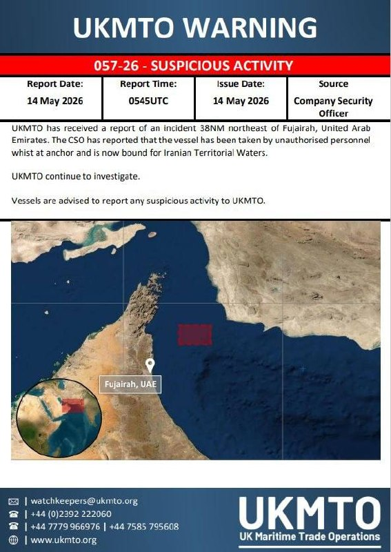

🔴 سازمان تجارت دریایی بریتانیا گزارش داد که یک حادثه در فاصله ۳۸ مایل دریایی شمال‌شرق فجیره در امارات رخ داده است.

گزارش‌ها حاکی است که یک کشتی لنگر گرفته توسط افراد غیرمجاز مورد بازدید قرار گرفته و اکنون به سمت آب‌های سرزمینی ایران در حرکت است.

@IranianMinds

## IranianMinds — post 20109

  

😤دنبال یه سایت شرط بندی بین المللی بودی که به ایرانیا خدمات بده؟!
⛔

👍دربی بت همون انتخاب  100%

💎ویژگی های سایت جهانی Derby Bet:

⬅️امکان شارژ امن با کارت بانکی

⬅️واریز اول دوبل شارژ می شوید(بونوس۱۰۰٪)

⬅️پر اپشن ترین سایت فعال در ایران

⬅️تسویه حساب کمتر از 5 دقیقه

⬅️برگشت بخشی از باخت به صورت هفتگی

🚨کد هدیه ثبت نام:GG007

⚠️برای دانلود اپلکیشن کلیک کنید
👉
re24

🔔کانال دربی بت :

🪙https://t.me/+aCbq7yy8QY80NzQ0

## IranianMinds — post 20107

  

ترامپ و رئیس جمهور‌ چین در معبد بهشت پکن

@IranianMinds

## BBCPersian — post 281018

  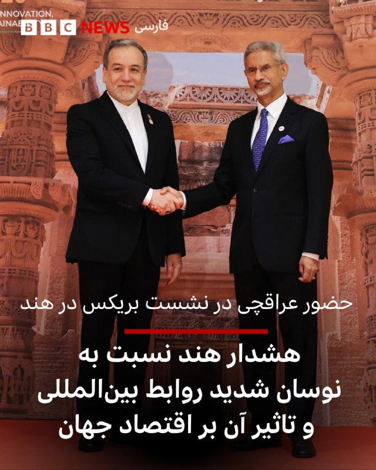

عباس عراقچی، وزیر خارجه ایران برای شرکت در نشست وزیران امور خارجه بریکس به هند سفر کرده است. جنگ ایران و بحران سوخت مرتبط با آن، بر گفت‌وگوهای این نشست دو روزه سایه انداخته است.

هند میزبان این نشست نسبت به «نوسان قابل توجه» در وضعیت بین‌المللی هشدار داد و گفت درگیری‌ها باعث بی‌ثباتی اقتصادی و ناامنی انرژی شده‌اند.

سوبرامانیام جایشانکار، وزیر امور خارجه هند، در سخنرانی افتتاحیه خود گفت: «ما در زمانی با نوسان قابل توجه در روابط بین‌الملل گرد هم آمده‌ایم.»

آقای جایشانکار افزود: «درگیری‌های جاری، نااطمینانی‌های اقتصادی و چالش‌ها در تجارت، فناوری و اقلیم، در حال شکل دادن به چشم‌انداز جهانی هستند.»

او گفت: «انتظار فزاینده‌ای، به‌ویژه از سوی اقتصادهای نوظهور و کشورهای در حال توسعه، وجود دارد که بریکس نقش سازنده و تثبیت‌کننده‌ای ایفا کند.»

بریکس نام گروهی به رهبری برخی از کشورهایی است که اقتصادی نوظهور در جهان دارند. برزیل، روسیه، هند، چین و آفریقای جنوبی اعضای اصلی بریکس هستند. نام بریکس از حروف اول نام کشورهای عضو به زبان انگلیسی گرفته شده است.

📷EPA/Shutterstock
https://bbc.in/4fkRCIA
@BBCPersian

## BBCPersian — post 281009

‌
دختر کیم جونگ‌اون بیشتر از همیشه با لباس‌هایی از برندهای لوکس طراحان غربی در عکس‌ها ظاهر می‌شود، برندهایی که در کره شمالی به دلیل «ضدسوسیالیستی» بودن ممنوع‌اند.

اما لباس‌های کیم جو ئه، از لباس‌های چرمی و مدل موی «خروسی» گرفته تا حتی پیراهن با آستین توری، بیش از آنکه نشانه سرکشی نوجوانانه باشد، نشان می‌دهد او برای جانشینی مقام رهبر عالی کره شمالی آماده می‌شود.

او برای نخستین بار در ۹ سالگی، در نوامبر ۲۰۲۲، در حالی که کنار پدرش در برابر یک موشک بالستیک قاره‌پیمای عظیم قدم می‌زد، به شکل رسمی دیده شد. اما همان زمان هم با موهای بسته از پشت، شلوار مشکی و کاپشن سفید پفی، ظاهری حساب‌شده داشت.

از آن زمان، مدل موی او هرچه بیشتر آراسته و شیک شده و پوشش او نیز به‌تدریج ظریف‌تر، مجلل‌تر و پخته‌تر جلوه می‌کند.

اکنون گزارش‌ها حاکی است که برخی می‌خواهند از سبک شیک و آراسته جو آئه الگوبرداری کنند.

مطلب را از لینک ⬇️ در سایت بی‌بی‌سی فارسی بخوانید.
https://bbc.in/3Pfgjf9

📸GettyImages/ News1/ Reuters/ EPA/Shutterstock/ LightRocket via Getty Images/ AFP via Getty Images

@BBCPersian

## BBCPersian — post 281007

‌ یونهاپ،‌ خبرگزاری رسمی کره‌جنوبی، روز پنج‌شنبه به نقل از یک مقام ارشد در سئول گزارش داد احتمال این که طرفی غیر از ایران مسئول حمله به یک کشتی باری کره‌جنوبی در نزدیکی تنگه هرمز باشد، کم است. در این گزارش به نقل از یک مقام ارشد کره‌جنوبی آمده است که این…

## BBCPersian — post 281006

  

‌
یونهاپ،‌ خبرگزاری رسمی کره‌جنوبی، روز پنج‌شنبه به نقل از یک مقام ارشد در سئول گزارش داد احتمال این که طرفی غیر از ایران مسئول حمله به یک کشتی باری کره‌جنوبی در نزدیکی تنگه هرمز باشد، کم است.

در این گزارش به نقل از یک مقام ارشد کره‌جنوبی آمده است که این کشور در حال بررسی اطلاعاتی است که آمریکا درباره حمله چهارم مه (۱۴ اردیبهشت) به کشتی «نامو» متعلق به شرکت کشتیرانی «اچ‌ام‌ام» کره‌جنوبی در اختیارش گذاشته است. این حمله باعث آتش‌سوزی و آسیب به بخشی از بدنه کشتی شد.

این مقام ارشد وزارت خارجه کره‌جنوبی به خبرنگاران گفت:«وقتی تحقیقات را کامل کنیم و شواهد را ارائه دهیم، اطمینان دارم طرف ایرانی واکنشی مناسب نشان خواهد داد.»

وزارت خارجه کره‌جنوبی تاکنون اظهارات این مقام را تأیید نکرده است.

📷South Korean Foreign Ministry/Reuters
@BBCPersian
⬇️

## BBCPersian — post 281005

🔻یک کمیسیون تحقیق اسرائیلی: حماس در حملات هفت اکتبر از خشونت جنسی به عنوان «سلاح» استفاده کرد

یک کمیسیون مستقل اسرائیلی جزئیات تکان‌دهنده‌ای از خشونت جنسی «سیستماتیک و گسترده» توسط حماس و سایر گروه‌های مسلح فلسطینی در جریان حملات ۷ اکتبر ۲۰۲۳ و علیه گروگان‌ها منتشر کرده است.

گزارش ۳۰۰ صفحه‌ای این کمیسیون نتیجه‌گیری می‌کند که تجاوز و شکنجه جنسی «با هدف به حداکثر رساندن درد و رنج» انجام شده است.

در حالی که سازمان ملل متحد و دیگران گزارش‌هایی در مورد خشونت جنسی در جریان این حملات منتشر کرده‌اند گفته می‌شود که گزارش این کمیسیون مستقل جامع‌ترین گزارش است.

حماس در حمله هفتم اکتبر ۲۰۲۳، حدود ۱۲۰۰ نفر را کشت و ۲۵۱ نفر را گروگان گرفت.

این گزارش بر اساس ۴۳۰ مصاحبه فیلمبرداری شده با بازماندگان و شاهدان آن حمله، بیش از ۱۰ هزار عکس و فیلم گرفته شده توسط مهاجمان و سوابق و مدارک رسمی از محل‌های حمله تهیه شده است.

بیشتر بخوانید:

https://bbc.in/4divTP2
@BBCPersian

## BBCPersian — post 280997

‌‌
رسانه‌ها و محافل سیاسی تندرو در ایران، به شکل روزافزونی تنگه هرمز را نه‌تنها به عنوان یک گلوگاه انرژی، بلکه به عنوان مسیری استراتژیک برای ترافیک جهانی اینترنت معرفی می‌کنند.

آنها معتقدند اهرم فشار جدید ایران در زیر آب‌های تنگه و در قالب کابل‌های بین‌المللی انتقال داده پنهان شده است. این بحث در شرایطی مطرح می‌شود که پس از درگیری‌های نظامی اخیر در اطراف تنگه هرمز، تنش‌ها میان ایران، آمریکا و کشورهای خلیج فارس افزایش یافته است. بر اساس این دیدگاه، ایران می‌تواند بر کابل‌های زیردریایی عبوری از تنگه، نظارت امنیتی و مقرراتی اعمال کند یا حتی برای عبور آنها عوارض تعیین کند.

هرچند چنین اقدامی با موانع حقوقی و فنی بسیار زیادی روبه‌رو است، اما این بحث نشان‌دهنده تلاش جدی ایران برای گسترش ابزارهای بازدارندگی نامتقارن به حوزه حساس زیرساخت‌های دیجیتال و فراتر از نفتکش‌ها است.

آیا کابل‌های زیردریایی اینترنت به سلاح تازه ایران در خلیج فارس تبدیل می‌شود؟

از لینک ⬇️ این مطلب را در سایت بی‌بی‌سی فارسی بخوانید.
https://bbc.in/4dGOl58

📸GettyImages/ AFP via Getty Images/ FARS
@BBCPersian

## idfinfarsi — post 11578

  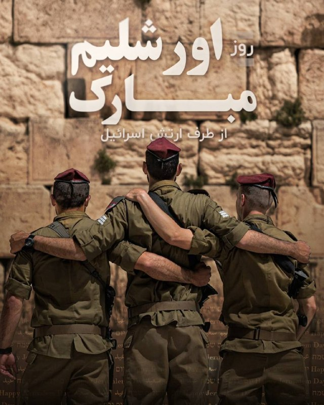

🔵اورشلیم، شهر ادیان و پایتخت ابدی اسرائیل. در روز اورشلیم، ما اتحاد شهری را جشن می‌گیریم که گذشته‌ای کهن و آینده‌ای امیدوار را به هم پیوند می‌دهد. سال نو مبارک، برای اورشلیم و ساکنانش.

## Dirty_Kids — post 389422

جدی پیک می تر از این جنده های حجابی تو دانشگاه وجود نداره، یارو سال اول کارشناسی کامپیوتره بعد استیکر زده رو لپ تاپش LEAVE ME ALONE IM CODING، بیا برو کیرم تو کدت شد

@Dirty_Kids 👻

## Dirty_Kids — post 389421

  <a href="telegram/content/Dirty_Kids_389421_1778746950.mp4" target="_blank">🎬 Download video</a>

پلیس شریف دانمارک vs طرفداران تروریسم جهانی

@Dirty_Kids 👻

## Dirty_Kids — post 389420

  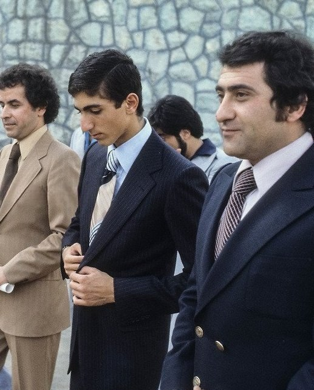

مانوک خدابخشیان: "فعالیتی که برای براندازی پهلوی سوم وجود داره، برای براندازی رژیم وجود نداره. همه تلاش می‌کنند که این شاهزاده پهلوی به ایران برنگرده‌."
روحت شاد عمومانوک

@Dirty_Kids 👻

## Dirty_Kids — post 389416

  <a href="telegram/content/Dirty_Kids_389416_1778746953.mp4" target="_blank">🎬 Download video</a>

#تکمیلی
یه پسره حدود 2 میلیون دلار هزینه کرده تا آلیس رزنبلوم | Alice Rosenblum دختر 19 ساله آمریکایی که مدل اونلی‌فنزه رو از نزدیک ببینه؛

پسره تا رسید بهش گفت چاق‌تر از عکساتی و من روزی 3 بار باهات خودارضایی می‌کنم...

تهشم فقط به دختره دست داد که آلیس چندشش شد و گفت اگه میشه بندازینش بیرون چون داره من رو می‌ترسونه!

@Dirty_Kids 👻

## Hranews — post 112940

  

بر اساس آخرین داده‌های نت‌ بلاکس، قطع اینترنت در ایران پس از گذشت ۱۸۰۰ ساعت، وارد هفتادوششمین روز خود شده است. این نهاد ناظر بر وضعیت دسترسی به اینترنت در جهان اعلام کرد که محدودیت‌های اعمال‌ شده بر پایه نوعی ساختار طبقاتی دنبال می‌شود؛ به‌گونه‌ای که تنها گروهی محدود به #اینترنت دسترسی دارند و عموم شهروندان همچنان در خاموشی دیجیتال به‌سر می‌برند. نت‌ بلاکس این وضعیت را مشابه همان ساختار تبعیض‌آمیزی توصیف کرده که مقام‌های جمهوری اسلامی مدعی مخالفت با آن هستند.

↘️
@hranews_bot تماس ✉️ - @Hranews کانال هرانا 🆑

## Hranews — post 112939

کیفرخواست پرونده صادق زیباکلام و مدیرمسئول خبرگزاری آنا صادر شد

❗️
❗️
❗️
❗️
❗️– مرکز رسانه قوه قضاییه از صدور کیفرخواست علیه صادق زیباکلام و مدیرمسئول خبرگزاری آنا خبر داد. همچنین بر اساس تصمیم قضایی، آقای زیباکلام به مدت سه ماه از هرگونه فعالیت رسانه‌ای و تولید محتوا در شبکه‌های اجتماعی منع شده است.

#صادق_زیباکلام

ادامه مطلب

↘️
@hranews_bot تماس ✉️ - @Hranews کانال هرانا 🆑

## Hranews — post 112938

اموال ۴۸ شهروند در استان همدان مصادره شد

❗️
❗️
❗️
❗️
❗️– دارایی‌ها و اموال ۴۸ شهروند در استان همدان توقیف شد. دستگاه قضایی این افراد را متهم به «همکاری با دشمن» دانسته است. ۴۲ تن از این شهروندان ساکن کشور‌های خارجی و مابقی در ایران سکونت دارند.

ادامه مطلب

↘️
@hranews_bot تماس ✉️ - @Hranews کانال هرانا 🆑

## manototv — post 105432

  <a href="telegram/content/manototv_105432_1778746955.mp4" target="_blank">🎬 Download video</a>

سازمان دریانوردی تجاری بریتانیا اعلام کرد یک کشتی در سواحل امارات و در نزدیکی تنگه هرمز دچار حادثه شده است.
بر اساس این گزارش، افرادی «غیرمجاز» کنترل این کشتی را در دست گرفته‌اند و شناور اکنون به‌سمت آب‌های سرزمینی ایران در حرکت است. این نهاد دریایی بریتانیا اعلام کرد کشتی در فاصله ۳۸ مایلی سواحل فجیره قرار داشته است.

## manototv — post 105431

  <a href="telegram/content/manototv_105431_1778746956.mp4" target="_blank">🎬 Download video</a>

پلیس بریتانیا اعلام کرد دومین فرد در چارچوب تحقیقات ضدتروریسم درباره آتش‌سوزی در یک کنیسه در شرق لندن متهم شده است.
براساس اعلام پلیس، یک مرد ۳۱ ساله در ارتباط با این حمله بازداشت و تفهیم اتهام شده و تحقیقات درباره انگیزه و جزئیات حادثه ادامه دارد.

## manototv — post 105430

  <a href="telegram/content/manototv_105430_1778746956.mp4" target="_blank">🎬 Download video</a>

همزمان با آغاز نشست وزیران خارجه کشورهای عضو بریکس در دهلی‌نو، عباس عراقچی، وزیر خارجه ایران، از اعضای این گروه و «همه کشورهای مسئول جامعه جهانی» خواست حملات آمریکا و اسرائیل علیه ایران را به‌صراحت محکوم کنند.
خبرگزاری رویترز گزارش داد جنگ ایران و اسرائیل بر نشست دو روزه بریکس در هند سایه انداخته و اختلاف‌ها میان اعضا، رسیدن به موضعی مشترک و صدور بیانیه نهایی را دشوار کرده است. ایران از هند، رئیس دوره‌ای بریکس، خواسته از این نشست برای ایجاد اجماع علیه واشینگتن و تل‌آویو استفاده کند

## manototv — post 105428

  <a href="telegram/content/manototv_105428_1778746957.mp4" target="_blank">🎬 Download video</a>

رسانه‌های وابسته به قوه قضاییه جمهوری اسلامی گزارش دادند با دستور مقام قضایی در استان همدان، اموال ۴۷ نفر که به «جاسوسی» و «همکاری با رژیم اسرائیل» متهم شده‌اند، توقیف شده است.
براساس این گزارش‌ها، این افراد در کشورهای مختلف از جمله بریتانیا، آلمان، آمریکا، ترکیه، عراق و سوئیس اقامت دارند و مقام‌های قضایی جمهوری اسلامی اعلام کرده‌اند پرونده آن‌ها در حال بررسی است. به گفته رسانه میزان، اموال توقیف‌شده قرار است برای «بازسازی اماکن آسیب‌دیده از جنگ» هزینه شود.

## manototv — post 105427

  <a href="telegram/content/manototv_105427_1778746958.mp4" target="_blank">🎬 Download video</a>

دونالد ترامپ، رئیس‌جمهوری آمریکا، در دیدار با شی جین‌پینگ در پکن، این نشست را «بسیار مهم» توصیف کرد و گفت توجه گسترده‌ای در آمریکا و جهان به این دیدار وجود دارد.
ترامپ با اشاره به اهمیت این مذاکرات گفت برخی این نشست را «بزرگ‌ترین دیدار تاریخ» می‌دانند و تاکید کرد مردم آمریکا تقریبا درباره موضوع دیگری صحبت نمی‌کنند. او همچنین حضور در کنار شی جین‌پینگ را «باعث افتخار» دانست و ابراز امیدواری کرد روابط میان آمریکا و چین «بهتر از هر زمان دیگری» شود.

## manototv — post 105426

  <a href="telegram/content/manototv_105426_1778746959.mp4" target="_blank">🎬 Download video</a>

دونالد ترامپ و شی جین‌پینگ، روسای جمهوری آمریکا و چین، در پکن دیدار کردند؛ دیداری که با مراسمی گسترده و تشریفات پرزرق‌وبرق همراه بود و صبح پنج‌شنبه با حضور هیات‌های بلندپایه دو کشور برگزار شد.
ترامپ در سخنان آغازین خود این دیدار را «باعث افتخار» توصیف کرد و گفت:
«رئیس‌جمهوری شی، بسیار سپاسگزارم. چنین استقبالی کمتر دیده‌ام. بیش از همه تحت تأثیر کودکان قرار گرفتم؛ شاد و فوق‌العاده بودند. ارتش چین قدرتمند بود، اما آن کودکان چیزهای زیادی را نمایندگی می‌کنند.»

## manototv — post 105425

  <a href="telegram/content/manototv_105425_1778746960.mp4" target="_blank">🎬 Download video</a>

دونالد ترامپ، رئیس‌جمهوری آمریکا، صبح پنج‌شنبه در جریان سفر خود به پکن همراه با شی جین‌پینگ، رئیس‌جمهوری چین، در مراسم رسمی استقبال و رژه نیروهای نظامی این کشور شرکت کرد.
این مراسم در مقابل ساختمان «تالار بزرگ خلق» برگزار شد و دو رهبر ضمن بازدید از یگان‌های نظامی، شاهد اجرای مراسم سان و رژه نیروهای ارتش چین بودند.

## alonews — post 119876

محسن مسلمان که حسابی تو تجمعات حامیان حکومت فعال بود، به کادرفنی تیم امید پرسپولیس پیوست.
@AloSport

## alonews — post 119875

  <a href="telegram/content/alonews_119875_1778746962.webm" target="_blank">🎬 Download video</a>

👈دقایقی پیش زمین‌لرزه‌ای ۵ ریشتری در عمق ۸ کیلومتری بردسیر کرمان را لرزاند

✅ @AloNews خبر جنگ

## alonews — post 119874

  <a href="telegram/content/alonews_119874_1778746962.webm" target="_blank">🎬 Download video</a>

👈فواد ایزدی، تحلیلگر ارشد صدا و سیما: ترامپ رفته چین تا التماس کنه که ایران ولش کنه و انقدر نزنیمش

✅ @AloNews خبر جنگ

## alonews — post 119873

  <a href="telegram/content/alonews_119873_1778746962.webm" target="_blank">🎬 Download video</a>

👈وزارت خارجه چین: پکن و واشنگتن بر سر جهت‌گیری جدید روابط توافق کردند

✅ @AloNews خبر جنگ

## alonews — post 119872

  <a href="telegram/content/alonews_119872_1778746963.webm" target="_blank">🎬 Download video</a>

👈وزارت امور خارجه هند اعلام کرد که یک کشتی با پرچم هند در سواحل عمان دیروز مورد حمله قرار گرفت، این حادثه را «غیرقابل قبول» دانست و نگرانی خود را از هدف قرار گرفتن مداوم کشتی‌های تجاری و دریانوردان غیرنظامی ابراز کرد.

🔴 دهلی نو تأیید کرد که همه اعضای خدمه هندی حاضر در کشتی در امنیت هستند و از مقامات عمانی برای انجام عملیات نجات تشکر کرد.

✅ @AloNews خبر جنگ

## alonews — post 119871

  <a href="telegram/content/alonews_119871_1778746963.webm" target="_blank">🎬 Download video</a>

👈تسنیم: کیفرخواست زیباکلام و مدیرمسئول خبرگزاری آنا صادر شد ممنوعیت زیباکلام از انجام هرگونه فعالیت رسانه‌ای به مدت سه ماه صادر شده

✅ @AloNews خبر جنگ

## alonews — post 119870

👈جهت رزرو تبلیغات vpn در کانال #الونیوز به کانال زیر مراجعه کنید👇

📃https://t.me/ads_alonews

📃https://t.me/ads_alonews

## alonews — post 119868

  <a href="telegram/content/alonews_119868_1778746963.webm" target="_blank">🎬 Download video</a>

👈تورم تخم مرغی!

🔴با ۵۰۰ هزارتومان(هزینه هر شانه تخم مرغ در این ماه) در ماه های مختلف چند شانه تخم مرغ می‌توان خرید؟

✅ @AloNews خبر جنگ

## alonews — post 119867

  <a href="telegram/content/alonews_119867_1778746963.webm" target="_blank">🎬 Download video</a>

🔴فوری/سازمان تجارت دریایی بریتانیا اعلام کرد: قایق های تندرو سپاه یک کشتی را که خارج از تنگه هرمز لنگر انداخته بود را تهدید به هدف قرار دادن و سپس توقیف کردند و اکنون در حال بردن آن به سوی بنادر ایران هستند.

✅ @AloNews خبر جنگ

## alonews — post 119866

  <a href="telegram/content/alonews_119866_1778746964.webm" target="_blank">🎬 Download video</a>

👈خبرگزاری دولتی شینهوا: رهبران چین و آمریکا «درباره مسائل مهم بین‌المللی و منطقه‌ای از جمله وضعیت خاورمیانه تبادل نظر کردند.»

✅ @AloNews خبر جنگ

## alonews — post 119865

  <a href="telegram/content/alonews_119865_1778746964.webm" target="_blank">🎬 Download video</a>

👈سی‌ان‌ان: تایوان اظهارات شی جین پینگ درباره استقلال این جزیره را رد کرد

🔴تایوان پس از آنکه شی جین پینگ، رهبر چین، گفته است استقلال تایوان با صلح «آشتی ناپذیر» است، چین را «تنها منبع» ناامنی در منطقه دانست.

🔴میشل لی، سخنگوی کابینه، در پاسخ به خبرنگاری که درباره اظهارات شی جین پینگ درباره تایوان سوال پرسیده بود، گفت: «تهدید نظامی چین تنها منبع ناامنی در تنگه تایوان و منطقه وسیع‌تر هند-اقیانوس آرام است.» او همچنین گفت: «تقویت مداوم دفاع و بازدارندگی مشترک مؤثر، مهم‌ترین عوامل برای تضمین امنیت منطقه‌ای هستند.»

🔴رسانه‌های دولتی چین گزارش دادند که واکنش تند تایپه پس از آن صورت گرفت که شی جین‌پینگ به دونالد ترامپ، رئیس‌جمهور آمریکا، گفت تایوان «مهم‌ترین مسئله در روابط چین و آمریکا» است و در صورت عدم مدیریت صحیح می‌تواند «وضعیت بسیار خطرناکی» ایجاد کند.

✅ @AloNews خبر جنگ

## alonews — post 119864

  <a href="telegram/content/alonews_119864_1778746964.webm" target="_blank">🎬 Download video</a>

👈تایوان: واشنگتن حمایت آشکار و قاطع خود را از این جزیره تجدید کرد.

🔴تایوان اعلام کرد که ایالات متحده «حمایت آشکار و قاطع» خود را از این جزیره تجدید می‌کند.

✅ @AloNews خبر جنگ

## alonews — post 119863

  <a href="telegram/content/alonews_119863_1778746964.webm" target="_blank">🎬 Download video</a>

👈عدد جدید از خسارت قطعی ۷۴ روزه اینترنت ایران؛ ۳۰۰ تا ۷۰۰ هزار میلیارد تومان

✅ @AloNews خبر جنگ

## alonews — post 119862

  <a href="telegram/content/alonews_119862_1778746965.webm" target="_blank">🎬 Download video</a>

👈ارتش اسرائیل دستور تخلیه 8 شهرک و روستا در دره بقاع و جنوب لبنان را صادر کرد

✅ @AloNews خبر جنگ

## alonews — post 119861

  <a href="telegram/content/alonews_119861_1778746965.webm" target="_blank">🎬 Download video</a>

👈عملیات تجارت دریایی بریتانیا از وقوع حادثه‌ای در ۳۸ مایل دریایی شمال شرقی فجیره خبر داد

🔴برخی رسانه‌ها گزارش دادند، انفجارهایی در سواحل فجیره امارات در پی حمله پهپادی به یک کشتی رخ داده است

✅ @AloNews خبر جنگ

## alonews — post 119860

  <a href="telegram/content/alonews_119860_1778746965.webm" target="_blank">🎬 Download video</a>

👈ارتش آمریکا با استفاده از تاسیسات گارد ساحلی و تاسیسات نظارتی و لجستیکی کویت در جزیره بوبیان اقدام به استقرار سامانه‌های متحرک پرتاب موشک‌های هیمارس در جزیره بوبیان و تعرض به خاک جمهوری اسلامی ایران کرده بود.

🔴این عملیات تجاوزکارانه از خاک کویت در روز ۴ فروردین سال جاری انجام شده بود

✅ @AloNews خبر جنگ

## alonews — post 119859

  <a href="telegram/content/alonews_119859_1778746965.webm" target="_blank">🎬 Download video</a>

👈وزیر انرژی و معادن کوبا اعلام کرد که کشور به طور کامل از دیزل و نفت کوره خالی شده است و تولید برق به صورت کامل متوقف شده، در حالی که ایالات متحده جزیره را محاصره کرده است،

🔴بسیاری از محله‌ها در پایتخت کوبا در حال حاضر با خاموشی‌هایی مواجه هستند که 20 تا 22 ساعت در روز طول می‌کشد.

✅ @AloNews خبر جنگ

## alonews — post 119858

  <a href="telegram/content/alonews_119858_1778746966.webm" target="_blank">🎬 Download video</a>

👈وزارت دفاع اسرائیل و شرکت البیت قابلیتی را برای افزایش برد پرواز جنگنده ادیر (F35) ایجاد خواهند کرد. این قرارداد که ارزش آن ۱۰۰ میلیون تخمین زده می‌شود، شامل توسعه و تطبیق مخازن سوخت خارجی، بر اساس طرح موجود برای هواپیماهای F16، می‌شود.

🔴تصویر اف۱۶ اسرائیلی با مخازن سوخت تطبیقی کنار بدنه

✅ @AloNews خبر جنگ

## alonews — post 119857

  <a href="telegram/content/alonews_119857_1778746966.webm" target="_blank">🎬 Download video</a>

👈عراقچی در نشست وزرای امور خارجه کشورهای عضو بریکس گفت که همان‌گونه که همگی شاهد بوده‌اید، کشور من طی کمتر از یک سال، دو بار هدف تجاوزی وحشیانه و غیرقانونی از سوی ایالات متحده و اسرائیل قرار گرفته است. 
🔴حقیقت آن است که ایران، همانند بسیاری از کشورهای مستقل،…

---
📅 بروزرسانی: 1405/02/24 09:06
---

## VahidOOnLine — post 240044

  

نتایج یک نظرسنجی ملی نشان می‌دهد مارکو روبیو، وزیر خارجه آمریکا، در رقابت برای نامزدی حزب جمهوری‌خواه در انتخابات ریاست‌جمهوری ۲۰۲۸ از جی‌دی ونس پیشی گرفته است. این نظرسنجی را موسسه اطلس‌اینتل در فاصله ۱۳ تا ۱۷ اردیبهشت انجام داده است.

بر اساس این نظرسنجی، روبیو با ۴۵.۴ درصد حمایت در صدر قرار دارد، در حالی که جی‌دی ونس ۲۹.۶ درصد آرا را به دست آورده است. ران دی‌سانتیس نیز با ۱۱.۲ درصد در جایگاه سوم قرار دارد.

این نتایج در مقایسه با پنج ماه پیش تغییر چشمگیری نشان می‌دهد. در آن زمان، ونس با ۴۶.۷ درصد پیشتاز بود و روبیو ۲۲.۶ درصد حمایت داشت. گزارش شده است که افزایش حمایت از روبیو پس از دوره‌ای از فعالیت‌های دیپلماتیک فشرده او، از اوکراین تا کوبا و ایران، رخ داده است.
‌🏁 🇬🇧 IranintlTV

🤖 @VahidOOnLine

## VahidOOnLine — post 240043

⭕️جنگ ایران بسته‌بندی چیپس در ژاپن را سیاه‌وسفید کرد

♦️شرکت ژاپنی «کالبی»، بزرگ‌ترین تولیدکننده چیپس در ژاپن، اعلام کرد به‌دلیل کمبود مواد اولیه ناشی از جنگ ایران و اختلال در بازار نفت، بسته‌بندی برخی محصولات خود را از رنگی به سیاه‌وسفید تغییر می‌دهد.

این شرکت دلیل تصمیم خود را اختلال در تامین مواد موردنیاز تولید جوهر چاپ، به‌ویژه «نفتا» عنوان کرده؛ ماده‌ای نفتی که بخش مهمی از صنایع شیمیایی و بسته‌بندی به آن وابسته‌اند.

اختلال در تنگه هرمز و افزایش بهای نفت، طی هفته‌های اخیر فشار قابل‌توجهی بر صنایع آسیایی وارد کرده و مقام‌های ژاپنی پیش‌تر نسبت به تاثیر «گسترده» بحران انرژی بر منطقه هشدار داده بودند.
‌🇸🇦 Indypersian

🤖 @VahidOOnLine

## VahidOOnLine — post 240042

  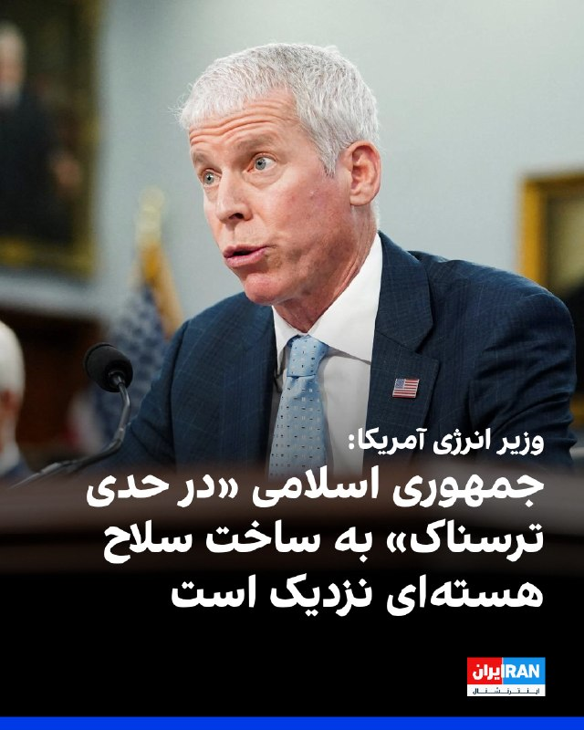

کریس رایت، وزیر انرژی آمریکا، هشدار داد جمهوری اسلامی «در حدی ترسناک» به ساخت سلاح هسته‌ای نزدیک شده است و تنها چند هفته با غنی‌سازی یک تُن اورانیوم تا سطح تسلیحاتی فاصله دارد.
رایت چهارشنبه شب در نشست کمیته نیروهای مسلح سنا گفت بخشی از ذخایر اورانیوم ایران تا ۶۰ درصد و مقدار زیادی نیز تا ۲۰ درصد غنی‌سازی شده است؛ در حالی که سطح حدود ۹۰ درصد برای سلاح هسته‌ای مناسب است. او تأکید کرد حتی پس از غنی‌سازی، مرحله «تسلیحاتی‌سازی» باقی می‌ماند اما ایران به این مرحله «بسیار نزدیک» شده است.
وزیر انرژی آمریکا راهبرد «عاقلانه» را توقف کامل برنامه هسته‌ای ایران و جلوگیری از هرگونه غنی‌سازی در آینده دانست. دولت ترامپ بارها ذخایر اورانیوم غنی‌شده تهران را از دلایل اصلی اقدام نظامی اعلام کرده است.

‌🏁 🇬🇧 IranintlTV

🤖 @VahidOOnLine

## VahidOOnLine — post 240041

  

ریک اسکات، سناتور جمهوری‌خواه آمریکا، گفت شعار «مرگ بر آمریکا» از سوی جمهوری اسلامی باید جدی گرفته شود و آن را نه یک شعار سیاسی، بلکه «یک وعده» توصیف کرد.
او در شبکه ایکس نوشت تهران نزدیک به نیم قرن این شعار را تکرار کرده و افزود: «وقتی دشمن به شما می‌گوید چه کسی است، باورش کنید. پیروزی برای آمریکا یک گزینه نیست، تنها گزینه است.»

‌🏁 🇬🇧 IranintlTV

🤖 @VahidOOnLine

## VahidOOnLine — post 240040

  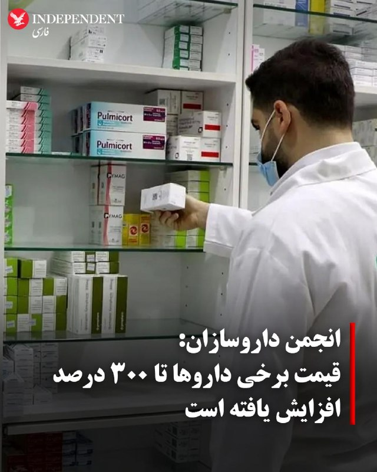

♦️انجمن داروسازان ایران اعلام کرد قیمت دارو در سال ۱۴۰۵ به‌طور میانگین بین ۳۰ تا ۷۰ درصد افزایش یافته و در برخی اقلام خاص، رشد قیمت‌ها به ۳۰۰ درصد رسیده است.
هادی احمدی، مدیر روابط عمومی انجمن داروسازان ایران، در گفتگو با دیده‌بان ایران گفت بیشترین افزایش قیمت مربوط به برخی داروهای خارجی بوده است. او افزود بخش عمده هزینه‌های تولید و واردات دارو به نرخ ارز وابسته است و حدود ۷۰ درصد هزینه‌ها به‌صورت مستقیم یا غیرمستقیم با ارز ارتباط دارد.
احمدی همچنین از اختلال در تامین مواد اولیه دارو به‌دلیل «محاصره دریایی» خبر داد و گفت این مسئله روند تامین برخی اقلام را با مشکل مواجه کرده است.
مدیر روابط عمومی انجمن داروسازان ایران درباره کمبود دارو نیز گفت بخشی از این کمبودها ناشی از مشکلات مالی و نبود نقدینگی در صنعت دارو است.
‌🇸🇦 Indypersian

🤖 @VahidOOnLine

## VahidOOnLine — post 240039

  

شی جین‌پینگ در دیدار با ترامپ در پکن هشدار داد اگر مسئله تایوان به‌درستی مدیریت نشود، چین و آمریکا ممکن است وارد برخورد یا حتی درگیری شوند و روابط دو کشور به «وضعیتی بسیار خطرناک» کشیده شود.
رییس‌جمهوری چین تایوان را مهم‌ترین موضوع در روابط پکن–واشینگتن خواند. چین این جزیره دموکراتیک را بخشی از قلمرو خود می‌داند، اما تایپه این ادعا را رد می‌کند. پکن همچنین با فروش سلاح آمریکا به تایوان مخالف است.

‌🏁 🇬🇧 IranintlTV

🤖 @VahidOOnLine

## VahidOOnLine — post 240038

  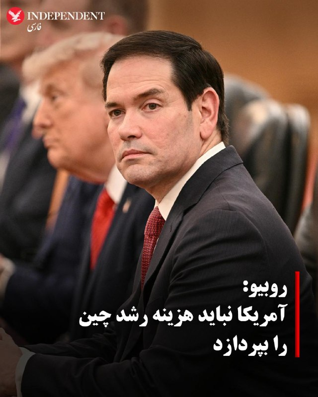

♦️مارکو روبیو، وزیر خارجه آمریکا، در مسیر سفر به چین در گفتگو با خبرنگاران گفت واشنگتن مخالف رشد چین نیست، اما این رشد «نباید به قیمت سقوط آمریکا» تمام شود.
روبیو در پاسخ به سوالی درباره شی جین‌پینگ، رئیس‌جمهوری چین، گفت پکن برنامه‌ای روشن برای تبدیل شدن به قدرتمندترین کشور جهان دارد و در حال اجرای آن است.
او افزود: «ما تلاشی برای محدود کردن چین نمی‌کنیم، اما رشد آن‌ها نمی‌تواند به قیمت ما تمام شود. رشد آن‌ها نمی‌تواند به قیمت سقوط ما باشد.»
وزیر خارجه آمریکا تاکید کرد دولت چین با اعتمادبه‌نفس در حال پیشبرد اهداف خود است و این رویکرد از منظر یک «دولت-ملت» قابل درک است، اما زمانی که این برنامه با منافع ملی ایالات متحده در تضاد قرار بگیرد، واشنگتن «کاری را انجام خواهد داد که برای آمریکا درست است.»
روبیو همچنین گفت این اختلاف دیدگاه در سفر او به چین مطرح خواهد شد و آن را یکی از ویژگی‌های اصلی روابط واشنگتن و پکن توصیف کرد.
‌🇸🇦 Indypersian

🤖 @VahidOOnLine

## VahidOOnLine — post 240037

  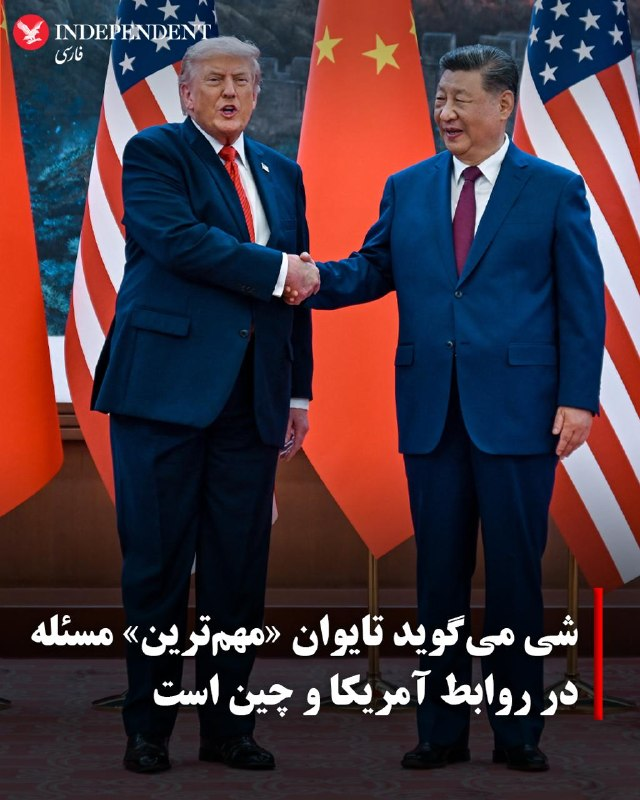

♦️طبق گزارش خبرگزاری دولتی چین، شینهوا، شی جین‌پینگ در جریان گفت‌وگوهای جاری با دونالد ترامپ، موضوع حساس تایوان را مطرح کرده است.
شی تاکید کرد که «مسئله تایوان مهم‌ترین موضوع در روابط چین و آمریکا است.»
شینهوا به نقل از او گزارش داد: «اگر این موضوع به‌درستی مدیریت شود، روابط دو کشور می‌تواند در مجموع ثبات خود را حفظ کند. اما اگر به‌درستی مدیریت نشود، دو کشور ممکن است با یکدیگر برخورد کرده یا حتی وارد درگیری شوند و کل روابط چین و آمریکا را به وضعیتی بسیار خطرناک سوق دهند.»
‌🇸🇦 Indypersian

🤖 @VahidOOnLine

## VahidOOnLine — post 240036

  

ترامپ در دیدار با شی‌جین پینگ در پکن این رویداد را «یکی بزرگ‌ترین نشست‌های تاریخ» خواند و گفت در این سفر هیئتی ۳۰ نفره از بزرگ‌ترین و بهترین بازرگانان جهان را به همراه خود آورده است.
او گفت: «ما از ۳۰ نفر برتر جهان دعوت کردیم. تک‌تک آنها پاسخ مثبت دادند. من نفر دوم یا سوم هیچ شرکتی را نمی‌خواستم؛ فقط برترین‌ها را می‌خواستم. آنها امروز اینجا هستند تا به شما و به چین ادای احترام کنند و مشتاق تجارت و انجام کسب‌وکار هستند و این روند از طرف ما کاملا متقابل خواهد بود.»
ترامپ گفت: «بسیار مشتاق گفت‌وگوی خود هستم. این گفت‌وگویی بزرگ است. برخی می‌گویند شاید این بزرگ‌ترین نشست تاریخ باشد. آنها هرگز چیزی شبیه به آن را به یاد نمی‌آورند.»

‌🏁 🇬🇧 IranintlTV

🤖 @VahidOOnLine

## VahidOOnLine — post 240035

  

♦️برخی از مشهورترین مدیران ارشد آمریکایی که همراه دونالد ترامپ سفر کرده‌اند، هنگام خروج از ورودی اصلی تالار بزرگ خلق و هم‌زمان با آغاز نشست دو رهبر، فضای صبح را مثبت و سازنده توصیف کردند.
وقتی خبرنگاران از ایلان ماسک ــ میلیاردر و بنیان‌گذار تسلا و اسپیس‌ایکس ــ پرسیدند دیدارها چگونه بوده، او پاسخ داد: «فوق‌العاده.»
او در پاسخ به این سوال که چه دستاوردی حاصل شده است، گفت: «اتفاقات خوب زیادی.»
تیم کوک، مدیرعامل اپل که قرار است اواخر امسال از سمت خود کناره‌گیری کند، ابتدا علامت صلح نشان داد و سپس انگشت شست خود را بالا برد.
جنسن هوانگ، مدیر شرکت فناوری انویدیا، نیز هنگام پایین آمدن مدیران از پله‌ها به سمت اتوبوس منتظرشان گفت: «دیدارها خوب پیش رفت. شی و رئیس‌جمهور ترامپ فوق‌العاده بودند.»
اوایل روز پنج‌شنبه، این مدیران در کنار مقام‌های دولت ترامپ روی پله‌های تالار بزرگ خلق در انتظار ورود ترامپ دیده شدند و هیات چینی نیز در نزدیکی آن‌ها حضور داشت؛ اما هنگام آغاز گفت‌وگوهای ترامپ و شی، آن‌ها داخل اتاق مذاکرات دیده نشدند.
پیش از این سفر، سخنگوی کاخ سفید گفته بود انتظار می‌رود گفت‌وگوها شامل ادامه کار روی «شورای تجارت آمریکا و چین» و «شورای سرمایه‌گذاری آمریکا و چین» باشد.
‌🇸🇦 Indypersian

🤖 @VahidOOnLine

## VahidOOnLine — post 240034

♦️دونالد ترامپ، رئیس‌جمهوری آمریکا، صبح پنجشنبه در آغاز گفتگوهای دوجانبه با شی جین‌پینگ در تالار بزرگ خلق پکن گفت روابط شخصی خوبی با رئیس‌جمهوری چین داشته و دو طرف در زمان بروز اختلاف‌ها، مشکلات را «خیلی سریع» حل کرده‌اند.
ترامپ خطاب به شی جین‌پینگ گفت: «رابطه فوق‌العاده‌ای داشتیم. هر وقت مشکلی پیش می‌آمد، من با شما تماس می‌گرفتم و شما هم با من تماس می‌گرفتید. مردم این را نمی‌دانند، اما هر وقت مشکلی داشتیم، خیلی سریع آن را حل می‌کردیم.»
او همچنین تاکید کرد آمریکا و چین «آینده فوق‌العاده‌ای» در روابط دوجانبه خواهند داشت.
‌🇸🇦 Indypersian

🤖 @VahidOOnLine

## VahidOOnLine — post 240033

  <a href="telegram/content/VahidOOnLine_240033_1778736997.mp4" target="_blank">🎬 Download video</a>

♦️رسانه‌های بین‌المللی با اشاره به استقبال گرم چین از ترامپ گزارش داده‌اند که این خوشامدگویی پرشور با صحنه‌هایی که کودکان چینی پرچم آمریکا را دار دست دارند و سرود ملی آمریکا پخش می‌شود، برای رئیس‌جمهوری آمریکا خوشایند بوده است. گاردین می‌نویسد: رئیس‌جمهور آمریکا احتمالا از تشریفات سرد و حساب‌شده‌ای که در تالار بزرگ خلق در پکن از او استقبال کرد، لذت برده است: فرش قرمز، شلیک توپ، موسیقی نظامی و نیروهایی با یونیفورم‌های تشریفاتی که با تفنگ‌های سرنیزه‌دار در صفوف منظم رژه می‌رفتند.
ترامپ برای تشویق کودکانی که با شور و حال، پرچم‌ها و گل‌ها را با نوعی ستایش نمایشی تکان می‌دادند، توقف کرد. او همچنین مشاهده کرد که شی جین‌پینگ با صمیمیت با پسرش اریک و نیز با نظریه‌پرداز راست‌گرای مورد علاقه‌اش، استیون میلر، دست داد. به گزارش این روزنامه بریتانیایی، زمانی که دو طرف در یک اتاق بزرگ و رسمی برای مذاکرات نشستند، ترامپ گفت: «این افتخاری بود که کمتر کسی در تاریخ دیده است»
‌🇸🇦 Indypersian

🤖 @VahidOOnLine

## VahidOOnLine — post 240032

  

♦️ داده‌های رهگیری کشتی ال‌اس‌ای‌جی LSEG نشان می‌دهد یک نفتکش حامل نفت خام با پرچم پاناما که توسط گروه پالایشی ژاپنی «انیوس» (Eneos) مدیریت می‌شود، از تنگه هرمز عبور کرده است؛ این دومین مورد از عبور یک کشتی مرتبط با ژاپن از این مسیر است. پیش از آنکه جنگ آمریکا و اسرائیل علیه ایران تا حد زیادی عرضه نفت از طریق تنگه هرمز را مختل کند، ژاپن حدود ۹۵ درصد واردات نفت خود را از خلیج فارس تامین می‌کرد. این نفتکش که توسط انیوس مدیریت می‌شود، حامل ۱.۲ میلیون بشکه نفت خام کویت و ۷۰۰ هزار بشکه نفت «داس بلِند» امارات است که در اواخر فوریه بارگیری شده بود. طبق داده‌های کپلر، این کشتی قرار است در ۳ ژوئن به ژاپن برسد. هنوز مشخص نیست این عبور تحت چه ترتیباتی انجام شده است. شرکت انیوس، بزرگ‌ترین گروه پالایشی ژاپن، از اظهارنظر خودداری کرده است. این عبور جدید از تنگه هرمز پس از عبور نفتکش «ایدمیتسو مارو» در اواخر آوریل رخ داده است؛ نفتکشی که نفت عربستان سعودی را حمل می‌کرد و توسط یکی از زیرمجموعه‌های شرکت ایدمیتسو کوسان Idemitsu Kosan مدیریت می‌شد. ایدمیتسو، دومین گروه بزرگ پالایش نفت ژاپن، این هفته اعلام کرد انتظار دارد تنگه هرمز بین ژوئیه تا سپتامبر دوباره بازگشایی شود و قیمت نفت شاخص دبی تا پایان سال مالی مارس ۲۰۲۷ به سطح پیش از جنگ بازگردد. به گزارش رویترز، در حالی که پالایشگاه‌های ژاپن از ذخایر استراتژیک استفاده می‌کنند و تامین جایگزین از مناطقی مانند ایالات متحده و منطقه خزر را افزایش داده‌اند، فعالیت پالایشگاه‌ها در این ماه دوباره به حالت عادی نزدیک شده و برای نخستین بار از اواخر مارس از ۷۰ درصد فراتر رفته است. یک نفتکش بسیار بزرگ چین که نفت عراق را حمل می‌کرد نیز روز چهارشنبه از تنگه عبور کرد و پیش از نشست پکن میان رهبران آمریکا و چین از خلیج فارس خارج شد.
‌🇸🇦 Indypersian

🤖 @VahidOOnLine

## VahidOOnLine — post 240031

♦️مارکو روبیو، وزیر خارجه آمریکا هنگام ورود به «تالار بزرگ خلق» در پکن به همراه ترامپ و دیگر مقامات دولت، به سقف این سالن نگاه می‌کند و سعی می‌کند توجه پیت هگست، وزیر جنگ را نیز جلب کند. این تالار در سال ۱۹۵۹ میلادی در ضلع غربی میدان تیان‌آن‌من افتتاح شد و محل برگزاری جلسات کنگره ملی خلق چین و نشست‌های رسمی دیپلماتیک (مثل دیدارهای سران کشورها) است.این ساختمان یکی از پروژه‌های بزرگ «ده ساختمان مهم» در دوره مائو تسه‌تونگ بود که با هدف نمایش قدرت و مدرن‌سازی سریع چین ساخته شد. طراحی آن ترکیبی از معماری رسمی سوسیالیستی و عناصر سنتی چینی است و روی سقف آن نقوش سنتی کلاسیک چین دیده می‌شود.
‌🇸🇦 Indypersian

🤖 @VahidOOnLine

## VahidOOnLine — post 240030

  

شی جین‌پینگ در دیدار با ترامپ در پکن ابراز امیدواری کرد سال ۲۰۲۶ سالی تاریخی و نقطه‌عطفی برای روابط چین و آمریکا باشد «تا گذشته را ادامه دهد و درها را به روی آینده بگشاید.»
شی گفت همواره معتقد بوده است منافع مشترک میان چین و آمریکا بر اختلافات دو کشور ارجحیت دارد و موفقیت پکن و واشینگتن فرصتی برای یکدیگر است.
شی ثبات روابط چین و آمریکا را برای جهان امر مثبتی دانست و گفت مشتاق است درباره مسائل مهم با ترامپ تبادل نظر کند.

‌🏁 🇬🇧 IranintlTV

🤖 @VahidOOnLine

## VahidOOnLine — post 240029

  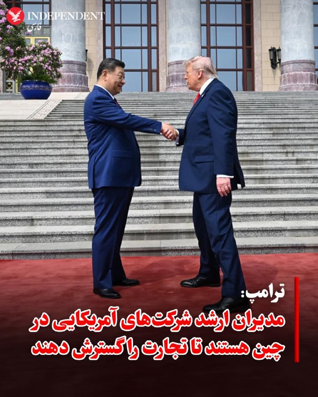

♦️دونالد ترامپ در دیدار با رهبر چین گفت گروهی از مدیران ارشد کسب‌وکار که همراه او به چین آمده‌اند ــ از جمله ایلان ماسک (مدیرعامل تسلا)، جنسن هوانگ (مدیرعامل انویدیا) و تیم کوک (مدیرعامل اپل)  برای «ادای احترام» و گسترش تجارت در این کشور حضور دارند.
ترامپ در سخنان آغازین خود گفت: «ما افراد فوق‌العاده‌ای داریم و همه‌شان همراه من هستند.»
او افزود: «ما از ۳۰ نفر برتر جهان دعوت کردیم. تک‌تک‌شان گفتند بله، و من نفر دوم یا سوم شرکت را نمی‌خواستم؛ فقط نفر اول را می‌خواستم. و امروز اینجا هستند تا به شما و چین ادای احترام کنند و مشتاق تجارت و انجام کسب‌وکار هستند، و این از طرف ما کاملا متقابل خواهد بود.»
ترامپ با ابراز خوش‌بینی در آغاز نشست به شی گفت: «افتخار بزرگی است که با شما هستم. افتخار بزرگی است که دوست شما باشم، و رابطه میان چین و آمریکا از همیشه بهتر خواهد شد.»
پس از مراسم استقبال رسمی، ترامپ گفت از کودکانی که در بیرون با شور و انرژی از او استقبال کردند «به‌طور ویژه تحت تاثیر قرار گرفته است».
او گفت: «آن‌ها خوشحال بودند. زیبا بودند. آن کودکان فوق‌العاده بودند و نماینده چیزهای زیادی هستند.»
‌🇸🇦 Indypersian

🤖 @VahidOOnLine

## VahidOOnLine — post 240028

  

♦️مارکو روبیو، وزیر خارجه آمریکا در گفتگو با مجری فاکس‌نیوز که در «ایرفورس وان» هنگام عزیمت او به چین انجام شد، درباره اظهارات پاپ درمورد ایران که بر دیپلماسی تاکید کرده است گفت: «چه راه‌حل دیپلماتیکی درباره آدولف هیتلر وجود داشت؟ هیچ.» او افزود و متاسفانه به جنگ منجر شد. روبیو گفت که کلیسا بر صلح و دوستی و پرهیز از جنگ تاکید دارد و من هم موافق هستم و ما خواستار جنگ نیستیم اما نسبت به امنیت ملی کشورمان وظیفه داریم و این باید در نظر گرفته شود. روبیو تاکید کرد، این وظیفه ما است که آمریکایی‌ها را در امنیت نگهداریم و به همین دلیل است که در ایران درگیر هستیم، به همین دلیل در هر کاری که در سراسر جهان انجام می‌دهیم درگیر هستیم.
‌🇸🇦 Indypersian

🤖 @VahidOOnLine

## VahidOOnLine — post 240027

  

دونالد ترامپ در دیدار با رییس‌جمهوری چین گفت روابط او و شی جین‌پینگ طولانی‌ترین رابطه میان روسای جمهور دو کشور بوده است و این موضوع را «مایه افتخار» دانست. او تاکید کرد روابط دو کشور «بهتر از هر زمان دیگری خواهد شد.»
ترامپ گفت هر زمان مشکلی پیش آمده، دو طرف مستقیما آن را حل کرده‌اند و آینده روابط واشینگتن و پکن «فوق‌العاده» خواهد بود.
ترامپ با تمجید از شی جین‌پینگ او را «رهبر بزرگی» خواند و گفت برای چین و دستاوردهایش احترام زیادی قائل است.
ترامپ این دیدار را «نشستی بزرگ» توصیف کرد و گفت در آمریکا همه درباره آن صحبت می‌کنند.

‌🏁 🇬🇧 IranintlTV

🤖 @VahidOOnLine

## VahidOOnLine — post 240026

♦️دونالد ترامپ، رئیس‌جمهوری آمریکا، در جریان سفر رسمی به پکن، مورد استقبال پرشور کودکان قرار گرفت.
در مراسم رسمی که پنجشنبه ۲۵ اردیبهشت در تالار بزرگ خلق برگزار شد، کودکان با تکان دادن پرچم‌های دو کشور و اجرای برنامه‌های ویژه از رئیس‌جمهوری آمریکا استقبال کردند.
این استقبال گرم در حالی صورت می‌گیرد که سران دو قدرت بزرگ اقتصادی جهان گفتگوهای فشرده‌ای را درباره مسائل راهبردی، از جمله امنیت آبراه‌های بین‌المللی و توازن تجاری، در دستور کار دارند.
‌🇸🇦 Indypersian

🤖 @VahidOOnLine

## VahidOOnLine — post 240025

  

♦️دونالد ترامپ و شی جین‌پینگ صبح پنجشنبه گفت‌وگوهای دوجانبه خود را در تالار بزرگ خلق، ساختمان مجلس ملی چین، آغاز کردند.
شی در سخنان آغازین خود گفت سال ۲۰۲۶ مصادف با دویست‌وپنجاهمین سال استقلال آمریکا است و افزود ثبات در روابط آمریکا و چین برای ثبات جهانی ضروری است.
ترامپ نیز گفت او و شی «مدت‌هاست یکدیگر را می‌شناسند» و شی را «رهبر بزرگی» توصیف کرد.
ترامپ خطاب به شی گفت: «من به همه می‌گویم شما رهبر بزرگی هستید. گاهی مردم دوست ندارند من این را بگویم، اما باز هم می‌گویم، چون حقیقت دارد.»ترامپ به شی گفت روابط دو کشور «بهتر از همیشه خواهد شد»
شی جین‌پینگ در سخنان افتتاحیه خود گفت همواره معتقد بوده که منافع مشترک چین و آمریکا بر اختلافات میان دو کشور غلبه دارد.
او همچنین گفت موفقیت چین و آمریکا برای یکدیگر یک فرصت است.
ترامپ نیز در پاسخ به او گفت روابط دو کشور «بهتر از همیشه خواهد شد.»شی جین‌پینگ در آغاز سخنان خود با توصیف وضعیت پرتنش جهانی گفت جهان «به یک نقطه عطف جدید رسیده است».
او گفت اکنون این پرسش مطرح است که «آیا چین و ایالات متحده می‌توانند از به‌اصطلاح «دام توسیدید»عبور کنند و الگوی جدیدی از روابط میان قدرت‌های بزرگ را پایه‌گذاری کنند»؛ اصطلاحی که به گرایش به درگیری زمانی اشاره دارد که یک قدرت نوظهور، قدرتی مسلط را به چالش می‌کشد.
شی افزود: «ما باید به‌جای رقیب بودن، شریک باشیم؛ برای موفقیت یکدیگر تلاش کنیم، با هم شکوفا شویم و شیوه‌ای درست برای همزیستی قدرت‌های بزرگ در عصر جدید ایجاد کنیم.»
ترامپ نیز از «روابط فوق‌العاده» خود با شی تمجید کرد.
او افزود هیات آمریکایی مشتاق گفت‌وگو درباره تجارت متقابل است و حضور در این نشست را «افتخار» دانست.
‌🇸🇦 Indypersian

🤖 @VahidOOnLine

## mwarmonitor — post 9062

  <a href="telegram/content/mwarmonitor_9062_1778737003.mp4" target="_blank">🎬 Download video</a>

🇨🇳🇺🇸دونالد ترامپ و شی جین‌پینگ در حال بازدید از «معبد آسمان» در پکن هستند.
🔸خبرنگار: آقای رئیس‌جمهور، گفتگوها چطور بود؟
🔹دونالد ترامپ: عالی بود. جای فوق‌العاده‌ایه. چین زیباست.
مترجم (به چینی): پرزیدنت ترامپ می‌گن که گفتگوها خیلی خوب بوده.
🔸خبرنگار: آقای رئیس‌جمهور، آیا درباره تایوان صحبتی کردید؟
(ترامپ و شی جین‌پینگ بدون پاسخ به سوال، در حال ژست گرفتن برای عکس هستند)
مقام چینی: متشکرم. ممنون. خیلی ممنون.
خبرنگار (دوباره): آقای رئیس‌جمهور، آیا در مورد تایوان صحبت کردید؟
مقام چینی: ممنون از مطبوعات. متشکرم. ممنون.

@mwarmonitor

## mwarmonitor — post 9061

⚽️خبر فوتبالی از نیویورک تایمز:

🎙شکیرا، مدونا و گروه BTS اجرای نخستین نمایش بین دو نیمه را در فینال جام جهانی فوتبال بر عهده خواهند داشت.

@mwarmonitor

## mwarmonitor — post 9060

🇺🇸🇨🇳مراسم رسمی استقبال از دونالد ترامپ با حضور شی جین‌پینگ در چین برگزار شد

💠در این مراسم، رئیس‌جمهور چین با برگزاری تشریفات کامل دیپلماتیک از رئیس‌جمهور آمریکا استقبال کرد؛ رویدادی که در چارچوب سفر رسمی ترامپ به پکن و با هدف بررسی روابط دوجانبه، همکاری‌های اقتصادی و تحولات راهبردی بین دو کشور انجام خواهد گرفت.

@mwarmonitor

## FoxNewsTwitter — post 341700

  <a href="telegram/content/FoxNewsTwitter_341700_1778737005.mp4" target="_blank">🎬 Download video</a>

Fox News (Twitter/X)

NOW: President Trump and President Xi visit Temple of Heaven after having "great" talks.

"China is beautiful."

## FoxNewsTwitter — post 341699

Fox News (Twitter/X)

WATCH LIVE: President Trump and Chinese President Xi Jinping visit Temple of Heaven https://twitter.com/i/broadcasts/1nxnRYlNzoLxO

## FoxNewsTwitter — post 341698

  <a href="telegram/content/FoxNewsTwitter_341698_1778737007.mp4" target="_blank">🎬 Download video</a>

Fox News (Twitter/X)

NOW: President Trump calls Chinese President Xi Jinping a "great leader."

"Sometimes people don't like me saying it, but I say it anyway, because it's true — I always say the truth."

## FoxNewsTwitter — post 341697

  

Fox News (Twitter/X)

NOW: President Trump expressed high hopes for U.S.-China relations at the Great Hall of the People, telling President Xi Jinping it is an honor to be his friend and predicting the partnership will be stronger than ever before.

## FoxNewsTwitter — post 341696

  <a href="telegram/content/FoxNewsTwitter_341696_1778737010.mp4" target="_blank">🎬 Download video</a>

Fox News (Twitter/X)

NOW: President Trump says "it's an honor" after meeting Chinese President Xi Jinping.

"It's an honor to be with you, it's an honor to be your friend, and the relationship between China and the USA is going to be better than ever before."

## FoxNewsTwitter — post 341695

  <a href="telegram/content/FoxNewsTwitter_341695_1778737011.mp4" target="_blank">🎬 Download video</a>

Fox News (Twitter/X)

NOW: President Trump thanks Chinese President Xi Jinping for welcoming him to Beijing, saying he was particularly impressed with the crowd of cheering children during the welcome ceremony.

## FoxNewsTwitter — post 341694

  <a href="telegram/content/FoxNewsTwitter_341694_1778737013.mp4" target="_blank">🎬 Download video</a>

Fox News (Twitter/X)

NOW: President Trump watches a ceremony with Chinese President Xi Jinping after arriving at the Great Hall of People in Beijing.

## FoxNewsTwitter — post 341693

  <a href="telegram/content/FoxNewsTwitter_341693_1778737016.mp4" target="_blank">🎬 Download video</a>

Fox News (Twitter/X)

BREAKING: President Trump receives a warm welcome at the Great Hall of People in Beijing for his meeting with President Xi Jinping.

## FoxNewsTwitter — post 341692

  <a href="telegram/content/FoxNewsTwitter_341692_1778737019.mp4" target="_blank">🎬 Download video</a>

Fox News (Twitter/X)

BREAKING: Chinese President Xi Jinping shakes hands with Secretary Rubio, Secretary Bessent and more in China as he walks with President Trump.

## FoxNewsTwitter — post 341691

  <a href="telegram/content/FoxNewsTwitter_341691_1778737022.mp4" target="_blank">🎬 Download video</a>

Fox News (Twitter/X)

BREAKING: President Trump meets Chinese President Xi Jinping at the Great Hall of People in Beijing.

## FoxNewsTwitter — post 341690

  <a href="telegram/content/FoxNewsTwitter_341690_1778737024.mp4" target="_blank">🎬 Download video</a>

Fox News (Twitter/X)

BREAKING: Chinese President Xi Jinping walks out for his meeting with President Trump.

## FoxNewsTwitter — post 341689

  <a href="telegram/content/FoxNewsTwitter_341689_1778737027.mp4" target="_blank">🎬 Download video</a>

Fox News (Twitter/X)

"There is no economy in Cuba."

Secretary Rubio says he doesn't believe the economic trajectory of Cuba can change under the current government.

## FoxNewsTwitter — post 341688

  <a href="telegram/content/FoxNewsTwitter_341688_1778737030.mp4" target="_blank">🎬 Download video</a>

Fox News (Twitter/X)

NEW: Secretary Rubio says stepping behind the White House press secretary podium wasn't "too bad," but he's not sure if he'd have fun if he had to do it every week.

"Karoline is irreplaceable....We can't wait until Karoline gets back." |@seanhannity

## FoxNewsTwitter — post 341687

  

Fox News (Twitter/X)

WATCH LIVE: President Trump and President Xi Jinping meet for bilateral talks https://twitter.com/i/broadcasts/1nJOLEBAamlxR

## pm_afshaa — post 90711

🔴روبیو: واشنگتن به پکن روشن کرد که هرگونه حمایت از ایران به روابط دوجانبه آسیب می رساند

💧 Rainbet.com the #1 Non-KYC Crypto Casino & Sportsbook @rainbetcom

😁 @Pm_Afshaa

## VahidOnline — post 75455

  <a href="telegram/content/VahidOnline_75455_1778737033.mp4" target="_blank">🎬 Download video</a>

خبرگزاری مهر پرچم حزب‌الله را در ویدیوی مربوط به بدرقه فوتبالیست‌ها سانسور کرد.
FattahiFarzad
اعضای تیم فوتبال چهارشنبه‌شب ۲۳ اردیبهشت‌ماه در میدان انقلاب تهران برای حضور در جام جهانی ۲۰۲۶ بدرقه شدند؛ رقابت‌هایی که خرداد و تیر ۱۴۰۵ به میزبانی مشترک آمریکا، مکزیک و کانادا برگزار خواهد شد.
@VahidOOnLine

📡 @VahidOnline

## IranIntlTV — post 337104

  

نتایج یک نظرسنجی ملی نشان می‌دهد مارکو روبیو، وزیر خارجه آمریکا، در رقابت برای نامزدی حزب جمهوری‌خواه در انتخابات ریاست‌جمهوری ۲۰۲۸ از جی‌دی ونس پیشی گرفته است. این نظرسنجی را موسسه اطلس‌اینتل در فاصله ۱۳ تا ۱۷ اردیبهشت انجام داده است.

بر اساس این نظرسنجی، روبیو با ۴۵.۴ درصد حمایت در صدر قرار دارد، در حالی که جی‌دی ونس ۲۹.۶ درصد آرا را به دست آورده است. ران دی‌سانتیس نیز با ۱۱.۲ درصد در جایگاه سوم قرار دارد.

این نتایج در مقایسه با پنج ماه پیش تغییر چشمگیری نشان می‌دهد. در آن زمان، ونس با ۴۶.۷ درصد پیشتاز بود و روبیو ۲۲.۶ درصد حمایت داشت. گزارش شده است که افزایش حمایت از روبیو پس از دوره‌ای از فعالیت‌های دیپلماتیک فشرده او، از اوکراین تا کوبا و ایران، رخ داده است.
https://iranintl.com/202605148918

## IranIntlTV — post 337103

  

کریس رایت، وزیر انرژی آمریکا، هشدار داد جمهوری اسلامی «در حدی ترسناک» به ساخت سلاح هسته‌ای نزدیک شده است و تنها چند هفته با غنی‌سازی یک تُن اورانیوم تا سطح تسلیحاتی فاصله دارد.
رایت چهارشنبه شب در نشست کمیته نیروهای مسلح سنا گفت بخشی از ذخایر اورانیوم ایران تا ۶۰ درصد و مقدار زیادی نیز تا ۲۰ درصد غنی‌سازی شده است؛ در حالی که سطح حدود ۹۰ درصد برای سلاح هسته‌ای مناسب است. او تأکید کرد حتی پس از غنی‌سازی، مرحله «تسلیحاتی‌سازی» باقی می‌ماند اما ایران به این مرحله «بسیار نزدیک» شده است.
وزیر انرژی آمریکا راهبرد «عاقلانه» را توقف کامل برنامه هسته‌ای ایران و جلوگیری از هرگونه غنی‌سازی در آینده دانست. دولت ترامپ بارها ذخایر اورانیوم غنی‌شده تهران را از دلایل اصلی اقدام نظامی اعلام کرده است.

https://iranintl.com/202605144976

## IranIntlTV — post 337102

  

ریک اسکات، سناتور جمهوری‌خواه آمریکا، گفت شعار «مرگ بر آمریکا» از سوی جمهوری اسلامی باید جدی گرفته شود و آن را نه یک شعار سیاسی، بلکه «یک وعده» توصیف کرد.
او در شبکه ایکس نوشت تهران نزدیک به نیم قرن این شعار را تکرار کرده و افزود: «وقتی دشمن به شما می‌گوید چه کسی است، باورش کنید. پیروزی برای آمریکا یک گزینه نیست، تنها گزینه است.»

https://iranintl.com/202605145770

## IranIntlTV — post 337101

  

شی جین‌پینگ در دیدار با ترامپ در پکن هشدار داد اگر مسئله تایوان به‌درستی مدیریت نشود، چین و آمریکا ممکن است وارد برخورد یا حتی درگیری شوند و روابط دو کشور به «وضعیتی بسیار خطرناک» کشیده شود.
رییس‌جمهوری چین تایوان را مهم‌ترین موضوع در روابط پکن–واشینگتن خواند. چین این جزیره دموکراتیک را بخشی از قلمرو خود می‌داند، اما تایپه این ادعا را رد می‌کند. پکن همچنین با فروش سلاح آمریکا به تایوان مخالف است.

https://iranintl.com/202605147049

## IranIntlTV — post 337100

  <a href="telegram/content/IranIntlTV_337100_1778737036.mp4" target="_blank">🎬 Download video</a>

سرخط خبرهای پنجشنبه ۲۴ اردیبهشت
@iranintltv

## IranIntlTV — post 337099

  

ترامپ در دیدار با شی‌جین پینگ در پکن این رویداد را «یکی بزرگ‌ترین نشست‌های تاریخ» خواند و گفت در این سفر هیئتی ۳۰ نفره از بزرگ‌ترین و بهترین بازرگانان جهان را به همراه خود آورده است.
او گفت: «ما از ۳۰ نفر برتر جهان دعوت کردیم. تک‌تک آنها پاسخ مثبت دادند. من نفر دوم یا سوم هیچ شرکتی را نمی‌خواستم؛ فقط برترین‌ها را می‌خواستم. آنها امروز اینجا هستند تا به شما و به چین ادای احترام کنند و مشتاق تجارت و انجام کسب‌وکار هستند و این روند از طرف ما کاملا متقابل خواهد بود.»
ترامپ گفت: «بسیار مشتاق گفت‌وگوی خود هستم. این گفت‌وگویی بزرگ است. برخی می‌گویند شاید این بزرگ‌ترین نشست تاریخ باشد. آنها هرگز چیزی شبیه به آن را به یاد نمی‌آورند.»

https://iranintl.com/202605149590

## IranIntlTV — post 337098

  

شی جین‌پینگ در دیدار با ترامپ در پکن ابراز امیدواری کرد سال ۲۰۲۶ سالی تاریخی و نقطه‌عطفی برای روابط چین و آمریکا باشد «تا گذشته را ادامه دهد و درها را به روی آینده بگشاید.»
شی گفت همواره معتقد بوده است منافع مشترک میان چین و آمریکا بر اختلافات دو کشور ارجحیت دارد و موفقیت پکن و واشینگتن فرصتی برای یکدیگر است.
شی ثبات روابط چین و آمریکا را برای جهان امر مثبتی دانست و گفت مشتاق است درباره مسائل مهم با ترامپ تبادل نظر کند.

https://iranintl.com/202605141916

## IranIntlTV — post 337097

  

دونالد ترامپ در دیدار با رییس‌جمهوری چین گفت روابط او و شی جین‌پینگ طولانی‌ترین رابطه میان روسای جمهور دو کشور بوده است و این موضوع را «مایه افتخار» دانست. او تاکید کرد روابط دو کشور «بهتر از هر زمان دیگری خواهد شد.»
ترامپ گفت هر زمان مشکلی پیش آمده، دو طرف مستقیما آن را حل کرده‌اند و آینده روابط واشینگتن و پکن «فوق‌العاده» خواهد بود.
ترامپ با تمجید از شی جین‌پینگ او را «رهبر بزرگی» خواند و گفت برای چین و دستاوردهایش احترام زیادی قائل است.
ترامپ این دیدار را «نشستی بزرگ» توصیف کرد و گفت در آمریکا همه درباره آن صحبت می‌کنند.

https://iranintl.com/202605147699

## IranIntlTV — post 337096

  

ترامپ و شی‌جین‌ پینگ صبح پنج‌شنبه به وقت محلی در مراسم استقبال و رژه نظامیان چین در مقابل «تالار بزرگ خلق» در پکن حضور یافتند. در این مراسم روسای جمهوری آمریکا و چین از نیروهای نظامی سان دیدند.
https://iranintl.com/202605146912

## IranIntlTV — post 337095

  

مارکو روبیو، وزیر خارجه آمریکا، به فاکس‌نیوز گفت تهدید جمهوری اسلامی قابل مصالحه نیست، زیرا حکومت روحانیون در پی دستیابی به سلاح هسته‌ای است. روبیو تاکید کرد جهان به رهبری ترامپ اجازه نخواهد داد جمهوری اسلامی به چنین سلاحی دست پیدا کند.
او افزود تهران قصد داشت با انباشت گسترده پهپاد و موشک، نوعی «مصونیت» برای خود ایجاد کند تا هیچ کشوری نتواند به آن حمله کند و سپس به سمت ساخت سلاح هسته‌ای حرکت کند.
روبیو تاکید کرد رئیس‌جمهور ترامپ اجازه نخواهد داد چنین سناریویی محقق شود.

https://iranintl.com/202605146709

## IranIntlTV — post 337094

  

مایک والتز، سفیر آمریکا در سازمان ملل، با اشاره به حمایت ۱۱۳ کشور از پیش‌نویس قطعنامه شورای امنیت در محکومیت اقدامات جمهوری اسلامی، گفت تهران به دلیل اقدامات غیرقانونی خود، از جمله مین‌گذاری و اعمال عوارض بر کشتیرانی در تنگه هرمز، «منزوی» شده است.
والتز در ایکس نوشت کشورهایی از جمله هند، ژاپن و کره جنوبی از این ابتکار حمایت کرده‌اند.

https://iranintl.com/202605145787

## IranIntlTV — post 337093

  

مایک والتز، سفیر آمریکا در سازمان ملل، با اشاره به حمایت ۱۱۳ کشور از پیش‌نویس قطعنامه شورای امنیت در محکومیت اقدامات جمهوری اسلامی، گفت تهران به دلیل اقدامات غیرقانونی خود، از جمله مین‌گذاری و اعمال عوارض بر کشتیرانی در تنگه هرمز، «منزوی» شده است.
والتز در ایکس نوشت کشورهایی از جمله هند، ژاپن و کره جنوبی از این ابتکار حمایت کرده‌اند.

https://iranintl.com/202605145787

## FarsiVOA — post 217696

  <a href="telegram/content/FarsiVOA_217696_1778737044.mp4" target="_blank">🎬 Download video</a>

⚡️گزارش فرهاد فلاحی از چین؛ واشنگتن از پکن در ارتباط با جمهوری اسلامی چه می‌خواهد؟
@FarsiVOA

## FarsiVOA — post 217695

⚡️مردم درباره سفر پرزيدنت ترامپ به چین چه می‌گویند؟
@FarsiVOA

## FarsiVOA — post 217694

⚡️گفت‌وگو با مسعود کاظم‌زاده و ابراهیم روشندل درباره انتظارات از سفر رئيس جمهوری آمریکا به چین
@FarsiVOA

## FarsiVOA — post 217693

⚡️راهبرد چین در خلیج فارس؛ انرژی حرف اول را می‌زند
@FarsiVOA

## FarsiVOA — post 217692

  <a href="telegram/content/FarsiVOA_217692_1778737045.mp4" target="_blank">🎬 Download video</a>

⚡️چه توقعات اقتصادی می‌توان از سفر دونالد ترامپ به چین داشت؟ گفت‌وگو با نادر حبیبی
@FarsiVOA

## FarsiVOA — post 217691

  <a href="telegram/content/FarsiVOA_217691_1778737047.mp4" target="_blank">🎬 Download video</a>

⚡️گزارش خبرنگار اعزامی صدای آمریکا از سفر رئیس جمهوری آمریکا به چین
@FarsiVOA

## FarsiVOA — post 217690

  <a href="telegram/content/FarsiVOA_217690_1778737048.mp4" target="_blank">🎬 Download video</a>

⚡️سخنان آغازین دونالد ترامپ، رئیس جمهوری آمریکا در دیدار با رئیس جمهوری چین پس از مراسم استقبال رسمی
@FarsiVOA

## FarsiVOA — post 217689

⚡️آیا چین اراده و قدرت این را دارد که جمهوری اسلامی را وادار کند از ناامن‌سازی تنگه هرمز دست بر دارد؟
@FarsiVOA

## FarsiVOA — post 217688

⚡️چه انتظاری از سفر پرزیدنت ترامپ به چین می‌‌توان داشت؟ گفت‌وگو با شهیر شهیدثالث و شکریا برادوست
@FarsiVOA

## FarsiVOA — post 217687

  <a href="telegram/content/FarsiVOA_217687_1778737049.mp4" target="_blank">🎬 Download video</a>

⚡️ادامه خاموشی اینترنت و اعدام‌ها درایران؛ واکنش کاربران
@FarsiVOA

## FarsiVOA — post 217686

⚡️مراسم استقبال رسمی از دونالد ترامپ رئیس جمهوری آمریکا، در چین
@FarsiVOA

## FarsiVOA — post 217685

  

⚡️دونالد ترامپ، رئیس جمهوری آمریکا روز پنج‌شنبه به وقت پکن مورد استقبال رسمی شی جین‌پینگ، رئیس جمهوری چین قرار گرفت. آقای ترامپ در راس یک هئیت عالی‌رتبه سیاسی و اقتصادی وارد چین شده است. انتظار می‌رود که مسئله تنگه هرمز یکی از مسائل مورد گفت‌وگو در این سفر باشد.
@FarsiVOA

## FarsiVOA — post 217684

⚡️تحریم‌های مرتبط با جمهوری اسلامی علیه نهادهای چینی چه اثری دارد؟
@FarsiVOA

## FarsiVOA — post 217683

⚡️نویسندگان زندانی، تصویر ترسناک جهان امروز
@FarsiVOA

## FarsiVOA — post 217682

  <a href="telegram/content/FarsiVOA_217682_1778737050.mp4" target="_blank">🎬 Download video</a>

⚡️ايران، كشورى كه آفلاين است
@FarsiVOA

## Persian_Trend_Official — post 14087

📍بولتن خبری ۲۴ ساعت اخیر پرشین ترند
🗓 ۲۴ اردیبهشت ۱۴۰۵

گرد آوری = آرشیو تحریریه پرشین ترند

◾️ نیویورک تایمز: ایران ۷۰ درصد از ذخایر موشکی خود را حفظ کرده و به ۳۰ سایت از ۳۳ سایت موشکی در تنگه هرمز دسترسی مجدد یافته است

◾️ رویترز: ایران رویکرد خود را از مسدودسازی هرمز به «کنترل دسترسی» تغییر داده؛ عراق و پاکستان به توافق جداگانه برای عبور نفتکش‌هایشان دست یافته‌اند

◾️خبرگزاری Wsj: عبور و مرور «خاموش» کشتی‌ها در تنگه هرمز ۶۰۰ درصد افزایش یافته

◾️ مجلس سنای آمریکا برای هفتمین بار قطعنامه پایان جنگ با ایران را رد کرد

◾️ پنتاگون: هزینه جنگ با ایران به ۲۹ میلیارد دلار رسید؛ تحلیلگران هشدار می‌دهند رقم نهایی به یک تریلیون دلار خواهد رسید

◾️ وزارت بهداشت ایران: تعداد مجروحان بستری جنگ به زیر ۴۰ نفر رسیده است

◾️سخنگوی وزارت خارجه ایران: آمریکا اهمیت فرصت مذاکره را درک نمی‌کند؛ ارزیابی دقیق‌تری از موضع آمریکا از طریق میانجیان پاکستانی دریافت خواهد شد

◾️سخنگوی کمیسیون امنیت ملی: غنی‌سازی ۹۰ درصدی یکی از گزینه‌های مطرح ایران است

◾️وزیر انرژی آمریکا: ایران به طرز نگران‌کننده‌ به غنی‌سازی درجه تسلیحاتی نزدیک شده و ممکن است چند هفته با آستانه ۹۰ درصد فاصله داشته باشد

◾️نروژ با سفر معاون وزیر خارجه به تهران، عمان و پاکستان در حال آزمودن نقش میانجیگری اروپایی است

◾️روسیه آمادگی خود را برای حمایت از تلاش‌های دیپلماتیک پاکستان در حل تنش خاورمیانه اعلام کرد

◾️ایتالیا اعلام کرد در صورت برقراری آتش‌بس پایدار، دو فروند مین‌روب به تنگه هرمز اعزام خواهد کرد

◾️ترامپ وارد پکن شد؛ ایران محور اصلی مذاکرات با شی جین‌پینگ عنوان شده است

◾️ترامپ: آمریکا برای پایان جنگ با ایران به کمک چین نیاز ندارد؛ «به هر شکل پیروز خواهیم شد»

◾️روبیو: واشنگتن امیدوار است پکن ایران را به عقب‌نشینی از رفتارهایش در منطقه متقاعد کند

◾️روبیو و وانگ یی توافق کردند هیچ کشوری حق دریافت عوارض حمل‌ونقل در تنگه هرمز را ندارد

◾️واشنگتن‌پست: گزارش محرمانه اطلاعاتی آمریکا نشان می‌دهد چین از جنگ ایران بهره راهبردی می‌برد؛ پکن در حین حملات ایران به کشورهای خلیج فارس تسلیحات فروخته است

◾️نیویورک تایمز: شرکت‌های چینی درباره فروش مخفیانه سلاح به ایران از طریق کشورهای ثالث مذاکره کرده‌اند

◾️گزارش‌ها حاکی است ایلان ماسک، تیم کوک، جنسن هوانگ و لری فینک در هیئت همراه ترامپ در سفر به پکن حضور دارند

◾️شهباز شریف از ۳ تا ۶ خرداد به پکن سفر می‌کند؛ میانجیگری میان ایران و آمریکا با مشارکت چین از دستور کار اصلی است

◾️وال استریت ژورنال: رئیس موساد دیوید بارنیا در جریان جنگ حداقل دو بار به‌صورت مخفیانه به امارات سفر کرده است

◾️دفتر نخست‌وزیری اسرائیل: نتانیاهو در میانه جنگ سفری محرمانه به امارات داشته؛ امارات این ادعا را تکذیب کرد

◾️داده‌های پروازی منتشرشده نشان می‌دهد دو هواپیمای شخصی در ۲۶ مارس از تل‌آویو به شهر العین امارات پرواز کرده‌اند

◾️وال استریت ژورنال: امارات فراتر از میانجیگری دیپلماتیک عمل کرده؛ حمله به جزیره لاوان و میزبانی سامانه‌های دفاع هوایی اسرائیل به این کشور نسبت داده شده است

◾️رویترز: جنگنده‌های عربستان سعودی اهداف شبه‌نظامیان وابسته به ایران را در نزدیکی مرز عراق بمباران کردند

◾️رویترز: کویت در دو نوبت حملات موشکی تلافی‌جویانه به مواضع شبه‌نظامیان در جنوب عراق انجام داده است

◾️عراقچی: کویت به‌صورت غیرقانونی به شناور ایرانی حمله و ۴ تبعه ایران را در خلیج فارس بازداشت کرده ؛ایران خواستار آزادی فوری آن‌هاست

◾️ احسان افرشته ۳۳ ساله بامداد چهارشنبه به اتهام همکاری با موساد اعدام شد؛ او پیش از بازگشت به ایران داوطلبانه خود را معرفی کرده بود

◾️ عضو کمیسیون بودجه مجلس: ۳۰ درصد از گرانی‌ها ناشی از جنگ و ۳۵ درصد ناشی از ناکارآمدی دستگاه‌هاست

◾️ شبکهNDTV تصاویر ماهواره‌ای منتشر کرد که حضور هواپیمای ترابری C-130H ایران در پایگاه هوایی نورخان پاکستان را تأیید می‌کند

◾️ وزیر دفاع پاکستان: ترکیه و قطر ممکن است به توافق دفاعی متقابل پاکستان و عربستان سعودی بپیوندند

◾️ رایمتال آلمان تولید انبوه پهپاد FV-014 با برد ۱۰۰ کیلومتر و استقامت ۷۰ دقیقه‌ای را آغاز کرد

◾️پنتاگون به‌طور غیرمنتظره اعزام تیپ رزمی زرهی «بلک‌جک» به لهستان را لغو کرد؛ برخی نیروها در مسیر بودند که دستور توقف صادر شد

◾️بلومبرگ: نزدیک به ۴۰ درصد از تأمین‌کنندگان سازندگان موشک دولتی چین در ۲۰۲۵ به درآمد رکوردی رسیدند

◾️ پوتین به تسلط کامل بر دونباس تا پاییز متمرکز شده و قصد دارد از آن برای درخواست قلمرو بیشتر در مذاکرات آتی بهره ببرد

◾️ ترکیه و ارمنستان آماده‌سازی‌های لازم برای راه‌اندازی تجارت مستقیم را تا ۱۱ مه ۲۰۲۶ تکمیل کردند

📌 @persian_trend_official
پرشین ترند | متفاوت‌ترین کانال نظامی

## Persian_Trend_Official — post 14086

  <a href="telegram/content/Persian_Trend_Official_14086_1778737051.mp4" target="_blank">🎬 Download video</a>

صبحتون بخیر ☕️

📝 Nick
📌 @persian_trend_official
پرشین ترند | متفاوت‌ترین کانال نظامی

## RadioFarda — post 157156

  

🔸وزارت خارجه امارات متحده عربی در بیانیه‌ای ادعای دفتر بنیامین نتانیاهو، نخست‌وزیر اسرائیل، مبنی بر سفر او به امارات در جریان جنگ ایران را تکذیب کرد.

🔸دفتر نخست‌وزیر اسرائیل پیش‌تر اعلام کرده بود که نتانیاهو در جریان جنگ با ایران به امارات سفر کرده و با شیخ محمد بن زاید، رئیس این کشور و حاکم ابوظبی دیدار داشته است.

🔸در بیانیه وزارت خارجه امارات که چهارشنبه ۲۴ اردیبهشت منتشر شده، آمده که روابط این کشور با اسرائیل «علنی» است و «بر پایه توافقات غیرشفاف یا غیررسمی بنا نشده است.»

🔸در این بیانیه تأکید شده: «هرگونه ادعا درباره سفرهای اعلام‌نشده یا توافقات پنهانی، مگر آنکه به‌طور رسمی توسط مقام‌های ذی‌ربط امارات اعلام شود، کاملاً بی‌اساس است.»

🔸دفتر نتانیاهو گفته بود که این دیدار به یک «پیشرفت تاریخی» در روابط میان دو کشور منجر شده است.

🔸با این حال یک منبع آگاه از این دیدار به رویترز گفت که نتانیاهو و شیخ محمد، ششم فروردین در شهر العین، واحه‌ای در نزدیکی مرز عمان، «دیدار کرده‌اند و ملاقات آنها چندین ساعت به طول انجامیده است».

@RadioFarda

## RadioFarda — post 157155

  <a href="https://t.me/radiofarda/157155" target="_blank">📎 Download file</a>

📻بشنوید: سرخط خبرها با رادیوفردا، ۲۴ اردیبهشت ۱۴۰۵‌

@RadioFarda

## IranianMinds — post 20105

  

🔴 مراد ویسی :

قصد دارم لیستی از قاتلان مردم ایران در دی ماه تهیه کنم و هر شب اسم هاشون رو‌ در لایو بخونم.

@IranianMinds

## IranianMinds — post 20104

🔴 الجزیره :

مذاکرات و صحبتای ترامپ و رئیس جمهور چین در تالار پکن پایان یافت

@IranianMinds

## IranianMinds — post 20103

  <a href="telegram/content/IranianMinds_20103_1778737055.mp4" target="_blank">🎬 Download video</a>

🔴 ترامپ به رئیس‌ جمهور چین:

افتخار دارم که در کنار شما هستم. افتخار دارم که دوست شما هستم و روابط بین چین و ایالات متحده بهتر از همیشه خواهد شد.

@IranianMinds

## IranianMinds — post 20102

  <a href="telegram/content/IranianMinds_20102_1778737056.mp4" target="_blank">🎬 Download video</a>

🔴 ترامپ به رئیس‌ جمهور چین:

شما یک رهبر بزرگ هستید. به همه می‌گویم که شما یک رهبر بزرگ هستید. گاهی مردم از گفتن این حرف توسط من خوششان نمی‌آید، اما با این حال می‌گویم چون حقیقت است.

من فقط حقیقت را می‌گویم.

@IranianMinds

## IranianMinds — post 20101

  <a href="telegram/content/IranianMinds_20101_1778737058.mp4" target="_blank">🎬 Download video</a>

🔴 رئیس ‌جمهور چین به ترامپ:

همیشه معتقد بودم که دو کشور ما منافع مشترک بیشتری نسبت به اختلافات داریم.

موفقیت یکی، فرصتی برای دیگری است و یک رابطه دوجانبه باثبات برای جهان مفید است.

چین و ایالات متحده هر دو از همکاری بهره می‌برند و از مواجهه ضرر می‌کنند. ما باید شریک باشیم، نه رقیب.

باید به یکدیگر کمک کنیم تا موفق شویم، با هم رونق پیدا کنیم و راه درست برای تعامل کشورهای بزرگ در عصر جدید را بیابیم.

@IranianMinds

## IranianMinds — post 20100

  <a href="telegram/content/IranianMinds_20100_1778737061.mp4" target="_blank">🎬 Download video</a>

🔴 رئیس ‌جمهور چین به ترامپ:

در حال حاضر، تحولی که در یک قرن گذشته دیده نشده در سراسر جهان شتاب گرفته و وضعیت بین‌المللی سیال و پرآشوب است.

جهان به یک چهارراه جدید رسیده است.

@IranianMinds

## IranianMinds — post 20099

  <a href="telegram/content/IranianMinds_20099_1778737063.mp4" target="_blank">🎬 Download video</a>

🔴 رئیس ‌جمهور چین به ترامپ:

آیا می‌توانیم، به نفع رفاه مردم هر دو کشور و آینده بشریت، آینده‌ای روشن‌تر برای روابط دوجانبه‌مان بسازیم؟

@IranianMinds

## IranianMinds — post 20098

  <a href="telegram/content/IranianMinds_20098_1778737065.mp4" target="_blank">🎬 Download video</a>

🔴 رئیس ‌جمهور چین به ترامپ:

تمام جهان در حال تماشای دیدار ماست

@IranianMindsi

## IranianMinds — post 20097

🔴 مارکو روبیو:

واشنگتن به پکن روشن کرد که هرگونه حمایت از ایران به روابط دوجانبه آسیب می رساند

@IranianMinds

## IranianMinds — post 20096

  <a href="telegram/content/IranianMinds_20096_1778737067.mp4" target="_blank">🎬 Download video</a>

🔴 لحظه ی دیدار ترامپ و رئیس جمهور‌ چین

@IranianMinds

## BBCPersian — post 280996

یک کمیسیون مستقل اسرائیلی جزئیات تکان‌دهنده‌ای از خشونت جنسی «سیستماتیک و گسترده» توسط حماس و سایر گروه‌های مسلح فلسطینی در جریان حملات ۷ اکتبر ۲۰۲۳ و علیه گروگان‌ها منتشر کرده است.

گزارش ۳۰۰ صفحه‌ای این کمیسیون نتیجه‌گیری می‌کند که تجاوز و شکنجه جنسی «با هدف به حداکثر رساندن درد و رنج» انجام شده است.

در حالی که سازمان ملل متحد و دیگران گزارش‌هایی در مورد خشونت جنسی در جریان این حملات منتشر کرده‌اند گفته می‌شود که گزارش این کمیسیون مستقل جامع‌ترین گزارش است.

حماس در حمله هفتم اکتبر ۲۰۲۳، حدود ۱۲۰۰ نفر را کشت و ۲۵۱ نفر را گروگان گرفت.

این گزارش بر اساس ۴۳۰ مصاحبه فیلمبرداری شده با بازماندگان و شاهدان آن حمله، بیش از ۱۰ هزار عکس و فیلم گرفته شده توسط مهاجمان و سوابق و مدارک رسمی از محل‌های حمله تهیه شده است.

بیشتر بخوانید:
📷Reuters
@BBCPersian

## BBCPersian — post 280995

🔻حضور شماری از رهبران ارشد تجاری در هیئت همراه ترامپ

شماری از مقامات تجاری برجسته از جمله ایلان ماسک،‌ مدیرعامل شرکت تسلا، تیم کوک، مدیرعامل اپل و جنسن هوانگ، مدیر اجرایی انویدیا، در سفر به چین دونالد ترامپ را همراهی می‌کنند.

نلویزیون دولتی چین ویدئویی منتشر کرده است که آن ها را در حال ورود به اتاقی نشان می‌دهد که دیدار دو رئیس‌جمهور در آن برگزار شده بود.

این افراد بعداً هنگام خروج از محل نشست دیده شدند و خبرنگاران از آن‌ها درباره این رویداد درخواست اظهارنظر کردند.
https://bbc.in/4fkRCIA
@BBCPersian

## BBCPersian — post 280994

🔻شی از مذاکرات مثبت میان وزرا و مدیران دو کشور سخن گفت

به گزارش رسانه‌های دولتی چين، شی جين‌پينگ گفته است تيم‌های تجاری امريکا و چين در نشست روز گذشته - سه شنبه - به «نتایجی متوازن و مثبت» دست يافتند.

اسکات بسنت، وزیر داراییآمریکا، روز گذشته در کره‌جنوبی با هه لی‌فنگ، معاون نخست‌وزیر چین دیدار کرد؛ نشستی که پیش از دیدار مورد انتظار روسای جمهور دو کشور انجام شد.

آقای شی همچنين گفت: «واقعيت بارها ثابت کرده است که در جنگ تجاری هيچ برنده‌ای وجود ندارد و ماهيت روابط اقتصادی و تجاری چين و امريکا بر پايه منافع متقابل و همکاری برد-برد است.»

او افزود: «دو طرف بايد برای حفظ روند مثبت و ارزشمندی که با دشواری به دست آمده، با يکديگر همکاری کنند.»

https://bbc.in/4doK2tY
@BBCPersian
@BBCPersian

## BBCPersian — post 280993

🔻گفتگوهای ترامپ و شی بر سر چیست؟

به گفته کلی گريکو از برنامه «بازانديشی راهبرد کلان امريکا» در مرکز استيمسون، سخنان دوستانه دونالد ترامپ خطاب به شی جين‌پينگ، در آستانه مذاکرات، چين را در جايگاهی برابر با امريکا قرار می‌دهد.

کلی گريکو به بی‌بی‌سی گفت ترامپ مشتاق خواهد بود توافق‌هايی به دست آورد که بر اساس آنها چين محصولات کشاورزی، هواپيما و ساير کالاهای امريکايی را خريداری کند تا «بتواند بگويد توافق‌های خوبی را به کشور بازگردانده است.»

اما موقعيت چانه‌زنی ايالات متحده امريکا تضعيف شده، زيرا تعرفه‌های ترامپ در يک سال گذشته عليه چين نتيجه مطلوبی نداشته‌اند.

پکن نيز در مقابل، اهرم فشار خود را در زمينه عناصر خاکی کمياب — فلزاتی حياتی برای توليد تجهيزات الکترونيک و نيمه‌رساناها — نشان داده است.

آقای ترامپ همچنين تلاش خواهد کرد چين را متقاعد کند تا برای پايان دادن به جنگ، بر ايران فشار وارد کند.

کلی گريکو معتقد است اگر چين بخواهد در اين زمينه کمک کند، «قطعا در مقابل چيزی خواهد خواست.»

https://bbc.in/4f4kBAD
@BBCPersian
@BBCPersian

## BBCPersian — post 280992

🔻دونالد ترامپ و شی جین پینگ، روسای جمهور دو اقتصاد بزرگ جهان در پکن دیدار کردند.

این دیدار که با مراسم‌های متعدد و پر زرق و برق همراه بود، صبح پنجشنبه در پکن و در حالی که هر دو رهبر را هیات‌های بلندپایه‌ای همراهی می‌کردند روی داد.

تصویر دست دادن این دو خیلی زود به صدر اخبار جهان راه یافت و احتمالا خیلی زود بر بازارهای جهانی که صبح پنجشنبه از شرق آسیا گشوده شدند، تاثیر خواهد گذاشت.

در سخنان آغازين دیدار با دونالد ترامپ، شی جين پينگ گفت: «تمام جهان نشست ما را زير نظر دارد. در حال حاضر، تحولاتی که در يک قرن گذشته بی‌سابقه بوده‌اند، با شتاب در سراسر جهان در حال وقوع است و وضعيت بين‌المللی سيال و پرتلاطم شده است.»

دونالد ترامپ، در سخنان آغازين خود گفت که ديدار امروز با شی جين پينگ «باعث افتخار» او است.

آقای ترامپ گفت: «ما روابط خوبی داشته‌ايم و هر زمان مشکلی پيش آمده، آن را حل کرده‌ايم. من به شما زنگ می‌زدم و شما هم به من زنگ می‌زديد.»

او افزود: «مردم نمی‌دانند، اما هر وقت مشکلی داشتيم، خيلی سريع آن را حل می‌کرديم.»

🎥APTN/ REUTERS
https://bbc.in/4wsi891
@BBCPersian

## BBCPersian — post 280991

🔻ترامپ به شی: از دوستی با شما افتخار می‌کنم

دونالد ترامپ، در سخنان آغازين خود گفت که ديدار امروز با شی جين پينگ «باعث افتخار» او است.

آقای ترامپ گفت: «ما روابط خوبی داشته‌ايم و هر زمان مشکلی پيش آمده، آن را حل کرده‌ايم. من به شما زنگ می‌زدم و شما هم به من زنگ می‌زديد.»

او افزود: «مردم نمی‌دانند، اما هر وقت مشکلی داشتيم، خيلی سريع آن را حل می‌کرديم.»

رئیس جمهور آمریکا همچنين خطاب به همتای چینی خود گفت: «هميشه به همه می‌گويم که شما يک رهبر بزرگ هستيد.»

وی گفت که در اين سفر «بهترين [رهبران تجاری] جهان» را همراه خود آورده است. او افزود: «امروز فقط برترين افراد اينجا حضور دارند تا به شما ادای احترام کنند.»

آقای ترامپ ادامه داد که برخی اين نشست را «بزرگ‌ترين اجلاس تاريخ» توصيف کرده‌اند و گفت که «بسيار مشتاق» گفت‌وگوهای پيش رو است.

او در پايان گفت: «بودن در کنار شما افتخار است و افتخار می‌کنم که دوست شما هستم»، و افزود روابط ايالات متحده امريکا و چين «بهتر از هر زمان ديگری خواهد شد.»

مارکو روبیو، وزیر خارجه؛ پیت هگست، وزیر دفاع (جنگ)؛ اسکات بسنت، وزیر دارایی آمریکا به همراه مدیران اقتصادی چون ایلان ماسک، تیم کوک و کلی اورتبرگ (بوئینگ) همراه آقای ترامپ در سفر هستند.

https://bbc.in/4tvc7Wr
@BBCPersian

## BBCPersian — post 280990

🔻شی جین پینگ: جهان دیدار ما را زیر نظر دارد

در سخنان آغازين دیدار با دونالد ترامپ، شی جين پينگ گفت: «تمام جهان نشست ما را زير نظر دارد. در حال حاضر، تحولاتی که در يک قرن گذشته بی‌سابقه بوده‌اند، با شتاب در سراسر جهان در حال وقوع است و وضعيت بين‌المللی سيال و پرتلاطم شده است.»

او افزود: «جهان به يک دوراهی تازه رسيده است. آيا چين و امريکا می‌توانند از «دام توسيديد» عبور کنند و الگويی جديد برای روابط دوجانبه ايجاد کنند؟ آيا می‌توانيم با چالش‌های جهانی مشترکا مقابله کرده و ثبات بيشتری برای جهان فراهم آوريم؟ آيا می‌توانيم به خاطر جهان، مردم دو کشور و آينده بشريت، آينده‌ای روشن‌تر برای روابط دوجانبه خود بسازيم؟»

(اصطلاح «دام توسیدید» که رئیس جمهور چین به کار برده، اشاره به مثال تاریخی یونان باستان و جنگ میان اسپارت و آتن دارد که اشاره‌ای به تنش میان یک قدرت نوظهور با قدرت فعلی است که اوضاع را به سوی جنگ و رویارویی می‌کشاند.)

آقای شی ادامه داد: «اينها پرسش‌هايی حياتی برای تاريخ، جهان و مردم هستند. اينها پرسش‌های زمانه ما هستند که من و شما به عنوان رهبران قدرت‌های بزرگ بايد به آنها پاسخ دهيم.»

او همچنين دويست و پنجاهمين سالگرد استقلال ايالات متحده امريکا را به دونالد ترامپ و مردم امريکا تبريک گفت.

آقای شی گفت: «من همواره باور داشته‌ام که دو کشور ما منافع مشترک بيشتری نسبت به اختلافات دارند. موفقيت يک طرف، فرصتی برای طرف ديگر است و روابط باثبات دوجانبه به سود جهان خواهد بود.»

او افزود: «چين و امريکا هر دو از همکاری سود می‌برند و از تقابل زيان خواهند ديد.»

رييس‌جمهور چين همچنين تاکيد کرد: «ما بايد شريک باشيم، نه رقيب. بايد به يکديگر برای موفقيت و شکوفايی کمک کنيم و راه درست تعامل قدرت‌های بزرگ در عصر جديد را پيدا کنيم.»

او در پايان گفت که مشتاق گفت‌وگو با ترامپ و «همکاری با شما برای تعيين مسير و هدايت کشتی عظيم روابط چين و امريکا» است تا «سال ۲۰۲۶ به سالی تاريخی تبديل شود که فصل تازه‌ای را می‌گشايد.»

https://bbc.in/4ffpG96
@BBCPersian

## BBCPersian — post 280989

🔻ترامپ و شی طی مراسمی پر زرق و برق دیدار کردند

دونالد ترامپ و شی جین پینگ، روسای جمهور دو اقتصاد بزرگ جهان در پکن دیدار کردند.

این دیدار که با مراسم‌های متعدد و پر زرق و برق همراه بود، صبح پنجشنبه در پکن و در حالی که هر دو رهبر را هیات‌های بلندپایه‌ای همراهی می‌کردند روی داد.

تصویر دست دادن این دو خیلی زود به صدر اخبار جهان راه یافت و احتمالا خیلی زود بر بازارهای جهانی که صبح پنجشنبه از شرق آسیا گشوده شدند، تاثیر خواهد گذاشت.

https://bbc.in/4npvAq6
@BBCPersian

## BBCPersian — post 280988

💢ترامپ در پکن به دنبال چه اهدافی است؟
🖌سورانجانا تیواری - بی‌بی‌سی آسیا - گزارشگر اقتصادی

در صدر دستور کار چين، آتش‌بس تجاری ميان دو کشور قرار خواهد داشت؛ توافقی که اکتبر گذشته حاصل شد. اين توافق از تشديد بيشتر تعرفه‌ها ميان دو طرف جلوگيری کرد، اما قرار است در ماه نوامبر منقضی شود.

همچنين انتظار می‌رود پکن افزايش خريد کالاهای آمريکايی را مطرح کند؛ موضوعی که برخی تحليلگران آن را «پنج ب» نامیده‌اند: هواپيماهای بوئينگ، گوشت گاو، دانه‌های سويا، و همچنين پيشنهاد تشکيل شورای تجارت و شورای سرمايه‌گذاری برای افزايش مبادلات آينده.

در مقابل، پکن مذاکرات را حول «سه ت» تنظيم کرده است: تعرفه‌ها، فناوری و تايوان؛ منطقه‌ای که چين همچنان آن را بخشی از قلمرو خود می‌داند.

فناوری و زنجيره‌های تامين همچنان يکی از اصلی‌ترين نقاط اختلاف باقی مانده‌اند. چين خواهان کاهش محدوديت‌های امريکا بر تراشه‌های پيشرفته و تجهيزات ساخت تراشه است، در حالی که واشنگتن به دنبال جريان باثبات مواد معدنی کمياب مورد نياز صنايع خودرو و هوافضا است.

دونالد ترامپ در اين مذاکرات همراه با رهبران تجاری از جمله ايلان ماسک (تسلا)* تيم کوک (اپل) و کلی اورتبرگ (بوئینگ) حضور خواهد داشت؛ موضوعی که نشان می‌دهد زنجيره‌های تامين شرکت‌ها تا چه اندازه به روابط دو کشور وابسته‌اند.

انتظار می‌رود مذاکرات همچنين جنگ ايران و امنيت دريايی، از جمله تنگه هرمز - مسيری حياتی برای انتقال نفت و گاز طبيعی مايع به آسيا - را دربر بگيرد.

حتی تغييرات جزئی در لحن يا واژگان به‌کاررفته در اين گفت‌وگوها می‌تواند پيامدهای گسترده‌ای برای بازارها و امنيت منطقه‌ای داشته باشد.
https://bbc.in/4dipXFK
@BBCPersian

## BBCPersian — post 280978

🖋دانیل رازنی

چند لحظه پس از آن ‌که اتریش در ماه مه گذشته از اسرائیل پیشی گرفت و برنده مسابقه آواز یوروویژن شد و در نتیجه حق میزبانی مسابقه امسال را به دست آورد، بینندگان بریتانیایی شنیدند که گراهام نورتون، گزارشگر برنامه، گفت برگزارکنندگان «احتمالا بزرگ‌ترین نفس راحت عمرشان را کشیده‌اند که مجبور نیستند سال آینده با فینالی در تل‌آویو روبه‌رو شوند».

پیش از برگزاری مسابقه، اعتراض‌های ضداسرائیلی شدت گرفته بود. در تجمعی با حضور چند صد نفر در شهر بازل سوئیس، جایی که فینال سال گذشته برگزار شد، معترضان پرچم فلسطین در دست داشتند و بدن خود را با خون مصنوعی پوشانده بودند تا نمادی از کشتارها در غزه باشد.

در جریان فینال، اجرای یووال رافائل خواننده اسرائیلی نیز با اعتراض همراه شد و دو نفر تلاش کردند وارد صحنه شوند. این معترضان به سوی اجراکنندگان رنگ پرتاب کردند که به یکی از اعضای گروه اجرایی یوروویژن برخورد کرد.
ادامه مطلب⬇️

📸GettyImages/ Reuters/ Anadolu via Getty Images/ WireImage/ AFP via Getty Images/ Gamma-Rapho via Getty Images
https://bbc.in/4npdrZz
@BBCPersian

## BBCPersian — post 280973

🔹دیوید کاماچو خودش شاید عنوان این مطلب را دوست نداشته باشد.

اول به این دلیل که او خود را مصداق عنوان «کودک نابغه» نمی‌داند. هر چند ضریب هوشی (آی‌کیو) ۱۶۲ او بالاتر از ضریب هوشی ۱۳۰ است که سازمان بهداشت جهانی برای حداقل میزان توانایی‌های بیشتر و موهبت هوش برتر در افراد تعیین کرده است.

او فروتنانه به بی‌بی‌سی موندو می‌گوید: «نابغه‌ها دیگر در میان ما نیستند و اگر نابغه هستند به دلیل آن است که کارهای بزرگی انجام داده‌اند».

دومین دلیل هم این است که او دلش نمی‌خواهد با ذهن‌های درخشان فیزیکدانانی مانند استیون هاوکینگ و آلبرت اینشتین که ضریب هوشی ۱۶۰ داشته‌اند هم‌تراز شود.

او با لبخندی بر لب اصرار دارد: «من ده سالم است و تازه شروع کرده‌ام. شاید وقتی هفتاد ساله شدم نابغه شدم اما فقط در صورتی که کارهای بزرگی در طول زندگی‌ام انجام دهم».

ادامه مطلب⬇️

📸Marcos González Díaz/ Courtesy/ POT
https://bbc.in/3PdBOgl
@BBCPersian

## alonews — post 119840

  <a href="telegram/content/alonews_119840_1778737070.webm" target="_blank">🎬 Download video</a>

👈رویترز: چین تمایلی برای کاهش حمایت از ایران در برابر آمریکا ندارد

✅ @AloNews خبر جنگ

## alonews — post 119839

  <a href="telegram/content/alonews_119839_1778737070.webm" target="_blank">🎬 Download video</a>

👈یک منبع امنیتی عراقی به شبکه العربیة: دو پهپاد حامل مواد منفجره، مقر یک حزب مخالف دولت ایران را در شمال اربیل هدف قرار دادند

✅ @AloNews خبر جنگ

## alonews — post 119838

  <a href="telegram/content/alonews_119838_1778737070.mp4" target="_blank">🎬 Download video</a>

👈دیدار شی جی پینگ و دونالد ترامپ

🔴دونالد ترامپ با ورود به محوطه تالار بزرگ خلق، با شی جینگ پینگ دیدار کرد و قرار است گفت‌و‌گوی دوجانبه انجام شود.

✅ @AloNews خبر جنگ

## alonews — post 119837

  <a href="telegram/content/alonews_119837_1778737073.mp4" target="_blank">🎬 Download video</a>

👈جریمه سنگین دوربین‌های نظارتی چین برای مجری فاکس‌نیوز / برت بایر:

🔴”به معنای واقعی کلمه همه جا دوربین وجود دارد.آنها همه چیز را می‌بینند... راننده ما به مدت ۲ دقیقه غیرقانونی پارک کرده و ۴۰ دلار جریمه شده است!"

✅ @AloNews خبر جنگ

---
📅 بروزرسانی: 1405/02/24 05:04
---

## VahidOOnLine — post 240015

  <a href="telegram/content/VahidOOnLine_240015_1778722475.mp4" target="_blank">🎬 Download video</a>

♦️رسانه‌های جمهوری اسلامی از برگزاری رزمایش پنج‌روزه سپاه تهران بزرگ با محوریت مقابله با عملیات هلی‌برن نیروهای متخاصم خبر دادند.

در تصاویری که خبرگزاری‌های فارس و تسنیم، نزدیک به سپاه پاسداران، از این رزمایش منتشر کردند، گروهی از نیروهای پیاده، موتورسوار و وانت‌سوار با سلاح‌های سبک، نیمه‌سنگین و پهپاد به اهداف فرضی تعیین‌شده، از جمله تصویر پارچه‌ای یک هلی‌کوپتر، شلیک می‌کنند.
این رزمایش پس از آن برگزار می‌شود که پیشتر در فروردین ۱۴۰۵ و در جریان عملیات جستجو و نجات خلبان دوم جنگنده اف-۱۵ آمریکا که در مناطق کوهستانی جنوب غربی ایران سرنگون شده بود، تصاویری از ورود هلی‌کوپترهای بلک‌هاوک و هواپیمای تانکر سوخت‌رسان به خاک ایران و شلیک ماموران پلیس و شماری از مردم محلی به آنها منتشر شده بود.
‌🇸🇦 Indypersian

🤖 @VahidOOnLine

## VahidOOnLine — post 240014

  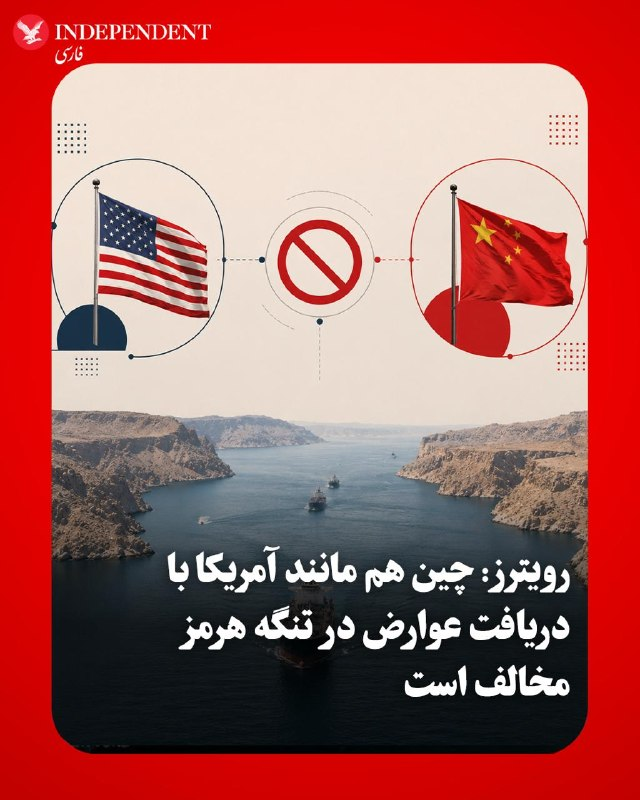

♦️وزارت خارجه آمریکا روز سه‌شنبه به رویترز گفت مقام‌های ارشد آمریکا و چین توافق دارند که هیچ کشوری نباید اجازه داشته باشد برای عبور کشتی‌ها از تنگه هرمز عوارض دریافت کند؛ نشانه‌ای از این‌که دو کشور در تلاش‌اند برای فشار بر رژیم ایران به‌منظور کنار گذاشتن کنترل این آبراه حیاتی، موضع مشترکی پیدا کنند.
بیانیه وزارت خارجه آمریکا پیش از نشست حساس دونالد ترامپ، رئیس‌جمهوری آمریکا، و شی جین‌پینگ، رئیس‌جمهوری چین، منتشر شد؛ نشستی که موضوع کنترل ایران بر تنگه هرمز نیز در دستور کار آن است.
وزارت خارجه آمریکا اعلام کرد وانگ یی، وزیر خارجه چین، و مارکو روبیو، وزیر خارجه آمریکا، در تماس تلفنی ماه آوریل درباره این موضوع گفت‌وگو کرده‌اند.
تامی پیگوت، سخنگوی وزارت خارجه آمریکا، در پاسخ به پرسش‌های رویترز درباره این تماس گفت: «آن‌ها توافق کردند که هیچ کشور یا سازمانی نباید اجازه داشته باشد برای عبور از آبراه‌های بین‌المللی مانند تنگه هرمز عوارض دریافت کند.» رویترز می نویسد،وزارت خارجه آمریکا پیش‌تر برخلاف رویه معمول خود، گزارشی از این تماس منتشر نکرده بود.
به گزارش رویترز،سفارت چین روایت آمریکا از این گفت‌وگو را رد نکرد و گفت امیدوار است همه طرف‌ها برای ازسرگیری عبور و مرور عادی از تنگه همکاری کنند؛ گذرگاهی که پیش از جنگ، یک‌پنجم نفت و گاز جهان از آن عبور می‌کرد.
لیو پنگیو، سخنگوی سفارت چین، به رویترز گفت: «حفظ امنیت و ثبات منطقه و تضمین عبور بدون مانع، در راستای منافع مشترک جامعه بین‌المللی است.»
کرد.دو منبع آگاه از گفت‌وگوی وانگ و روبیو گفتند روبیو احتمال پرداخت عوارض از سوی کشتی‌های چینی را مطرح کرده بود؛ اقدامی که به گفته آن‌ها ظاهرا با هدف ترغیب پکن به اعمال فشار بیشتر بر تهران برای پایان دادن به درگیری انجام شده است.
‌🇸🇦 Indypersian

🤖 @VahidOOnLine

## VahidOOnLine — post 240013

  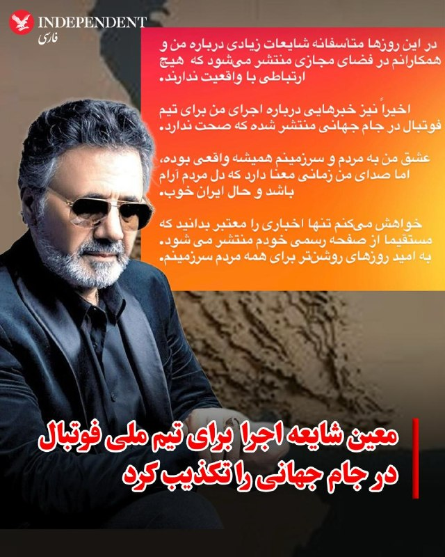

♦️معین، خواننده سرشناس ایرانی، با انتشار پیامی در صفحه رسمی اینستاگرام خود، اخبار مربوط به همکاری با تیم ملی را تکذیب کرد.
او در این پیام نوشت: «در این روزها متأسفانه شایعات زیادی درباره من و همکارانم در فضای مجازی منتشر می‌شود که هیچ ارتباطی با واقعیت ندارند. اخیراً نیز خبرهایی درباره اجرای من برای تیم ملی فوتبال در جام جهانی منتشر شده که صحت ندارد.»
این هنرمند در پایان با تأکید بر لزوم آرامش جامعه خاطرنشان کرد: «عشق من به مردم و سرزمینم همیشه واقعی بوده، اما صدای من زمانی معنا دارد که دل مردم آرام باشد و حال ایران خوب. به امید روزهای روشن‌تر برای همه مردم سرزمینم.»
پیش از این، مهدی تاج، رئیس فدراسیون فوتبال، در حاشیه مراسم رونمایی از پیراهن تیم ملی برای جام جهانی ۲۰۲۶ گفته بود این فدراسیون در جریان ترانه‌ای قرار دارد که معین برای تیم ملی ایران خواهد خواند. او گفته بود: «هر کسی برای ایران بخواند، روی چشم ما جا دارد.»
‌🇸🇦 Indypersian

🤖 @VahidOOnLine

## VahidOOnLine — post 240012

  <a href="telegram/content/VahidOOnLine_240012_1778722476.mp4" target="_blank">🎬 Download video</a>

♦️خبرگزاری مهر چهارشنبه‌شب ۲۳ اردیبهشت‌ماه، پرچم حزب‌الله را در ویدیوی مربوط به بدرقه اعضای تیم ملی فوتبال ایران سانسور کرد.

اعضای تیم ملی فوتبال ایران در میدان انقلاب تهران برای حضور در جام جهانی ۲۰۲۶ بدرقه شدند؛ رقابت‌هایی که خرداد و تیر ۱۴۰۵ به میزبانی مشترک آمریکا، مکزیک و کانادا برگزار خواهد شد.
‌🇸🇦 Indypersian

🤖 @VahidOOnLine

## VahidOOnLine — post 240011

  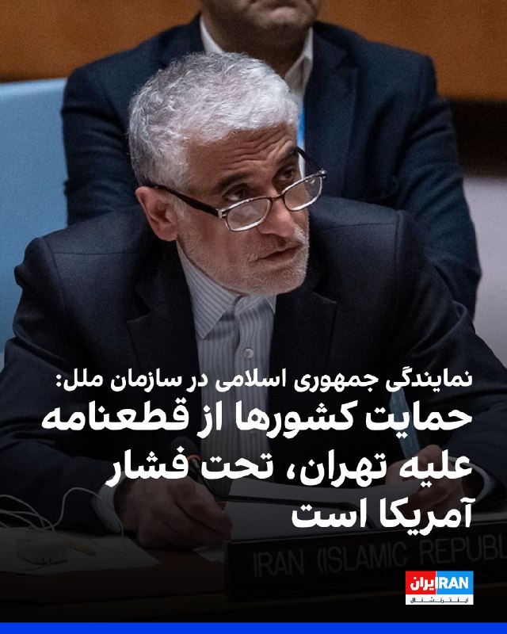

نمایندگی جمهوری اسلامی در سازمان ملل در بیانیه‌ای گفت حمایت بسیاری از کشورها از پیش‌نویس قطعنامه مورد حمایت واشینگتن علیه جمهوری اسلامی تحت «فشار سیاسی، اجبار و حتی تهدید» بوده است و این قطعنامه را «پوشش سیاسی برای اقدامات غیرقانونی» دانست.
این بیانیه افزود: «هیچ میزان از همراهی‌های مشترک تحمیلی، از جمله محاصره دریایی، حمله به کشتی‌های تجاری ایران و توقیف غیرقانونی آنها، و گروگان‌گیری خدمه این کشتی‌ها به شیوه‌ای شبیه به دزدی دریایی، نمی‌تواند اقدامات مداوم و ناقض حقوق بین‌الملل واشینگتن علیه جمهوری اسلامی را مشروعیت ببخشد.»

‌🏁 🇬🇧 IranintlTV

🤖 @VahidOOnLine

## VahidOOnLine — post 240010

  <a href="telegram/content/VahidOOnLine_240010_1778722478.mp4" target="_blank">🎬 Download video</a>

ویدیوهای منتشرشده در رسانه‌های حکومتی نشان می‌دهد ماموران جمهوری اسلامی، شامگاه چهارشنبه ۲۳ اردیبهشت، پهپاد شاهد ۱۳۶ را در دو مدل رنگی صورتی و آبی به شهر پیشوا برده‌اند تا مردم برای دیدن پهپادهای رنگی جمع شوند.
‌🏁 🇬🇧 IranintlTV

🤖 @VahidOOnLine

## VahidOOnLine — post 240009

  

♦️پایگاه خبری «فرارو» چهارشنبه ۲۴ اردیبهشت‌ماه گزارش داد قیمت برخی مدل‌های تلفن همراه در بازار ایران به بیش از دو برابر نرخ جهانی رسیده و هم‌زمان توقف ورود گوشی به کشور از ابتدای سال، باعث جهش تازه قیمت‌ها شده است.

براساس این گزارش، گلکسی اس۲۵ اولترا نسخه ۲۵۶ گیگابایت با رم ۱۲ گیگ در بازار جهانی هزار و ۲۹۹ دلار قیمت دارد، اما همین مدل در بازار ایران تا ۴۸۷ میلیون تومان، معادل حدود دو هزار و ۷۰۰ دلار، فروخته می‌شود.

فرارو همچنین نوشت آیفون ۱۷ پرو مکس نسخه ۵۱۲ گیگ با قیمت جهانی هزار و ۳۹۹ دلار، در بازار موبایل ایران حدود ۵۱۴ میلیون تومان، معادل نزدیک دو هزار و ۸۵۰ دلار، قیمت‌گذاری شده است. آیفون ۱۷ نسخه معمولی نیز که حدود ۸۰۰ دلار ارزش دارد، در ایران تا حدود هزار و ۸۰۰ دلار فروخته می‌شود.

فعالان بازار موبایل به فرارو گفته‌اند روند ورود گوشی به کشور از ابتدای سال متوقف شده و کاهش عرضه، عامل اصلی افزایش قیمت‌ها بوده است. براساس این گزارش، گلکسی ای۰۷ که پیش از نوروز بین ۱۳ تا ۱۴ میلیون تومان فروخته می‌شد، اکنون به حدود ۲۲ میلیون تومان رسیده است. همچنین قیمت گلکسی ای۳۶ بین ۶۸ تا ۷۲ میلیون تومان و گلکسی ای۵۶ بین ۸۵ تا ۹۸ میلیون تومان اعلام شده است.
‌🇸🇦 Indypersian

🤖 @VahidOOnLine

## VahidOOnLine — post 240000

این‌ها فقط چند روایت کوتاه از دی‌ماه‌اند؛
از روزهایی که خیابان‌های ایران، شاهد خاموش شدن زندگی جوان‌هایی شد که هر کدام در حال ساختن آینده خود بودند.<
یکی ورزشکار بود،
یکی تازه زندگی مشترکش را شروع کرده بود،
یکی کار می‌کرد تا روی پای خودش بایستد،
و یکی پدر کودکی بود که حالا باید بدون او بزرگ شود.<
مهدی جعفری، سروش (حسین) دانشمندی، جواد زارعی، حامد بیابانی، حسین رضایی، امیرحسین میرزایی، محمدمهدی سیف‌الله‌پور و فاطمه اعزازی کله‌سر
جاویدنامان انقلاب ملی ایرانیان؛
نام‌هایی که در حافظه این سرزمین مانده‌اند، چون زندگی‌شان پیش از آن‌که فرصت کامل شدن پیدا کند، با گلوله متوقف شد.<
#جاویدنامان_انقلاب_ملی_ایرانیان
‌🏁 🇬🇧 IranintlTV

🤖 @VahidOOnLine

## VahidOOnLine — post 239999

  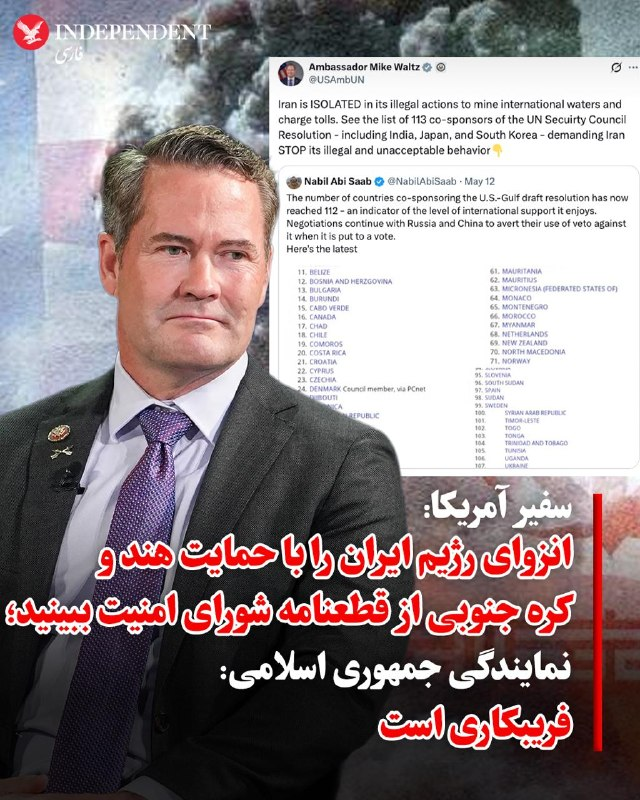

♦️درحالی که مایک والتز، سفیر آمریکا در سازمان ملل با انتشار فهرستی از ۱۱۲ کشور حامی پیش‌نویس قطعنامه سازمان ملل در محکومیت اقدامات تهران در تنگه هرمز، این فهرست طولانی شامل هند، کره جنوبی و ژاپن را نشانه انزوای رژیم ایران توصیف کرده است، نمایندگی جمهوری اسلامی در سازمان ملل مدعی شد که آمریکا به کشورها برای حمایت از این قطعنامه فشار آورده است. والتز در پیامی در اکس نوشت: «ایران در اقدامات غیرقانونی خود برای مین‌گذاری در آب‌های بین‌المللی و دریافت عوارض، منزوی شده است. فهرست ۱۱۳ کشور هم‌حامی قطعنامه شورای امنیت سازمان ملل از جمله هند، ژاپن و کره جنوبی را ببینید که از ایران می‌خواهند به رفتار غیرقانونی و غیرقابل قبول خود پایان دهد.» در واکنش نمایندگی جمهوری اسلامی در سازمان ملل نیز آمده که نمایش تعداد کشورهای حمایت کننده از این قطعنامه «فریبکارانه و مضحک» است. نمایندگی جمهوری اسلامی مدعی شده که آمریکا به کشورها برای پیوستن به این قطعنامه فشار آورده است.
‌🇸🇦 Indypersian

🤖 @VahidOOnLine

## FoxNewsTwitter — post 341686

  <a href="telegram/content/FoxNewsTwitter_341686_1778722480.mp4" target="_blank">🎬 Download video</a>

Fox News (Twitter/X)

.@seanhannity: "What is your read on President Xi?"

SECRETARY RUBIO: "China has a plan...they believe they will be the world's most powerful country."

"We're not trying to constrain China, but their rise cannot come at our expense."

## FoxNewsTwitter — post 341685

  <a href="telegram/content/FoxNewsTwitter_341685_1778722482.mp4" target="_blank">🎬 Download video</a>

Fox News (Twitter/X)

SENATOR MURRAY: "Do you seriously believe there's abortion in the water, like some of the far-right activists are suggesting?"

EPA ADMIN ZELDIN: "You just said abortion in the water?"

MURRAY: "That's what some far-right activists are saying. That they have an audience, in the EPA, on that absurd issue."

ZELDIN: "I have not had a conversation with anyone at the agency as far as abortions in water."

"I don't even know what you're talking about."

## FoxNewsTwitter — post 341684

  

Fox News (Twitter/X)

WATCH LIVE: 38th annual candlelight vigil for fallen officers in Washington, DC https://twitter.com/i/broadcasts/1NGaraWVDYVJj

## pm_afshaa — post 90710

  <a href="telegram/content/pm_afshaa_90710_1778722484.webm" target="_blank">🎬 Download video</a>

🔴روبیو، وزیر خارجه آمریکا:

چین کلی کشتی تو خلیج فارس داره که گیر افتادن و آخر هفته هم یه کشتی باری چینی آسیب دید، فکر نمیکنم ایران عمدی زده باشه، ولی خب به هر حال اتفاق افتاده و الان همین باعث شده کشتی‌های چینی نتونن راحت رفت‌وآمد کنن؛ این وضعیت داره حسابی منطقه رو بی‌ثبات میکنه، مخصوصاً آسیا که بخش زیادی از انرژی‌شون از همین مسیر رد میشه. به نفع خود چینه که این قضیه جمع بشه.

ما هم امیدواریم پکن بیشتر وارد ماجرا بشه و ایران رو قانع کنه از کارهایی که الان داره تو خلیج فارس انجام میده عقب‌نشینی کنه.

💧 Rainbet.com the #1 Non-KYC Crypto Casino & Sportsbook @rainbetcom

😁 @Pm_Afshaa

## DEJradio — post 4622

  <a href="telegram/content/DEJradio_4622_1778722484.mp4" target="_blank">🎬 Download video</a>

🚨
🔸 خبر ۲۱
چهارشنبه ۲۳ اردیبهشت ۱۴۰۵

#خبر۲۱
@DEJradio

## mamlekate — post 103524

📝 جی‌دی‌ ونس در مورد در مذاکرات با جمهوری اسلامی: فکر می‌کنم پیشرفت‌هایی حاصل شده است

جی‌دی ونس، معاون رئیس‌جمهوری آمریکا، روز چهارشنبه در گفت‌وگو با خبرنگاران گفت که در مذاکرات با جمهوری اسلامی پیشرفت‌هایی حاصل شده است.

@mamlekate

## mamlekate — post 103523

📝 دولت اسرائیل: نتانیاهو در جریان عملیات «غرش شیران» در سفری محرمانه با رئیس امارات دیدار کرد

دفتر نخست‌وزیر اسرائیل روز چهارشنبه ۲۳ اردیبهشت با انتشار پیامی در ایکس اعلام کرد: «بنیامین نتانیاهو، نخست‌وزیر اسرائیل، در بحبوحه عملیات شیر غران، مخفیانه از امارات متحده عربی بازدید کرد و در آن‌جا با شیخ محمد بن زاید، رئیس امارات، دیدار کرد.»

📝 امارات «گزارش‌ها درباره سفر نخست‌وزیر اسرائیل» را تکذیب کرد

وزارت امور خارجه امارات در بیانیه‌ای «گزارش‌های منتشرشده درباره سفر ادعایی بنیامین نتانیاهو، نخست‌وزیر اسرائیل، به امارات یا پذیرش هرگونه هیئت نظامی اسرائیلی در این کشور را» تکذیب کرد.

📝 نماینده آمریکا استقرار «گنبد آهنین» در امارات را تأیید کرد

@mamlekate

## IranIntlTV — post 337092

  

نمایندگی جمهوری اسلامی در سازمان ملل در بیانیه‌ای گفت حمایت بسیاری از کشورها از پیش‌نویس قطعنامه مورد حمایت واشینگتن علیه جمهوری اسلامی تحت «فشار سیاسی، اجبار و حتی تهدید» بوده است و این قطعنامه را «پوشش سیاسی برای اقدامات غیرقانونی» دانست.
این بیانیه افزود: «هیچ میزان از همراهی‌های مشترک تحمیلی، از جمله محاصره دریایی، حمله به کشتی‌های تجاری ایران و توقیف غیرقانونی آنها، و گروگان‌گیری خدمه این کشتی‌ها به شیوه‌ای شبیه به دزدی دریایی، نمی‌تواند اقدامات مداوم و ناقض حقوق بین‌الملل واشینگتن علیه جمهوری اسلامی را مشروعیت ببخشد.»

https://iranintl.com/202605145471

## IranIntlTV — post 337091

  <a href="telegram/content/IranIntlTV_337091_1778722487.mp4" target="_blank">🎬 Download video</a>

ویدیوهای منتشرشده در رسانه‌های حکومتی نشان می‌دهد ماموران جمهوری اسلامی، شامگاه چهارشنبه ۲۳ اردیبهشت، پهپاد شاهد ۱۳۶ را در دو مدل رنگی صورتی و آبی به شهر پیشوا برده‌اند تا مردم برای دیدن پهپادهای رنگی جمع شوند.

## IranIntlTV — post 337082

این‌ها فقط چند روایت کوتاه از دی‌ماه‌اند؛
از روزهایی که خیابان‌های ایران، شاهد خاموش شدن زندگی جوان‌هایی شد که هر کدام در حال ساختن آینده خود بودند.
یکی ورزشکار بود،
یکی تازه زندگی مشترکش را شروع کرده بود،
یکی کار می‌کرد تا روی پای خودش بایستد،
و یکی پدر کودکی بود که حالا باید بدون او بزرگ شود.
مهدی جعفری، سروش (حسین) دانشمندی، جواد زارعی، حامد بیابانی، حسین رضایی، امیرحسین میرزایی، محمدمهدی سیف‌الله‌پور و فاطمه اعزازی کله‌سر
جاویدنامان انقلاب ملی ایرانیان؛
نام‌هایی که در حافظه این سرزمین مانده‌اند، چون زندگی‌شان پیش از آن‌که فرصت کامل شدن پیدا کند، با گلوله متوقف شد.
#جاویدنامان_انقلاب_ملی_ایرانیان

## FarsiVOA — post 217681

⚡️نشست «عراق در خاورمیانه جدید» در اندیشکده آتلانتیک
@FarsiVOA

## FarsiVOA — post 217680

⚡️جی دی ونس، معاون رئیس جمهوری آمریکا: در مذاکرات با جمهوری اسلامی پیشرفت‌هایی حاصل شده است
@FarsiVOA

## FarsiVOA — post 217679

⚡️شروط آمریکا برای عادی‌سازی روابط با طالبان
@FarsiVOA

## FarsiVOA — post 217678

⚡️تازه‌ترین مواضع قانون‌گذاران آمریکایی در کنگره
@FarsiVOA

## FarsiVOA — post 217677

⚡️آنچه دولت علی الزیدی برای عراق به ارمغان نمی‌آورد؟
@FarsiVOA

## FarsiVOA — post 217676

🔺مارکو روبیو: امیدواریم چین در واداشتن جمهوری اسلامی به اتمام بی‌ثبات‌سازی خلیج فارس نقش فعال‌تری ایفا کند

▪️مارکو روبیو، وزیر امور خارجه آمریکا، در یک گفت‌وگوی اختصاصی با شان هنیتی از شبکه فاکس‌نیوز درباره تلاش‌ها برای وادار کردن چین به برخورد با جمهوری اسلامی ایران در ارتباط با اقداماتش در خلیج فارس توضیح داد.

⬇️ بیشتر بخوانید:
https://ir.voanews.com/a/8149668.html
@FarsiVOA

## Persian_Trend_Official — post 14085

🔴 روبیو: امیدواریم چین ایران را به عقب‌نشینی از رفتارهایش متقاعد کند

💢مارکو روبیو، وزیر خارجه آمریکا، اعلام کرد واشینگتن امیدوار است چین نقش فعال‌تری برای متقاعد کردن ایران به عقب‌نشینی از رفتارهایش در منطقه ایفا کند.

▪️روبیو همچنین گفت:

▪️ آمریکا به‌دنبال مدیریت راهبردی روابط پیچیده خود با چین است
▪️ چین بزرگ‌ترین چالش ژئوپلیتیکی و سیاسی پیش‌روی آمریکا محسوب می‌شود
▪️ واشینگتن خواهان جلوگیری از تشدید تنش‌ها در منطقه است

🫆:Tony

📌 @persian_trend_official
پرشین ترند | متفاوت‌ترین کانال نظامی

## Persian_Trend_Official — post 14084

🔴 واشینگتن‌پست: چین از جنگ ایران سود راهبردی می‌برد

💢روزنامه «واشینگتن‌پست» به‌نقل از یک گزارش محرمانه اطلاعاتی آمریکا مدعی شد چین در حال کسب مزایای راهبردی از جنگ ایران است؛ در حالی که آمریکا منابع نظامی و اقتصادی خود را در این درگیری مصرف می‌کند.

▪️بر اساس این ارزیابی:

▪️ چین در جریان حملات ایران، به کشورهای خلیج فارس تسلیحات فروخته است
▪️ پکن به برخی کشورها برای مدیریت بحران انرژی پس از بسته‌شدن تنگه هرمز کمک کرده است
▪️ جنگ باعث کاهش ذخایر موشکی و سامانه‌های دفاعی آمریکا شده و نگرانی‌هایی درباره آمادگی واشینگتن برای درگیری احتمالی بر سر تایوان ایجاد کرده است
▪️ چین عملیات‌های نظامی آمریکا را زیر نظر دارد و از پیام‌های ضدجنگ برای نمایش آمریکا به‌عنوان عامل بی‌ثباتی استفاده می‌کند

💢تحلیلگران معتقدند ادامه این درگیری می‌تواند نفوذ جهانی چین را افزایش داده و جایگاه آمریکا نزد متحدانش را تضعیف کند.

🫆:Tony

📌 @persian_trend_official
پرشین ترند | متفاوت‌ترین کانال نظامی

## Persian_Trend_Official — post 14083

  

🔴 ترامپ: آمریکا برای پایان جنگ با ایران به کمک چین نیاز ندارد

💢دونالد ترامپ اعلام کرد آمریکا برای پایان دادن به جنگ با ایران و کاهش تنش‌ها در تنگه هرمز، نیازی به کمک چین ندارد.

▪️ «فکر نمی‌کنم برای موضوع ایران به کمکی نیاز داشته باشیم»
▪️ «به هر شکلی پیروز خواهیم شد؛ چه از راه صلح و چه غیر از آن»

💢گزارش‌ها حاکی است موضوع جنگ ایران در دیدار ترامپ و شی جین‌پینگ طی دو روز آینده مطرح خواهد شد، اما ترامپ نقش پکن در پایان درگیری را کم‌اهمیت توصیف کرده است.

در همین حال، رسانه‌ها گزارش می‌دهند در ایران نیز دیدار ترامپ و رئیس‌جمهور چین تهدیدی برای روابط تهران و پکن تلقی نمی‌شود.

بر اساس این گزارش:

▪️ مقام‌ها و تحلیلگران ایرانی روابط دو کشور را «راهبردی و مستقل» توصیف می‌کنند
▪️ به توافق ۲۵ ساله ایران و چین که در سال ۲۰۲۰ امضا شد اشاره شده است
▪️ این توافق حوزه‌های سیاسی، اقتصادی و فرهنگی را شامل می‌شود

🫆:Tony

📌 @persian_trend_official
پرشین ترند | متفاوت‌ترین کانال نظامی

## Persian_Trend_Official — post 14082

  <a href="telegram/content/Persian_Trend_Official_14082_1778722489.webm" target="_blank">🎬 Download video</a>

🔴دیوار نوشته‌ای در تهران؛

💢ورود سگ‌ها و آمریکایی‌ها به تنگهٔ هرمز ممنوع...🚫

🫆:Tony

📌 @persian_trend_official
پرشین ترند | متفاوت‌ترین کانال نظامی

## BBCPersian — post 280972

🔸مهدی تاج، رئیس فدراسیون فوتبال ایران، که روز چهارشنبه به همراه بازیکنان تیم ملی در میدان انقلاب تهران حضور داشت، به خبرنگاران گفت از تهیه سرودی برای تیم ملی ایران توسط معین،‌ خواننده برجسته ایرانی مقیم خارج از این کشور، مطلع است و از آن استقبال می‌کند.

روز چهارشنبه بازیکنان تیم ملی فوتبال ایران در میان جمع بزرگی که در میدان انقلاب تهران حضور داشتند، با خواندن میثاق نامه خود و رد شدن از زیر قرآن - کتاب مقدس مسلمانان - رسما برای حضور در مسابقات جام جهانی ۲۰۲۶ بدرقه شدند.

در این مراسم سرود رسمی تیم ملی ایران که پرواز همای، خواننده ایرانی، تهیه کرده بود با حضور خود او خوانده شد.

پرواز همای گفته است برای تهیه این سرود از سه ماه پیش به سفارش فدراسیون فوتبال ایران مشغول به کار شده است اما امیدوار است که تولید سرود توسط معین هم به واقعیت تبدیل شود.

تیم ملی به زودی راهی اردوی تدارکاتی در ترکیه خواهد شد و کمتر از یک ماه دیگر در کرانه غربی آمریکا به میدان خواهد رفت.
🎥IRNA/ BORNA
@BBCPersian

---
📅 بروزرسانی: 1405/02/24 03:10
---

## VahidOOnLine — post 239998

  

♦️طی روزهای اخیر ده‌ها اصله درخت تنومند و قدیمی در منطقه گردشگری سراب اسکان شازند که برخی از آن‌ها بین ۳۰ تا ۵۰ سال قدمت داشتند، بدون اعلام دلیل مشخصی قطع شده‌اند؛ اقدامی که واکنش شهروندان و فعالان محیط زیست را در پی داشته و نگرانی‌ها درباره آینده طبیعت این منطقه را افزایش داده است.

خبرگزاری ایسنا یکشنبه ۲۰ اردیبهشت‌ماه گزارش داد در روستای گردشگری اسکان در شهرستان شازند استان مرکزی، بیش از ۵۰ اصله درخت زنده قطع شده و بخش‌هایی از سیمای طبیعی منطقه دستخوش تغییر شده است.

این خبرگزاری نوشت پیگیری‌ها نشان می‌دهد این اقدام احتمالا بدون اطلاع‌رسانی شفاف و اخذ مجوزهای لازم انجام شده است.

گردشگران و اهالی منطقه با ابراز نگرانی از قطع درختان و نبود اطلاع‌رسانی، خواستار پیگیری موضوع و اعلام دلایل قطع ناگهانی درختان شده‌اند.

روستای اسکان در مسیر اراک ـ بروجرد و در مجاورت رودخانه قره‌چای قرار دارد و به‌دلیل طبیعت سرسبز و درختان کهنسال خود شناخته می‌شود.

به گزارش ایسنا، قطع این درختان علاوه بر تغییر سیمای طبیعی منطقه، نگرانی‌هایی درباره افزایش فرسایش خاک، تهدید منابع آبی و پیامدهای محیط زیستی ایجاد کرده است.
‌🇸🇦 Indypersian

🤖 @VahidOOnLine

## VahidOOnLine — post 239997

  

♦️کریس رایت، وزیر انرژی آمریکا، روز چهارشنبه هشدار داد که رژیم ایران «به‌طرز نگران‌کننده‌ای» به تولید اورانیوم غنی‌شده در سطح مورد نیاز برای ساخت سلاح هسته‌ای نزدیک شده است.
رایت گفت اورانیوم غنی‌شده ایران ـ که دونالد ترامپ، رئیس‌جمهوری آمریکا، مصرانه به‌دنبال توقیف آن است ـ رژیم جمهوری اسلامی را تنها چند هفته با رسیدن به آستانه لازم برای دستیابی به بمب هسته‌ای فاصله داده است.
او در جلسه کمیته نیروهای مسلح سنای آمریکا گفت: «آن‌ها فقط چند هفته با غنی‌سازی این مواد تا سطح تسلیحاتی فاصله دارند. البته پس از آن هنوز فرایند ساخت و تسلیحاتی‌کردن بمب باقی می‌ماند، اما آن‌ها بسیار نزدیک شده‌اند.»
استیو ویتکاف، فرستاده ویژه آمریکا، پیش‌تر به‌طور علنی گفته بود ایران مدعی است آن‌قدر اورانیوم با غنای ۶۰ درصد در اختیار دارد که در صورت غنی‌سازی بیشتر تا سطح ۹۰ درصد، برای ساخت ۱۱ بمب هسته‌ای کافی خواهد بود.
به گفته کارشناسان هسته‌ای، رسیدن به سطح غنی‌سازی ۶۰ درصد، از نظر فنی جهشی بسیار دشوارتر از حرکت از ۶۰ درصد به ۹۰ درصد است؛ سطحی که غنی‌سازی در حد تسلیحاتی محسوب می‌شود.
گفته می‌شود ایران حدود ۴۰۰ کیلوگرم اورانیوم با غنای ۶۰ درصد در اختیار دارد.
به گزارش نیویورک پست، رایت و سناتور ریچارد بلومنتال، دموکرات ایالت کنتیکت، در این جلسه توافق داشتند که جمهوری اسلامی «تنها چند هفته» با تبدیل این مواد به اورانیوم در سطح تسلیحاتی فاصله دارد.
ایران همچنین ۱۱ تن اورانیوم دیگر با سطح پایین‌تر غنی‌سازی در اختیار دارد.
رایت افزود: «آن‌ها مقداری اورانیوم ۲۰ درصدی هم دارند و [رسیدن آن] به سطح ۶۰ درصد، چند هفته بیشتر زمان می‌برد.»
او ادامه داد: «[در مورد] اورانیوم غنی‌نشده، رساندن آن به سطح تسلیحاتی فرایندی طولانی است. اما وقتی به ۶۰ درصد می‌رسید، هرچند اعداد شاید این را نشان ندهند، در واقع بیش از ۹۰ درصد مسیر لازم برای غنی‌سازی در سطح تسلیحاتی را طی کرده‌اید.»
او تاکید کرد: «این موضوع بسیار نگران‌کننده است.»
بلومنتال گفت اگر ترامپ بخواهد این تهدید را به‌طور کامل از بین ببرد، احتمالا باید علاوه بر حدود یک تن اورانیوم ۶۰ درصدی، ۱۱ تن اورانیوم ۲۰ درصدی ایران را نیز در اختیار بگیرد.
رایت در پاسخ گفت: «فکر می‌کنم این راهبرد عاقلانه‌ای است. در نهایت، هدف این است که از غنی‌سازی اورانیوم در آینده نیز جلوگیری شود. بله، برای داشتن جهانی امن، باید به برنامه هسته‌ای آن‌ها پایان دهیم.
‌🇸🇦 Indypersian

🤖 @VahidOOnLine

## VahidOOnLine — post 239996

  

نیویورک‌تایمز به نقل از مقام‌های آمریکایی گزارش داد شرکت‌های چینی با جمهوری اسلامی درباره فروش سلاح در حال گفت‌وگو بوده‌اند و قصد داشته‌اند این تسلیحات را از طریق کشورهای دیگر ارسال کنند تا منشا کمک نظامی پنهان بماند.
مقام‌های آمریکایی گفتند دست‌کم یکی از کشورهای ثالث در آفریقا قرار دارد، اما مشخص نیست آیا محموله‌ای به آن کشور رسیده است یا نه.
مقام‌هایی که در جریان این اطلاعات قرار گرفته‌اند، درباره اینکه آیا سلاح‌ها پیش‌تر به کشورهای ثالث ارسال شده‌اند یا نه، به جمع‌بندی‌های متفاوتی رسیده‌اند. با این حال، از زمان آغاز جنگ کنونی علیه جمهوری اسلامی، به نظر نمی‌رسد هیچ سلاح چینی در میدان نبرد علیه نیروهای آمریکایی یا اسرائیلی استفاده شده باشد.
هنوز مشخص نیست چه تعداد سلاح منتقل شده یا مقام‌های چینی تا چه اندازه این فروش‌ها را تایید کرده‌اند.

‌🏁 🇬🇧 IranintlTV

🤖 @VahidOOnLine

## VahidOOnLine — post 239995

  

♦️ایمان خلیف، بوکسور الجزایری و قهرمان جنجالی المپیک، در نخستین حضور خود در جشنواره فیلم کن، با کت‌وشلوار رسمی مشکی مردانه روی فرش قرمز ظاهر شد.
حضور خلیف در شرایطی خبرساز شده که جنجال‌ها درباره نتایج آزمایش‌های پزشکی او همچنان ادامه دارد. نشریه تلگراف پیش‌تر گزارش داده بود اسناد آزمایش تعیین جنسیت این ورزشکار نشان می‌دهد او دارای ساختار کروموزومی XY (مردانه) است. فدراسیون جهانی بوکس نیز اعلام کرده ایمان خلیف بدون انجام آزمایش‌های جدید و تایید صلاحیت، نمی‌تواند در رقابت‌های آینده زنان شرکت کند.
دونالد ترامپ، رئیس‌جمهوری آمریکا، نیز پیش‌تر گفته بود ورزشکارانی که از نظر بیولوژیکی مرد هستند، نباید در رقابت‌های زنان المپیک شرکت کنند. با ادامه این جنجال‌ها، هنوز مشخص نیست ایمان خلیف امکان حضور در المپیک آینده را خواهد داشت یا خیر.
‌🇸🇦 Indypersian

🤖 @VahidOOnLine

## VahidOOnLine — post 239994

  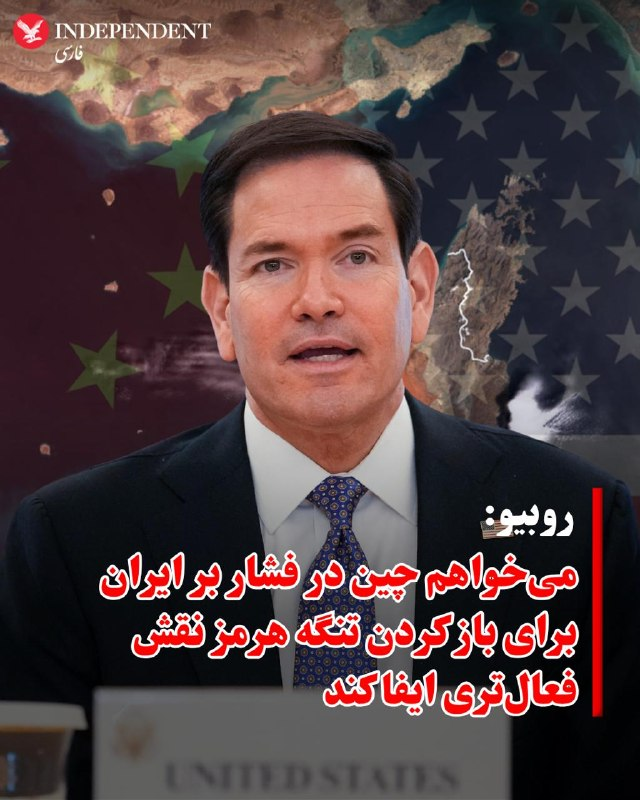

♦️مارکو روبیو، وزیر خارجه آمریکا، در گفتگو با فاکس‌نیوز گفت واشینگتن امیدوار است چین نقش فعال‌تری برای ترغیب جمهوری اسلامی به کنار گذاشتن اقداماتش در خلیج فارس ایفا کند.

روبیو در گفتگویی با شان هنیتی در هواپیمای ریاست‌جمهوری آمریکا گفت: «کشتی‌های چینی در خلیج فارس گیر افتاده‌اند.» او افزود یک کشتی حامل بار چینی آخر هفته هدف قرار گرفته است.

وزیر خارجه آمریکا همچنین گفت واشینگتن این موضوع را با مقام‌های چینی مطرح کرده و امیدوار است پکن از قطعنامه شورای امنیت سازمان ملل درباره محکومیت اقدامات جمهوری اسلامی در تنگه‌ها حمایت کند.

او تاکید کرد بحران در تنگه هرمز منبع بزرگی از بی‌ثباتی است و بیش از هر منطقه دیگری، آسیا را تهدید می‌کند، زیرا کشورهای آسیایی به‌شدت به مسیرهای انرژی در این منطقه وابسته‌اند.

روبیو افزود اقتصاد چین بر پایه صادرات بنا شده و ادامه بحران در تنگه هرمز می‌تواند باعث کاهش خرید کالاهای چینی و افت شدید صادرات این کشور شود.

وزیر خارجه آمریکا در پایان گفت: «حل این بحران به نفع چین است و امیدواریم آن‌ها نقش فعال‌تری برای وادار کردن ایران به عقب‌نشینی از اقداماتی که اکنون در خلیج فارس انجام می‌دهد، ایفا کنند.»
‌🇸🇦 Indypersian

🤖 @VahidOOnLine

## WithYashar — post 11178

مارکو روبیو تایید کرد چین و آمریکا به توافق رسیدن که ایران نباید تو تنگه عوارض بگیره از کشوری

این «توافق» فعلاً در حد موضع مشترک سیاسی و دیپلماتیک گزارش شده، نه یک پیمان رسمی یا قطعنامه بین‌المللی.
چین هنوز در بسیاری از موضوعات از ایران فاصله نگرفته و حتی در شورای امنیت بعضی قطعنامه‌های ضد ایران را وتو کرده است.
دلیل حساسیت موضوع این است که حدود یک‌پنجم نفت جهان از تنگه هرمز عبور می‌کند و هرگونه عوارض یا محدودیت می‌تواند قیمت جهانی انرژی را به شدت تحت تأثیر قرار دهد
@withyashar

## WithYashar — post 11177

@withyashar سفر قاهره

## WithYashar — post 11176

قصه بگم ؟ شایدم بهترین شرحی ‌باشه که لازم دارید بشنوید …

## FoxNewsTwitter — post 341683

  <a href="telegram/content/FoxNewsTwitter_341683_1778715618.mp4" target="_blank">🎬 Download video</a>

Fox News (Twitter/X)

FOX NEWS REPORT: President Trump is in China and expected to talk trade and the Iran war with Chinese President Xi Jinping. @BillMelugin_ has the latest.

## IranIntlTV — post 337081

  <a href="telegram/content/IranIntlTV_337081_1778715621.mp4" target="_blank">🎬 Download video</a>

رسانه‌های جمهوری اسلامی از برگزاری رزمایش پنج‌روزه سپاه تهران بزرگ با محوریت مقابله با عملیات «هلی‌برن» نیروهای متخاصم خبر دادند.
در تصاویر منتشرشده، نیروهای پیاده با سلاح‌های سبک، نیمه‌سنگین و پهپاد به اهداف فرضی، همچون تصویر پارچه‌ای یک بالگرد، شلیک می‌کنند.
این رزمایش پس از ورود بالگردهای بلک‌هاوک و هواپیمای سوخت‌رسان آمریکا به خاک ایران، در جریان عملیات جست‌وجوی خلبان اف-۱۵، برگزار شده است.
@iranintltv

## IranIntlTV — post 337080

  <a href="telegram/content/IranIntlTV_337080_1778715623.mp4" target="_blank">🎬 Download video</a>

موج تازهٔ اعدام جوانان نخبه؛
احسان افرشته با اتهام «جاسوسی» اعدام شد

جمهوری اسلامی بامداد چهارشنبه حکم اعدام احسان افرشته، زندانی سیاسی متهم به «جاسوسی برای اسرائیل»، را اجرا کرد؛ پرونده‌ای که مانند بسیاری از پرونده‌های امنیتی مشابه، بدون انتشار سند و مدرک مستقل به پایان رسید.

نهادهای حقوق بشری پیش‌تر هشدار داده بودند که اتهامات مطرح‌شده علیه او بر پایهٔ اعترافات اجباری و تحت فشار مطرح شده است.

کامبیز حسینی در «برنامه» به این موضوع می‌پردازد.

«یک ایران صدای شما را می‌شنود»
دوشنبه تا پنجشنبه ۱۱ شب تهران
از تلویزیون ایران اینترنشنال

تماشای نسخه کامل این قسمت از «برنامه» در یوتیوب:
https://youtu.be/HsShW7razys
@iranintltv

## IranIntlTV — post 337079

  <a href="telegram/content/IranIntlTV_337079_1778715625.mp4" target="_blank">🎬 Download video</a>

محمد از آلمان: کسی که پول دارو ندارد، آب ندارد، برق ندارد، او هم اعدامی جمهوری اسلامی است

«یک ایران صدای شما را می‌شنود»
دوشنبه تا پنجشنبه ۱۱ شب تهران
از تلویزیون ایران اینترنشنال

تماشای نسخه کامل این قسمت از «برنامه» در یوتیوب:
https://youtu.be/HsShW7razys
@iranintltv

## IranIntlTV — post 337078

  <a href="telegram/content/IranIntlTV_337078_1778715628.mp4" target="_blank">🎬 Download video</a>

حمید از بندرعباس: می‌روم خرید، ولی فقط می‌توانم به اندازهٔ جیبم خرید کنم، نه نیازم

«یک ایران صدای شما را می‌شنود»
دوشنبه تا پنجشنبه ۱۱ شب تهران
از تلویزیون ایران اینترنشنال

تماشای نسخه کامل این قسمت از «برنامه» در یوتیوب:
https://youtu.be/HsShW7razys
@iranintltv

## IranIntlTV — post 337077

  <a href="telegram/content/IranIntlTV_337077_1778715630.mp4" target="_blank">🎬 Download video</a>

فریبرز از خوزستان: مردمی که اینترنت ندارند، چه کار کنند؟ ایرانی‌های خارج از کشور کمک کنند

«یک ایران صدای شما را می‌شنود»
دوشنبه تا پنجشنبه ۱۱ شب تهران
از تلویزیون ایران اینترنشنال

تماشای نسخه کامل این قسمت از «برنامه» در یوتیوب:
https://youtu.be/HsShW7razys
@iranintltv

## IranIntlTV — post 337076

  <a href="https://t.me/IranintlTV/337076" target="_blank">📎 Download file</a>

🎧نسخه صوتی سیاست با مراد ویسی: ایران کارت بازی دیگران
@iranintlTV

## IranIntlTV — post 337075

  <a href="telegram/content/IranIntlTV_337075_1778715633.mp4" target="_blank">🎬 Download video</a>

فرامرز از استکهلم: به ترامپ توجه نکنید؛ او در حال جنگ سرد است؛ما باید مسیر خودمان را برویم

«یک ایران صدای شما را می‌شنود»
دوشنبه تا پنجشنبه ۱۱ شب تهران
از تلویزیون ایران اینترنشنال

تماشای نسخه کامل این قسمت از «برنامه» در یوتیوب:
https://youtu.be/HsShW7razys
@iranintltv

## IranIntlTV — post 337074

  <a href="telegram/content/IranIntlTV_337074_1778715636.mp4" target="_blank">🎬 Download video</a>

احمد از انگلستان: مردم ایران صبرشان استراتژیک و تاریخی است و می‌دانند کی باید به آب بزنند

«یک ایران صدای شما را می‌شنود»
دوشنبه تا پنجشنبه ۱۱ شب تهران
از تلویزیون ایران اینترنشنال

تماشای نسخه کامل این قسمت از «برنامه» در یوتیوب:
https://youtu.be/HsShW7razys
@iranintltv

## IranIntlTV — post 337073

  

نیویورک‌تایمز به نقل از مقام‌های آمریکایی گزارش داد شرکت‌های چینی با جمهوری اسلامی درباره فروش سلاح در حال گفت‌وگو بوده‌اند و قصد داشته‌اند این تسلیحات را از طریق کشورهای دیگر ارسال کنند تا منشا کمک نظامی پنهان بماند.
مقام‌های آمریکایی گفتند دست‌کم یکی از کشورهای ثالث در آفریقا قرار دارد، اما مشخص نیست آیا محموله‌ای به آن کشور رسیده است یا نه.
مقام‌هایی که در جریان این اطلاعات قرار گرفته‌اند، درباره اینکه آیا سلاح‌ها پیش‌تر به کشورهای ثالث ارسال شده‌اند یا نه، به جمع‌بندی‌های متفاوتی رسیده‌اند. با این حال، از زمان آغاز جنگ کنونی علیه جمهوری اسلامی، به نظر نمی‌رسد هیچ سلاح چینی در میدان نبرد علیه نیروهای آمریکایی یا اسرائیلی استفاده شده باشد.
هنوز مشخص نیست چه تعداد سلاح منتقل شده یا مقام‌های چینی تا چه اندازه این فروش‌ها را تایید کرده‌اند.

https://iranintl.com/202605134264

## IranIntlTV — post 337072

  <a href="telegram/content/IranIntlTV_337072_1778715639.mp4" target="_blank">🎬 Download video</a>

دفتر نخست‌وزیری اسرائیل اعلام کرد بنیامین نتانیاهو در جریان جنگ علیه جمهوری اسلامی به‌صورت محرمانه به امارات سفر و با محمد بن زاید دیدار کرده است. رادیو ملی اسرائیل نیز گزارش داد این نخستین بار نیست که نتانیاهو به امارات رفته، اما برای نخستین‌بار است که این موضوع به‌صورت رسمی تایید می‌شود.

گفت‌وگو با بن سبطی، پژوهشگر ایران و اسرائیل
@iranintltv

## IranIntlTV — post 337071

  <a href="telegram/content/IranIntlTV_337071_1778715642.mp4" target="_blank">🎬 Download video</a>

در پی موج جدید بیکاری در ایران در سایه جنگ، سرکوب و قطعی اینترنت، آمار رسمی از بیش از ۲۰۰ هزار متقاضی دریافت بیمه بیکاری خبر می‌دهد. مسعود پزشکیان پیش‌تر در واکنش به تورم و گرانی گفته بود کشور به‌شدت به صرفه‌جویی نیاز دارد.

گفت‌وگو با جمشید اسدی، اقتصاددان
@iranintltv

## IranIntlTV — post 337070

  <a href="telegram/content/IranIntlTV_337070_1778715644.mp4" target="_blank">🎬 Download video</a>

گزارش‌ها حاکی است در کمتر از یک ماه، دست‌کم ۱۲ هسته مرتبط با تهران در کویت، بحرین، امارات و قطر شناسایی و متلاشی شده‌اند.
مقام‌های امنیتی این کشورها می‌گویند ده‌ها نفر به اتهام جاسوسی، پول‌شویی، طراحی ترور و همکاری با سپاه و حزب‌الله بازداشت شده‌اند.

گزارش نیلوفر منصوری، خبرنگار ایران‌اینترنشنال
@iranintltv

## FarsiVOA — post 217675

🔺آمریکا سپرده ضمانت ویزا برای اعضای واجد شرایط تیم‌های شرکت‌کننده در «جام جهانی» و برخی هواداران را لغو کرد

▪️ایالات متحده می‌گوید سپرده ضمانت ویزا برای اعضای واجد شرایط تیم‌ها و برخی هواداران تیم‌ها لغو کرده است.

⬇️ بیشتر بخوانید:
https://ir.voanews.com/a/8149664.html
@FarsiVOA

## FarsiVOA — post 217674

🔺مایک والتز: جمهوری اسلامی در انجام اقدامات غیرقانونی خود منزوی است

▪️مایک والتز، سفیر آمریکا در سازمان ملل متحد، فهرستی از ۱۱۳ کشور را بازنشر کرد که پیش‌نویس قطعنامه شورای امنیت سازمان ملل که جمهوری اسلامی را به دلیل بستن تنگه هرمز محکوم می‌کند،‌ امضا کرده‌اند.

⬇️ بیشتر بخوانید:
https://ir.voanews.com/a/8149663.html
@FarsiVOA

## BBCPersian — post 280971

🔻در اوج دور جدید جنگ میان حزب‌الله و ارتش اسرائیل ساختمانی مسکونی در بیروت در مقابل دوربینها و پخش زنده تلویزیونی توسط جنگنده‌ های اسرائیلی بمباران و ویران شد. صحنه‌ای که از زوایای مختلف به تصویر کشیده شد و ذهنها ماند.

اسرائیل گفت یکی از زیرساختهای مالی مربوط به حزب‌الله را هدف گرفته. در این حمله که بعد از هشدار تخلیه بود، کسی کشته نشد اما دهها خانواده بی‌خانمان شدند. ساکنان محله و صاحبخانه‌ها در گفتگو با بی‌بی‌سی ادعای اسرائیل را رد کردند. پیگیریهای بی‌بی‌سی از این ارتش درباره جزییات این منابع مالی ادعایی بی‌جواب ماند.

این درحالیست که گروه‌های حقوق بشری می‌گویند این نوع حملات خلاف قوانین بین‌المللی هستند و می‌توانند جنایت جنگی محسوب شوند.

گزارش تحقیقی نفیسه کوهنورد از بیروت را ببینیم

@BBCPersian

## BBCPersian — post 280970

  

🔻فرماندهی مرکزی ارتش آمریکا، سنتکام، در منطقه در اطلاعیه‌ای گفته است از زمان آغاز محاصره بنادر ایران به ۱۵ کشتی حامل کمک‌های بشردوستانه اجازه عبور داده است.

این نهاد در اطلاعیه‌ای اعلام کرده است: «چهار هفته پیش، سنتکام اجرای محاصره کشتی‌هایی را که به بنادر ایران وارد و از آنها خارج می‌شدند، آغاز کرد. تا امروز، نیروهای آمریکایی ۶۷ کشتی تجاری را مجبور به تغییر مسیر کردند، به ۱۵ کشتی حامل کمک‌های بشردوستانه اجازه عبور دادند و ۴ کشتی را برای اطمینان از رعایت محاصره، غیرفعال کردند.»

در ادامه این اطلاعیه آمده است: «اوایل این هفته، نیروهای سنتکام پس از برقراری ارتباط رادیویی و شلیک گلوله‌های هشدار دهنده با سلاح‌های سبک، از بازگشت دو کشتی تجاری برای رعایت محاصره مطمئن شدند و به وضوح نشان دادند که اجرای قوانین ایالات متحده همچنان به طور کامل ادامه دارد.»

📸U.S. Navy via Getty Images
https://bbc.in/3RDx18x
@BBCPersian

## alonews — post 119836

  <a href="telegram/content/alonews_119836_1778715648.webm" target="_blank">🎬 Download video</a>

👈معین: مهدی تاج الکی میگه، من قرار نیست هیچ آهنگی واسه تیم فوتبال تو جام جهانی بخونم.

✅ @AloNews خبر جنگ

<!-- MSG END -->

<!-- NAV START -->

<!-- NAV END -->
