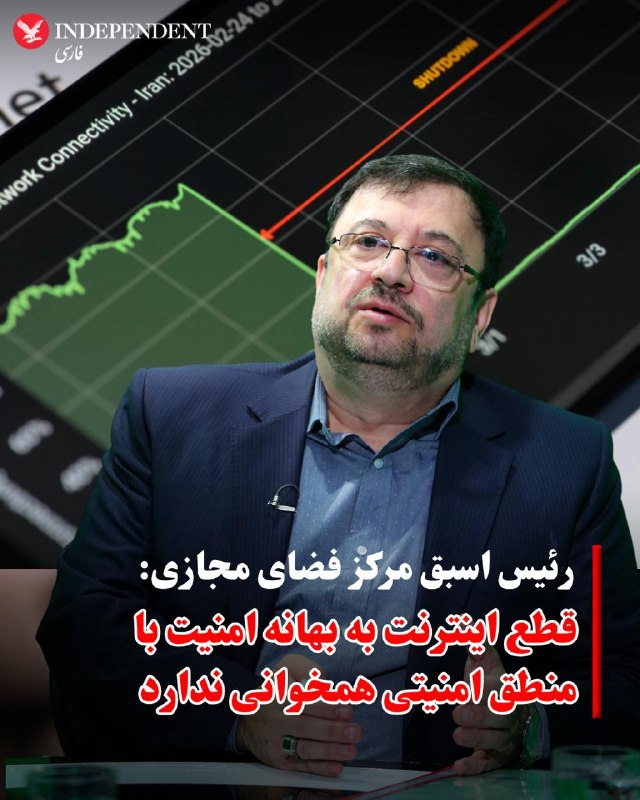
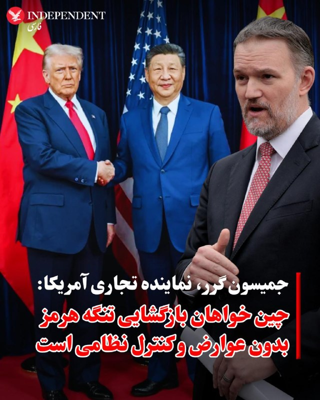
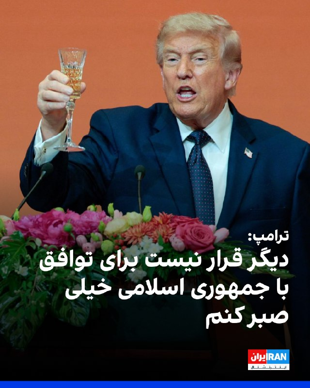
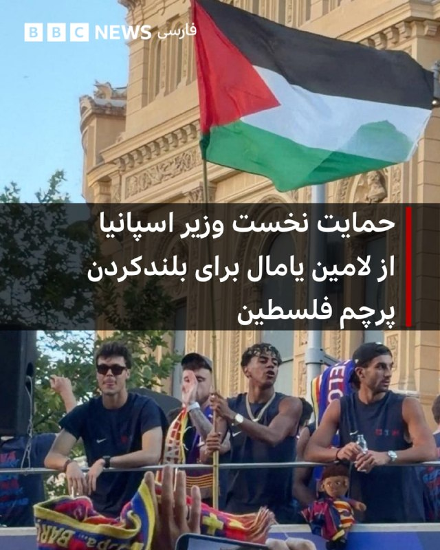
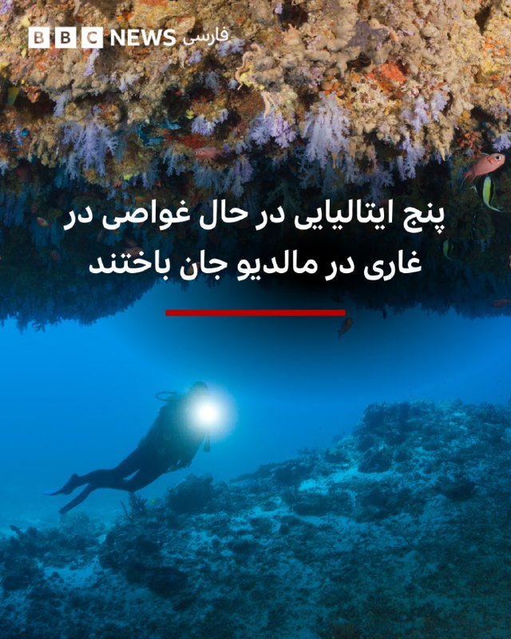
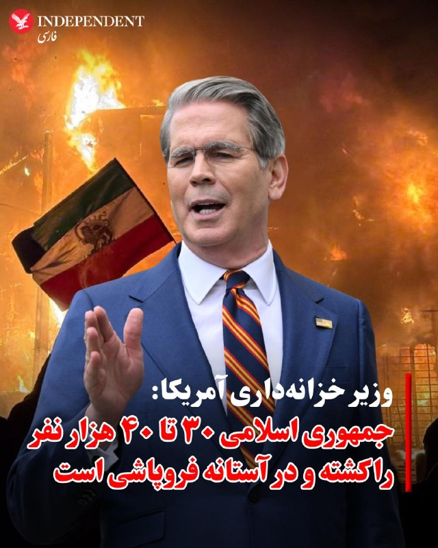
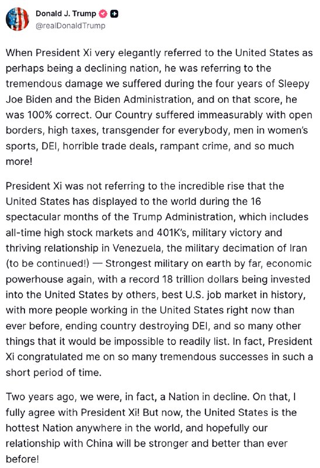
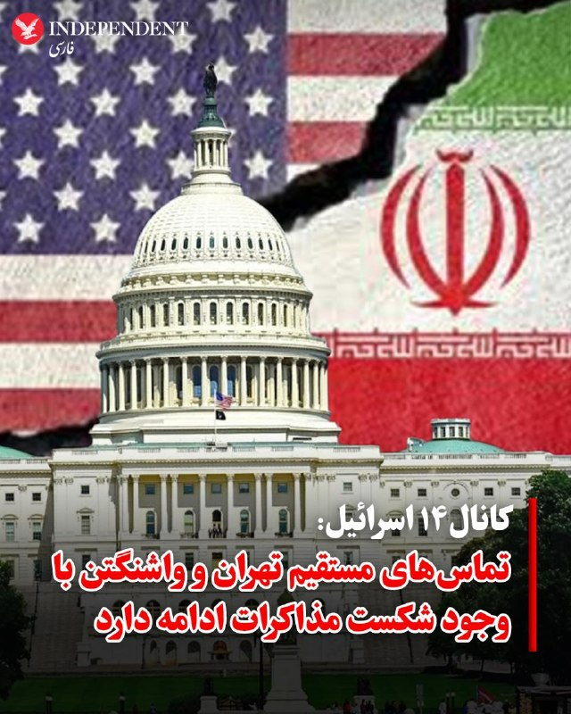
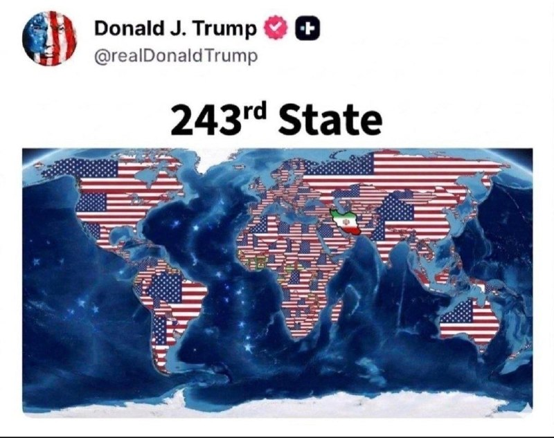
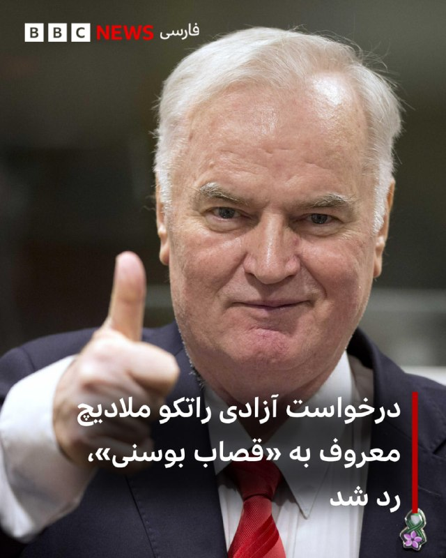

# خواننده تلگرام

<!-- TOP_NAV START -->

<a href="https://github.com/M0einReza/aio-downloader/blob/main/telegram/content/archive_1.md" style="display:inline-block; padding:6px 12px; margin:0 4px; background-color:#2ea44f; color:white; text-decoration:none; border-radius:4px; font-weight:bold;">صفحه بعد</a>

<!-- TOP_NAV END -->

<!-- MSG START -->

---
📅 بروزرسانی: 1405/02/25 06:21
---

## VahidOOnLine — post 240233

  

♦️دونالد ترامپ، رئیس‌جمهوری آمریکا که در چین حضور دارد با اشاره به مشکلات در تنگه هرمز به فاکس و اینکه چین ۴۰ درصد نفت خود را از طریق تنگه هرمز وارد می‌کند، گفت: «ما قرار است شروع کنیم به فرستادن کشتی‌های چینی به تگزاس. و به لوئیزیانا. و به آلاسکا!»
ترامپ افزود: «فکر می‌کنم ما یک توافق انجام خواهیم داد… همه‌چیز مربوط به انرژی. این همان چیزی است که واقعا به آن نیاز دارند: انرژی… و ما انرژی نامحدود داریم.»
‌🇸🇦 Indypersian

🤖 @VahidOOnLine

## VahidOOnLine — post 240232

  

♦️یک نماینده مجلس شورای اسلامی گفت: ما با کسری بنزین مواجه هستیم و قبل از جنگ هم کمبود بنزین وجود داشت و روزانه حدود ۲۰ میلیون لیتر کسری بنزین داشتیم که باید با واردات جبران می کردیم.
به گزارش خبرآنلاین، مصطفی نخعی، عضو کمیسیون انرژی مجلس گفت: هنوز تصمیمی در خصوص تغییر سهمیه‌بندی بنزین گرفته نشده و مذاکرات در این‌باره در حال انجام است. در واقع، سناریوهای مختلفی در دولت در حال بررسی است که هنوز سناریویی قطعی نشده است.
این نماینده مجلس گفت: درحال حاضر یا سهمیه باید کاهش یابد یا از ابزار قیمتی استفاده شود که حداقل مجلس چندان موافق این موضوع نیست. اخیرا برخی گزارش‌ها نیز مبنی بر افزایش قیمت بنزین به لیتری ۱۵ تا ۲۰ هزار تومان مطرح است.
‌🇸🇦 Indypersian

🤖 @VahidOOnLine

## VahidOOnLine — post 240231

  

♦️دونالد ترامپ، رئیس‌جمهوری آمریکا، تاکید کرد که ایالات متحده اصلا نیازی به باز شدن تنگه هرمز ندارد ـ یا دست‌کم به اندازه چین به آن نیاز ندارد ـ و تلاش‌های نظامی آمریکا در منطقه را نوعی خدمت عمومی به کشورهای دیگر توصیف کرد.
ترامپ عصر پنجشنبه به فاکس گفت: «ما اصلا به آن نیاز نداریم. اصلا به آن نیاز نداریم.»
او ادامه داد: «می‌شود گفت، می‌دانید، چرا اصلا ما داریم این کار را می‌کنیم؟ ما این کار را برای کمک به اسرائیل انجام می‌دهیم، برای کمک به عربستان سعودی، قطر، امارات، کویت و کشورهای دیگر، بحرین.»
ترامپ با اشاره به دیدارش با شی جین‌پینگ گفت: «امروز به او گفتم: می‌دانید، ما داریم به شما کمک می‌کنیم.»
مارکو روبیو، وزیر خارجه آمریکا، در مصاحبه‌ای با شبکه ان‌بی‌سی نیوز که امروز پخش شد نیز گفت: «ایران قرار نیست از این موضوع به‌عنوان اهرم فشار علیه ما استفاده کند.»
‌🇸🇦 Indypersian

🤖 @VahidOOnLine

## VahidOOnLine — post 240230

  

مارکو روبیو، وزیر خارجه آمریکا، در گفت‌وگو با شبکه ان‌بی‌سی نیوز گفت تنگه هرمز حتما باز خواهد شد و قیمت انرژی هم کاهش خواهد یافت. او در عین حال تاکید کرد که تلاش جمهوری اسلامی در تحقق یک «ایران هسته‌ای» برایش بسیار گران تمام خواهد شد.
روبیو همچنین هشدار داد که اگر حکومت ایران به سلاح هسته‌ای دست یابد، هیچ چیز مانع کنترل تنگه هرمز از سوی آن نخواهد بود و این وضعیت می‌تواند به بحرانی دائمی برای جهان تبدیل شود.

‌🏁 🇬🇧 IranintlTV

🤖 @VahidOOnLine

## VahidOOnLine — post 240229

  

♦️به گزارش رویترز، دونالد ترامپ، رئیس‌جمهوری ایالات متحده، در مصاحبه‌ای با برنامه «هانیتی» در شبکه فاکس‌نیوز که پنجشنبه شب ۲۴ اردیبهشت پخش شد، خطاب به تهران گفت: «من قرار نیست خیلی صبورتر از این باشم.» ترامپ با تاکید بر اینکه مقامات ایران باید با واشنگتن به یک توافق دست یابند، اعلام کرد که دیگر صبر چندانی در قبال آن‌ها نخواهد داشت.
‌🇸🇦 Indypersian

🤖 @VahidOOnLine

## VahidOOnLine — post 240228

  

ترامپ در مورد جمهوری اسلامی به فاکس‌نیوز گفت شی جین‌پینگ احتمالا توانایی تأثیرگذاری بر حکومت ایران را دارد. ترامپ رهبران ایران را که با آن‌ها مذاکره می‌شود «معقول» توصیف کرد، اما هشدار داد: «دیگر قرار نیست خیلی بیشتر صبر کنم. آن‌ها باید به توافق برسند.»
ترامپ گفت اورانیوم غنی‌شده ایران می‌تواند «دفن و مهر و موم» شود، اما او ترجیح می‌دهد آمریکا آن را در اختیار بگیرد. ترامپ افزود گرفتن این اورانیوم «بیش از هر چیز جنبه روابط عمومی دارد.»

‌🏁 🇬🇧 IranintlTV

🤖 @VahidOOnLine

## VahidOOnLine — post 240227

  

رسانه‌های آمریکایی از درگیری‌های فیزیکی در پشت صحنه دیدار ترامپ و شی در پکن خبر دادند. این تنش‌ها پس از آن رخ داد که مقام‌های چینی مانع ورود یک مامور سرویس مخفی آمریکا به منطقه حفاظت‌شده شدند و به خبرنگاران آمریکایی نیز اجازه ندادند به کاروان خودروهای ترامپ بپیوندند.
خبرنگار فاکس نیوز گزارش داد ماموران سرویس مخفی آمریکا در جریان سفر ترامپ با پلیس چین وارد درگیری‌های فیزیکی شدید شدند. این درگیری‌ها پس از آن صورت گرفت که ماموران چینی تلاش کردند مانع ورود یک مامور آمریکایی همراه با سلاحش به محل اجلاس شوند.
نیویورک‌پست نیز در گزارشی با تشریح این درگیری‌ها، نوشت خبرنگاران آمریکایی همچنین در نشست پکن با محدودیت‌های شدید روبه‌رو شدند و به سرویس‌های بهداشتی، امکانات ضبط خبر و بطری‌های آب دسترسی بسیار محدودی داشتند.

‌🏁 🇬🇧 IranintlTV

🤖 @VahidOOnLine

## VahidOOnLine — post 240226

  

♦️رئیس اسبق مرکز «ملی» فضای مجازی با انتقاد شدید از رویکرد فعلی در اعمال محدودیت‌های اینترنتی، روش «فهرست سفید» (باز بودن فقط سایت‌های تأیید شده) را کاری بیهوده دانست و تأکید کرد که اگر ملاک محدودیت‌ها امنیت ملی باشد، گوگل از هر حیث خطرناک‌تر از شبکه‌های اجتماعی است.
به گزارش خبرآنلاین، فیروزآبادی، در واکنش به تداوم مسدودسازی سایت‌های علمی و مرجع جهانی و عدم دسترسی آزاد مردم به منابع اینترنتی پایه، به سیتن گفت: «قرار بر این بود که ما بر اساس “لیست سیاه” فعالیت کنیم، اما اکنون شاهد یک انقلاب مدام هستیم که دوستان می‌خواهند بر اساس “لیست سفید” کار کنند؛ این اقدام به نظر من رسما یک کار عبث و بیهوده است. من متوجه نظام استدلالی آقایان نیستم. تا به حال هیچ‌کس هم توضیح نداده که دلیل این نوع برخوردها چیست. وقتی نظام استدلالی مشخصی وجود ندارد، نمی‌توان آن را بررسی کرد.»
‌
فیروزآبادی با به چالش کشیدن توجیهات امنیتی برای فیلترینگ، افزود: «اینکه بگویند این کار برای حفظ امنیت ملی است، استدلال محسوب نمی‌شود؛ چون با این منطق برای امنیت بیشتر باید برق، آب، پست و تلفن را هم قطع کرد! اگر واقعا بحث امنیت مطرح باشد، گوگل به دلیل مالکیت سیستم‌عامل اندروید، گزارش‌گیری مداوم از گوشی‌ها و آنلاین بودن همیشگی، خطرناک‌ترین سایت است؛ پس چرا گوگل باز است؟»
‌
دبیر اسبق شورای عالی فضای مجازی در پایان خاطرنشان کرد که وقتی پلتفرمی مانند گوگل با این سطح از دسترسی به اطلاعات کاربران باز است، مسدود ماندن سایر ظرفیت‌های اینترنتی با منطق امنیتی همخوانی ندارد.
‌🇸🇦 Indypersian

🤖 @VahidOOnLine

## VahidOOnLine — post 240225

  

♦️جمیسون گرر، نماینده تجاری آمریکا، روز جمعه ۲۵ اردیبهشت‌ماه در پکن به بلومبرگ گفت مقام‌های چینی در نشست سران آمریکا و چین به‌روشنی اعلام کردند که خواهان بازگشایی تنگه هرمز بدون محدودیت، عوارض یا کنترل نظامی هستند.

گرر که در جریان دیدار دونالد ترامپ و شی جین‌پینگ در پکن حضور داشت، گفت: «برای چین بسیار مهم است که تنگه هرمز باز باشد؛ بدون دریافت عوارض و بدون کنترل نظامی، و این موضوع در نشست کاملا روشن بود.»

او افزود آمریکا از این موضع چین استقبال می‌کند.

نماینده تجاری آمریکا همچنین گفت واشنگتن معتقد است پکن در قبال ایران «عملگرایانه» رفتار می‌کند و نمی‌خواهد «در سمت اشتباه این موضوع» قرار بگیرد.

گرر افزود: «چین خواهان صلح در منطقه است و ما اطمینان زیادی داریم که آنها هر کاری بتوانند انجام خواهند داد تا هرگونه حمایت مادی از ایران را محدود کنند.»

این اظهارات پس از آن مطرح شد که دونالد ترامپ در مصاحبه با فاکس نیوز گفت شی جین‌پینگ «با قاطعیت» به او اطمینان داده چین هیچ‌گونه تجهیزات نظامی در اختیار جمهوری اسلامی قرار نخواهد داد. ترامپ همچنین گفته بود پکن به‌دلیل وابستگی به واردات نفت، خواهان باز ماندن تنگه هرمز و ادامه تجارت در منطقه است.

مارکو روبیو، وزیر امور خارجه ایالات متحده، نیز پنجشنبه ۲۴ اردیبهشت‌ماه اعلام کرد واشنگتن و پکن درباره «نظامی نشدن» تنگه هرمز توافق نظر دارند. روبیو که در جریان سفر به پکن با شبکه ان‌بی‌سی نیوز گفتگو می‌کرد، گفت چین با هرگونه سیستم دریافت عوارض از سوی جمهوری اسلامی در این تنگه مخالف است.
‌🇸🇦 Indypersian

🤖 @VahidOOnLine

## VahidOOnLine — post 240224

  

♦️مارکو روبیو، وزیر امور خارجه ایالات متحده، روز پنجشنبه ۲۴ اردیبهشت‌ماه در گفتگو با شبکه ان‌بی‌سی نیوز، در جریان سفر خود به پکن، گفت تنگه هرمز باز خواهد شد و قیمت نفت و گاز کاهش می‌یابد، اما هشدار داد ایران هسته‌ای «بهای سنگینی» خواهد داشت.

روبیو گفت: «ما اقدام‌های فوق‌العاده‌ای انجام داده‌ایم تا قیمت گاز از آنچه در برخی نقاط دیگر جهان دیده می‌شود پایین‌تر بماند، و این قیمت‌ها باز هم کاهش خواهد یافت.»

او افزود: «آن تنگه‌ها باز خواهند شد و شاهد کاهش این قیمت‌ها خواهیم بود.»

وزیر امور خارجه آمریکا گفت به‌دلیل متوقف ماندن صادرات و انباشت نفت جمهوری اسلامی، حجم بزرگی از نفت هنوز وارد بازار جهانی نشده و با بازگشت این نفت به بازار، قیمت جهانی انرژی کاهش خواهد یافت.

روبیو همچنین هشدار داد دستیابی جمهوری اسلامی به سلاح هسته‌ای می‌تواند به تهران امکان دهد مسیرهای حیاتی کشتیرانی و انتقال نفت، از جمله تنگه هرمز، را تحت فشار یا کنترل خود قرار دهد؛ موضوعی که به گفته او می‌تواند امنیت انرژی جهان را با بحران روبه‌رو کند.
‌🇸🇦 Indypersian

🤖 @VahidOOnLine

## VahidOOnLine — post 240223

  

جمیسون گرر، نماینده تجاری آمریکا، جمعه در پکن به بلومبرگ گفت مقام‌های چینی در نشست سران آمریکا و چین به‌روشنی اعلام کردند که خواهان بازگشایی تنگه هرمز بدون محدودیت یا اخذ عوارض هستند و پکن به‌صورت عملگرایانه برای محدود کردن حمایت نظامی از ایران اقدام خواهد کرد.
گرر گفت: «برای چین بسیار مهم است که تنگه هرمز باز باشد، هیچ عوارضی دریافت نشود و هیچ کنترل نظامی وجود نداشته باشد و این موضوع در نشست روشن بود. بنابراین از آن استقبال می‌کنیم.»
او افزود: «در مورد نقش چین در قبال ایران، دیدگاه ما این است که چینی‌ها بسیار عملگرا رفتار می‌کنند و نمی‌خواهند در سوی نادرست این موضوع قرار بگیرند. آنها خواهان صلح در آن منطقه هستند. دونالد ترامپ نیز خواهان صلح در آن منطقه است. بنابراین اطمینان زیادی داریم که آنها هر کاری بتوانند انجام خواهند داد تا هرگونه حمایت مادی از ایران را محدود کنند.»

‌🏁 🇬🇧 IranintlTV

🤖 @VahidOOnLine

## VahidOOnLine — post 240222

  <a href="telegram/content/VahidOOnLine_240222_1778813475.mp4" target="_blank">🎬 Download video</a>

♦️خبرگزاری رویترز گزارش داد یک هیات آمریکایی به ریاست «جان رتکلیف» رئیس سازمان اطلاعات مرکزی آمریکا (سیا)، پنجشنبه ۲۴ اردیبهشت‌ماه در هاوانا با مقام‌های ارشد کوبایی دیدار کرده است.

این گزارش پس از آن منتشر شد که ویدیوی خروج یک هواپیمای دولتی آمریکا از فرودگاه بین‌المللی هاوانا به دست رویترز رسید. یک شاهد عینی نیز به این خبرگزاری گفت این هواپیما عصر پنجشنبه فرودگاه را ترک کرده است.

دولت کوبا در بیانیه‌ای که در رسانه دولتی «کوبا دباته» منتشر شد اعلام کرد هیات آمریکایی به ریاست رئیس سیا با همتایان خود در وزارت کشور کوبا دیدار و درباره همکاری‌های امنیتی گفتگو کرده‌اند.

در این بیانیه آمده است: «دو طرف بر علاقه خود برای توسعه همکاری دوجانبه میان نهادهای مجری قانون، در راستای امنیت دو کشور و همچنین امنیت منطقه‌ای و بین‌المللی تاکید کردند.»

دولت کوبا همچنین اعلام کرد به هیات آمریکایی گفته است که کوبا تهدیدی برای امنیت ملی ایالات متحده به شمار نمی‌رود.

فاکس نیوز به نقل از یک مقام آمریکایی گزارش داد جان رتکلیف در این سفر، پیام دونالد ترامپ، رئیس‌جمهوری آمریکا، را «شخصا» منتقل کرده است.

بر اساس این گزارش، در پیام ترامپ آمده بود: «ایالات متحده آماده است در مسائل اقتصادی و امنیتی کوبا به‌طور جدی وارد تعامل شود، اما تنها در صورتی که کوبا تغییرات بنیادین انجام دهد.»

حساب کاربری سیا نیز تصاویری از دیدارهای رتکلیف در هاوانا منتشر کرد.

دونالد ترامپ پیش‌تر و در چندین نوبت، با اشاره به عملیات نظامی «خشم حماسی» علیه جمهوری اسلامی گفته بود پس از حکومت ایران، «نوبت کوبا است.»

کوبا در ماه‌های اخیر با بحران شدید تامین سوخت روبه‌رو بوده است.

این دیدار چند روز پس از آن انجام شد که ترامپ گفته بود آمریکا و کوبا، «قرار است گفتگو کنند.»
‌🇸🇦 Indypersian

🤖 @VahidOOnLine

## VahidOOnLine — post 240221

♦️امید برزگری، مربی سازمان امداد و نجات هلال‌احمر، در گفتگویی تصویری با خبرآنلاین درباره سگ‌های امداد و نجات گفت: «این سگ‌ها پست نیستند؛ فرشته‌اند، فرشته نجات.»
او این اظهارات را در واکنش به گزارشی از صداوسیمای جمهوری اسلامی مطرح کرد که در آن از مردم پرسیده شده بود: «کدامیک از سگ‌های هلال‌احمر پست‌تر است؟»
جمعیت هلال‌احمر ایران اعلام کرده سگ‌های زنده‌یاب این سازمان از ابتدای جنگ اخیر در ۷۹۲ عملیات جستجو و نجات شرکت کرده‌اند و در ۷۱۱ عملیات موفق به زنده‌یابی یا جستجوی پیکر کشته‌شدگان شده‌اند.
‌🇸🇦 Indypersian

🤖 @VahidOOnLine

## VahidOOnLine — post 240220

  

♦️ برنامه «پاداش برای عدالت» وابسته به وزارت خارجه آمریکا اعلام کرد برای دریافت اطلاعات درباره اعضا و فعالیت‌های شرکت «کیمیا پارت سیوان» (کیپاس)، که از آن به‌عنوان یکی از شبکه‌های تامین و تولید پهپاد نیروی قدس سپاه پاسداران یاد شده، تا ۱۵ میلیون دلار پاداش پرداخت می‌کند.

در اطلاعیه منتشرشده در شبکه اجتماعی اکس آمده است این پاداش به اطلاعاتی تعلق می‌گیرد که بتواند به شناسایی یا مختل کردن سازوکارهای مالی سپاه پاسداران کمک کند. ایالات متحده سپاه پاسداران را در فهرست سازمان‌های تروریستی قرار داده است.

بر اساس این بیانیه، شرکت کیپاس یکی از بازوهای تولید پهپاد نیروی قدس سپاه پاسداران به شمار می‌رود و اعضا و مقام‌های آن در آزمایش‌های پروازی پهپادها و پشتیبانی فنی پهپادهای عملیاتی نیروی قدس که به عراق منتقل شده‌اند نقش داشته‌اند.

برنامه «پاداش برای عدالت» همچنین اعلام کرد این شرکت قطعات پهپاد را از شرکت‌های خارجی تهیه می‌کرده تا در اختیار سپاه پاسداران قرار گیرد.

در بیانیه دولت آمریکا که چهارشنبه ۲۴ اردیبهشت‌ماه منتشر شد، از «حسن آرامبونژاد»، «ابوالفضل رمضان‌زاده مشکانی»، «مهدی غفاری نقنه»، «رضا نهاردانی»، «عباس سرتاجی» و «هادی جمشیدی زوارکی» به‌عنوان اعضای اصلی این شبکه نام برده شده است.

در این بیانیه آمده این افراد در توسعه، آزمایش و تامین پهپادها برای گروه‌های همسو با جمهوری اسلامی در عراق، یمن و سوریه مشارکت داشته‌اند.

وزارت خزانه‌داری آمریکا دو سال پیش شرکت کیپاس و اعضای اصلی آن را در فهرست تحریم‌های خود قرار داده بود.
‌🇸🇦 Indypersian

🤖 @VahidOOnLine

## VahidOOnLine — post 240211

هر کدام از این نام‌ها، روایت جوانی‌ست که می‌توانست زندگی کند، کار کند، عاشق شود و آینده‌ای بسازد؛ اما گلوله سرکوب مسیر زندگی‌شان را قطع کرد.
جاویدنامان انقلاب ملی ایرانیان فقط نام‌های ثبت‌شده در یک فهرست نیستند؛ حافظه زخمی نسلی‌اند که بهای آزادی را با جان خود پرداخت.<
عرفان علیزاده، علی‌اصغر محمدی چمستان، مبین فیلی، علیرضا موسی‌نیا، محمدامین قبادی، علی زنگنه، امیررضا حسنوند و محمدرضا سعیدی؛
نام‌هایی که از خیابان‌های ایران پاک نشدند و در حافظه جمعی این سرزمین باقی خواهند ماند.<
#جاویدنامان_انقلاب_ملی_ایرانیان
‌🏁 🇬🇧 IranintlTV

🤖 @VahidOOnLine

## FoxNewsTwitter — post 341758

  <a href="telegram/content/FoxNewsTwitter_341758_1778813476.mp4" target="_blank">🎬 Download video</a>

Fox News (Twitter/X)

President Trump says he came up with a nickname, "Dumocrats," after talking about top Democratic leader Hakeem Jeffries. || @seanhannity

## pm_afshaa — post 90763

  <a href="telegram/content/pm_afshaa_90763_1778813477.webm" target="_blank">🎬 Download video</a>

🔴مجلس آمریکا امروز طرحی رو با عنوان «توقف جنگ علیه ایران» رای گیری کرد که این طرح با 212 رای موافق و 212 رای مخالف تصویب نشد.

💧 Rainbet.com the #1 Non-KYC Crypto Casino & Sportsbook @rainbetcom

😁 @Pm_Afshaa

## IranIntlTV — post 337253

  

مارکو روبیو، وزیر خارجه آمریکا، در گفت‌وگو با شبکه ان‌بی‌سی نیوز گفت تنگه هرمز حتما باز خواهد شد و قیمت انرژی هم کاهش خواهد یافت. او در عین حال تاکید کرد که تلاش جمهوری اسلامی در تحقق یک «ایران هسته‌ای» برایش بسیار گران تمام خواهد شد.
روبیو همچنین هشدار داد که اگر حکومت ایران به سلاح هسته‌ای دست یابد، هیچ چیز مانع کنترل تنگه هرمز از سوی آن نخواهد بود و این وضعیت می‌تواند به بحرانی دائمی برای جهان تبدیل شود.

https://iranintl.com/202605156991

## IranIntlTV — post 337252

  

ترامپ در مورد جمهوری اسلامی به فاکس‌نیوز گفت شی جین‌پینگ احتمالا توانایی تأثیرگذاری بر حکومت ایران را دارد. ترامپ رهبران ایران را که با آن‌ها مذاکره می‌شود «معقول» توصیف کرد، اما هشدار داد: «دیگر قرار نیست خیلی بیشتر صبر کنم. آن‌ها باید به توافق برسند.»
ترامپ گفت اورانیوم غنی‌شده ایران می‌تواند «دفن و مهر و موم» شود، اما او ترجیح می‌دهد آمریکا آن را در اختیار بگیرد. ترامپ افزود گرفتن این اورانیوم «بیش از هر چیز جنبه روابط عمومی دارد.»

https://iranintl.com/202605150652

## IranIntlTV — post 337251

  

رسانه‌های آمریکایی از درگیری‌های فیزیکی در پشت صحنه دیدار ترامپ و شی در پکن خبر دادند. این تنش‌ها پس از آن رخ داد که مقام‌های چینی مانع ورود یک مامور سرویس مخفی آمریکا به منطقه حفاظت‌شده شدند و به خبرنگاران آمریکایی نیز اجازه ندادند به کاروان خودروهای ترامپ بپیوندند.
خبرنگار فاکس نیوز گزارش داد ماموران سرویس مخفی آمریکا در جریان سفر ترامپ با پلیس چین وارد درگیری‌های فیزیکی شدید شدند. این درگیری‌ها پس از آن صورت گرفت که ماموران چینی تلاش کردند مانع ورود یک مامور آمریکایی همراه با سلاحش به محل اجلاس شوند.
نیویورک‌پست نیز در گزارشی با تشریح این درگیری‌ها، نوشت خبرنگاران آمریکایی همچنین در نشست پکن با محدودیت‌های شدید روبه‌رو شدند و به سرویس‌های بهداشتی، امکانات ضبط خبر و بطری‌های آب دسترسی بسیار محدودی داشتند.

https://iranintl.com/202605150526

## IranIntlTV — post 337250

  

جمیسون گرر، نماینده تجاری آمریکا، جمعه در پکن به بلومبرگ گفت مقام‌های چینی در نشست سران آمریکا و چین به‌روشنی اعلام کردند که خواهان بازگشایی تنگه هرمز بدون محدودیت یا اخذ عوارض هستند و پکن به‌صورت عملگرایانه برای محدود کردن حمایت نظامی از ایران اقدام خواهد کرد.
گرر گفت: «برای چین بسیار مهم است که تنگه هرمز باز باشد، هیچ عوارضی دریافت نشود و هیچ کنترل نظامی وجود نداشته باشد و این موضوع در نشست روشن بود. بنابراین از آن استقبال می‌کنیم.»
او افزود: «در مورد نقش چین در قبال ایران، دیدگاه ما این است که چینی‌ها بسیار عملگرا رفتار می‌کنند و نمی‌خواهند در سوی نادرست این موضوع قرار بگیرند. آنها خواهان صلح در آن منطقه هستند. دونالد ترامپ نیز خواهان صلح در آن منطقه است. بنابراین اطمینان زیادی داریم که آنها هر کاری بتوانند انجام خواهند داد تا هرگونه حمایت مادی از ایران را محدود کنند.»

https://iranintl.com/202605157555

## IranIntlTV — post 337249

  <a href="telegram/content/IranIntlTV_337249_1778813480.mp4" target="_blank">🎬 Download video</a>

اینترنت؛ رانت تازهٔ جمهوری اسلامی
شرط دسترسی به اینترنت: انتشار تصاویر خامنه‌ای

در حالی‌ که قطع و محدودیت اینترنت خسارت‌های سنگینی به زندگی و کسب‌وکار مردم وارد کرده، حکومت نه‌تنها محدودیت‌ها را کاهش نداده، بلکه با طرح‌هایی مانند «اینترنت پرو» و «سیم‌کارت سفید»، نگرانی‌ها دربارهٔ اینترنت طبقاتی را افزایش داده است.

گزارش‌هایی منتشر شده که نشان می‌دهد برخی شهروندان، پس از انتقاد از حکومت یا فعالیت در شبکه‌های اجتماعی، با قطع سیم‌کارت و اینترنت مواجه شده‌اند و برای وصل دوباره، مجبور به ارائهٔ تعهد یا فعالیت حمایتی به نفع حکومت شده‌اند.

جمهوری اسلامی اینترنت را به ابزاری برای کنترل سیاسی و سنجش وفاداری شهروندان تبدیل کرده است؛ وضعیتی که برای بسیاری از مردم فقط یک معنا دارد:
هرجا اینترنت نیست، آزادی هم نیست.

کامبیز حسینی در «برنامه» به این موضوع می‌پردازد.

«یک ایران صدای شما را می‌شنود»
دوشنبه تا پنجشنبه ۱۱ شب تهران
از تلویزیون ایران اینترنشنال

تماشای نسخه کامل این قسمت از «برنامه» در یوتیوب:
https://youtu.be/9CC8wX4Bim0
@iranintltv

## IranIntlTV — post 337240

هر کدام از این نام‌ها، روایت جوانی‌ست که می‌توانست زندگی کند، کار کند، عاشق شود و آینده‌ای بسازد؛ اما گلوله سرکوب مسیر زندگی‌شان را قطع کرد.
جاویدنامان انقلاب ملی ایرانیان فقط نام‌های ثبت‌شده در یک فهرست نیستند؛ حافظه زخمی نسلی‌اند که بهای آزادی را با جان خود پرداخت.
عرفان علیزاده، علی‌اصغر محمدی چمستان، مبین فیلی، علیرضا موسی‌نیا، محمدامین قبادی، علی زنگنه، امیررضا حسنوند و محمدرضا سعیدی؛
نام‌هایی که از خیابان‌های ایران پاک نشدند و در حافظه جمعی این سرزمین باقی خواهند ماند.
#جاویدنامان_انقلاب_ملی_ایرانیان

## IranIntlTV — post 337239

  <a href="telegram/content/IranIntlTV_337239_1778813482.mp4" target="_blank">🎬 Download video</a>

مریم از پاریس: نگران حال فاطمه سپهری هستم و امیدوارم پوشش خبری بیشتری درباره ایشان داده شود

«یک ایران صدای شما را می‌شنود»
دوشنبه تا پنجشنبه ۱۱ شب تهران
از تلویزیون ایران اینترنشنال

تماشای نسخه کامل این قسمت از «برنامه» در یوتیوب:
https://youtu.be/9CC8wX4Bim0
@iranintltv

## IranIntlTV — post 337238

  <a href="telegram/content/IranIntlTV_337238_1778813483.mp4" target="_blank">🎬 Download video</a>

دریا از لندن: با زور و اعتراف اجباری، زندانی بی‌گناه را به اعدام محکوم می‌کنند

«یک ایران صدای شما را می‌شنود»
دوشنبه تا پنجشنبه ۱۱ شب تهران
از تلویزیون ایران اینترنشنال

تماشای نسخه کامل این قسمت از «برنامه» در یوتیوب:
https://youtu.be/9CC8wX4Bim0
@iranintltv

## IranIntlTV — post 337237

  <a href="telegram/content/IranIntlTV_337237_1778813485.mp4" target="_blank">🎬 Download video</a>

عسل از اصفهان: جنگ اوضاع را تغییر نداد؛ حالا خودمان باید تغییرش بدهیم

«یک ایران صدای شما را می‌شنود»
دوشنبه تا پنجشنبه ۱۱ شب تهران
از تلویزیون ایران اینترنشنال

تماشای نسخه کامل این قسمت از «برنامه» در یوتیوب:
https://youtu.be/9CC8wX4Bim0
@iranintltv

## IranIntlTV — post 337236

  <a href="telegram/content/IranIntlTV_337236_1778813486.mp4" target="_blank">🎬 Download video</a>

سهراب از تهران: «درود بر وی‌پی‌ان‌فروشِ حلال‌خور!»

«یک ایران صدای شما را می‌شنود»
دوشنبه تا پنجشنبه ۱۱ شب تهران
از تلویزیون ایران اینترنشنال

تماشای نسخه کامل این قسمت از «برنامه» در یوتیوب:
https://youtu.be/9CC8wX4Bim0
@iranintltv

## IranIntlTV — post 337235

  <a href="telegram/content/IranIntlTV_337235_1778813487.mp4" target="_blank">🎬 Download video</a>

امیر از چالوس: حواستان به سلامت روانتان باشد؛ ایران با شهروندان افسرده آباد نمی‌شود

«یک ایران صدای شما را می‌شنود»
دوشنبه تا پنجشنبه ۱۱ شب تهران
از تلویزیون ایران اینترنشنال
تماشای نسخه کامل این قسمت از «برنامه» در یوتیوب:
https://youtu.be/9CC8wX4Bim0
@iranintltv

## Shin_Persian — post 6005

  

U.S. Central Command ✓ @CENTCOM
Fri, 15 May 2026 00:38:22 UTC

A U.S. Air Force F-16 takes off from a base in the Middle East for a night flight. Air Force fighter aircraft regularly patrol the skies over the Middle East in support of regional security.

فارسی

یک فروند اف-۱۶ نیروی هوایی ایالات متحده (USAF) برای یک پرواز شبانه از پایگاهی در خاورمیانه به هوا برمی‌خیزد. جنگنده‌های نیروی هوایی به طور منظم در حمایت از امنیت منطقه‌ای، در آسمان‌های خاورمیانه گشت‌زنی می‌کنند.

𝕏 · @shin_persian

## FarsiVOA — post 217788

🔺دونالد ترامپ: جمهوری اسلامی یا می‌تواند توافق کند یا حذف شود؛ دقیقا می‌دانیم در چهار هفته گذشته چه کرده‌اند

▪️دونالد ترامپ، رئیس جمهوری آمریکا در مصاحبه‌ای که با فاکس نیوز انجام داد گفت او درباره ایران با چین صحبت کرده است.

⬇️ بیشتر بخوانید:
https://ir.voanews.com/a/8150331.html
@FarsiVOA

## FarsiVOA — post 217787

⚡️گفت‌وگو با حسین رئیسی درباره تداوم توقیف و مصادره اموال ایرانیان مخالف جمهوری اسلامی
@FarsiVOA

## FarsiVOA — post 217785

🔺دونالد ترامپ: هالیوود نمی‌تواند کسی مثل شی جین‌پینگ برای ایفای نقش او پیدا کند

▪️دونالد ترامپ، رئیس‌جمهوری‌ آمریکا، در مصاحبه‌ای با شان هنیتی مجری فاکس‌نیوز، با تمجید از شی جین‌پینگ، رئیس‌جمهوری چین، او را رهبری «مورد احترام» توصیف کرد و گفت اگر هالیوود به‌دنبال بازیگری برای ایفای نقش رهبر چین باشد، «نمی‌تواند کسی مثل او پیدا کند.»

⬇️ بیشتر بخوانید:
https://ir.voanews.com/a/8150329.html
@FarsiVOA

## FarsiVOA — post 217782

⚡️حساب کاربری سازمان اطلاعات مرکزی آمریکا (سیا) شامگاه پنج‌شنبه تصاویری از سفر نادر جان رتکلیف، رئیس این سازمان، به کوبا را منتشر کرد. رتکلیف در این سفر پیام رئیس‌جمهوری ایالات متحده،‌ دونالد ترامپ را به مقامات کوبایی منتقل کرد.
@FarsiVOA

## Persian_Trend_Official — post 14173

  <a href="telegram/content/Persian_Trend_Official_14173_1778813489.mp4" target="_blank">🎬 Download video</a>

صبحتون بخیر ☕️😆

📝 Nick
📌 @persian_trend_official
پرشین ترند | متفاوت‌ترین کانال نظامی

## Persian_Trend_Official — post 14172

  

💢اسماعیل بقایی

«کسی که در خفا خیانت کند، در برابر افکار عمومی رسوا خواهد شد»

🫆:Tony

📌 @persian_trend_official
پرشین ترند | متفاوت‌ترین کانال نظامی

## Persian_Trend_Official — post 14171

  <a href="telegram/content/Persian_Trend_Official_14171_1778813491.mp4" target="_blank">🎬 Download video</a>

💢خلاقیت و نوآوری با کمترین هزینه را از اوکراین بخواهید ❗️

💢اپراتورای پهپاد اوکراینی با یه پهپاد FPV که روی آن تفنگ ساچمه زن بستن، دارن پهپادهای FPV روسی رو می‌زنن

🫆:Tony

📌 @persian_trend_official
پرشین ترند | متفاوت‌ترین کانال نظامی

## Persian_Trend_Official — post 14170

  <a href="telegram/content/Persian_Trend_Official_14170_1778813492.mp4" target="_blank">🎬 Download video</a>

🔴یک نیروی حزب‌الله تا از محل اختفا خودش بیرون آمد توسط نیرو های تیپ گولانی هدف قرار گرفت و کشته شد.

🫆:Tony

📌 @persian_trend_official
پرشین ترند | متفاوت‌ترین کانال نظامی

## IranianMinds — post 20162

🔴 تروث جدید ترامپ در مورد شی، رئیس‌جمهور چین:

وقتی شی جین‌پینگ خیلی شیک و محترمانه از آمریکا به‌عنوان کشوری در حال افول یاد کرد، منظورش خسارت وحشتناکی بود که تو دوران جو خواب‌آلود بایدن و دولتش به کشورمون وارد شد؛ و تو این مورد، صددرصد حق با اون بود. کشور ما به خاطر مرزهای باز، مالیات‌های سنگین، ترویج ترنس‌ها برای همه، حضور مردها تو ورزش زنان، سیاست‌های DEI، قراردادهای تجاری افتضاح، افزایش جرم و جنایت و کلی چیز دیگه ضربه شدیدی خورد.

اما شی جین‌پینگ منظورش اون پیشرفت فوق‌العاده‌ای نبود که آمریکا تو ۱۶ ماه درخشان دولت ترامپ به دنیا نشون داده. پیشرفتی که شامل رکورد تاریخی بازار بورس و صندوق‌های بازنشستگی 401K، پیروزی‌های نظامی، رابطه عالی با ونزوئلا، نابود کردن قدرت نظامی ایران (که ادامه هم داره!)، قوی‌ترین ارتش دنیا، تبدیل شدن دوباره آمریکا به ابرقدرت اقتصادی و سرمایه‌گذاری رکوردشکن ۱۸ تریلیون دلاری تو آمریکاست. همین‌طور بهترین بازار کار تاریخ آمریکا، با بیشترین تعداد افراد شاغل در تاریخ کشور، پایان دادن به سیاست‌های نابودکننده DEI و خیلی موفقیت‌های دیگه. در واقع، شی جین‌پینگ تو مدت کوتاهی بابت این همه موفقیت به من تبریک گفت.

دو سال پیش، ما واقعاً کشوری در حال سقوط بودیم و من کاملاً با شی جین‌پینگ موافق بودم! ولی الان آمریکا داغ‌ترین و قدرتمندترین کشور دنیاست و امیدوارم رابطه‌مون با چین از همیشه قوی‌تر و بهتر بشه.

@IranianMinds

## IranianMinds — post 20161

  <a href="telegram/content/IranianMinds_20161_1778813493.mp4" target="_blank">🎬 Download video</a>

بچه ها اسم این بازی عبور مرغ از خیابون  هست ویدئو نگاه کنید خیلی راحت 8 میلیون ازش سود گرفتیم😍

😤اگ توم دوس داری خیلی راحت از بازی های انلاین پول در بیاری حتما عضو کازینو شبانه شو✅

توی کازینو شبانه بهت اموزش میدیم از بازی های انلاین پول دربیاری👌

کازینو شبانه راهی برای چند برابر کردن سرمایت 🤷‍♂

کسب درامد انلاین با یه ادم حرفه ای یاد بگیر و‌ پول دربیار 💵
ae24
🎯همین حالا عضو شو و شروع کن👇
https://t.me/+OS-QBvyDO4M2ZGY0
https://t.me/+OS-QBvyDO4M2ZGY0

## BBCPersian — post 281065

🔻 قاضی کانادایی طومار درخواست استقلال آلبرتا را رد کرد

یک قاضی در استان آلبرتا دادخواستی را که خواستار جدایی این استان از کانادا بود، رد کرد؛ پس از آنکه گروه‌های بومی استدلال کردند استقلال آلبرتا بدون مشورت با آنان، حقوق معاهده‌ای‌شان با دولت فدرال کانادا را نقض می‌کند.

این حکم ۳۷ صفحه‌ای روز چهارشنبه توسط قاضی شاینا لئونارد در دادگاهی در ادمونتون آلبرتا صادر شد.

این تصمیم پس از آن اتخاذ شد که گروه «آزاد بمان آلبرتا - Stay Free Alberta»، که پشت کارزار مردمی استقلال آلبرتا قرار دارد، اعلام کرد بیش از ۳۰۰ هزار امضا جمع‌آوری کرده؛ رقمی که برای برگزاری همه‌پرسی سراسری در استان کافی است.

قاضی لئونارد تا زمان صدور رأی درباره شکایت حقوقی اقوام بومی، روند تایید امضاها را متوقف کرده بود.

در بخشی از این حکم، قاضی اعلام کرد که در مورد مشورت با اقوام آتاباسکا چیپویان، بلاد ترایب، پیکانی نیشن و سیکسیکا نیشن کوتاهی صورت گرفته است.

او در حکم خود نوشت: «از منظر منطق و عقل سلیم، هیچ تردیدی وجود ندارد که جدایی آلبرتا از کانادا بر» دو معاهده‌ای که در قرن نوزدهم میان مردم بومی اولیه ساکن اینجا و نظام سلطنتی بریتانیا امضا شد، «تاثیر خواهد گذاشت.»

قاضی لئونارد افزود با وجود تاثیر آشکار جدایی، «هیچ مشورتی انجام نشده است» و تاکید کرد: «دولت آلبرتا وظیفه خود برای مشورت با شاکیان را نقض کرده است.»

https://bbc.in/42D9Eyp
@BBCPersian

## BBCPersian — post 281064

  

‌ ‌ ‌ ‌
پدرو سانچز، نخست‌وزیر اسپانیا با حمایت از لامین یامال، فوق ستاره تیم بارسلونا که پرچم فلسطین را در مراسم قهرمانی این تیم بلند کرده بود گفته است:

«کسانی که برافراشتن پرچم یک کشور را «تحریک به نفرت» می‌دانند، یا قضاوت خود را از دست داده‌اند یا حقارت‌شان کورشان کرده است. لامین تنها همبستگی با فلسطین را ابراز کرده است؛ احساسی که میلیون‌ها اسپانیایی آن را دارند. دلیلی دیگر برای افتخار به او.»

بارسلونا روز یکشنبه با شکست رقیب سنتی خود - رئال مادرید - سه هفته مانده به پایان مسابقات لالیگا امسال، قهرمان شد. بازیکنان این تیم روز بعد در جشن خیابانی میان هواداران بارسلونا حاضر شدند که در جریان این جشن لامین یامال با بلند کردن پرچم اسرائیل موجب هیجان در میان جمعیت حاضر شد اما پس از آن با موجی از انتقادها در شبکه‌های مجازی روبرو شد.

اسپانیا از کشورهای پیشگام در اروپا است که کشور مستقل فلسطینی را به رسمیت شناخته است.

https://bbc.in/4eNo0DM
📷INSTAGRAM/Reuters
@BBCPersian

## BBCPersian — post 281063

  

‌ ‌ ‌
دولت کوبا اعلام کرد که جان رتکلیف، رئیس سازمان سیا، پس از تمدید پیشنهاد کمک ۱۰۰ میلیون دلاری ایالات متحده برای کاهش اثرات محاصره نفتی، با همتای کوبایی خود در وزارت کشور در هاوانا دیدار کرده است.

در بیانیه‌ای که از سوی دولت کوبا منتشر شده گفته شده این دیدار تلاشی برای بهبود گفتگو بوده و به مقامات آمریکایی گفته شده است که هاوانا تهدیدی برای امنیت ملی ایالات متحده نیست.

کمبود سوخت مانند گازوئیل و نفت کوره، به دلیل فشار اعمال شده از سوی ایالات متحده بر تامین مواد ضروری این کشور کمونیستی تشدید شده و باعث شده بیمارستان‌های کوبا نتوانند به طور عادی کار کنند و مدارس و ادارات دولتی تعطیل شوند.

به طور جداگانه، میگل دیاز-کانل، رئیس جمهور کوبا، گفت که به جای ارائه کمک، اگر ایالات متحده محاصره خود را لغو کند، شرایط می‌تواند سریع‌تر بهبود یابد.

در بیانیه کوبا آمده است: «هر دو طرف همچنین بر علاقه خود به توسعه همکاری‌های دوجانبه بین سازمان‌های مجری قانون به نفع امنیت هر دو کشور و همچنین امنیت منطقه‌ای و بین‌المللی تاکید کردند.»

https://bbc.in/4wuy5vF
📷Reuters
@BBCPersian

## BBCPersian — post 281062

  

‌ ‌ ‌
وزارت خارجه ایتالیا اعلام کرد که پنج شهروند این کشور در یک حادثه غواصی در مالدیو جان باختند.

این وزارتخانه با بیان اینکه این اتفاق در جزیره واوو آتول رخ داده است، اعلام کرد: «گمان می‌رود غواصان هنگام تلاش برای کاوش غارها در عمق ۵۰ متری جان خود را از دست داده‌اند.»

ارتش مالدیو اعلام کرد که یک جسد در غاری در حدود ۶۰ متری زیر آب پیدا شده و گمان می‌رود چهار غواص دیگر نیز در آنجا باشند.

به گفته ارتش مالدیو غواصانی با تجهیزات ویژه به منطقه اعزام شده‌اند و عملیات جستجو را بسیار پرخطر توصیف کرده است.

اعتقاد بر این است که این حادثه بدترین حادثه غواصی در این کشور کوچک اقیانوس هند است که به دلیل رشته جزایر مرجانی خود، یک مقصد گردشگری محبوب است.

خدمه کشتی که غواص‌ها با آن سفر می‌کردند، پس از آنکه نتوانستند با غواص‌ها تماس برقرار کنند و آنها به سطح آب بازنگشتند، مفقود شدن آنها را گزارش کردند.

📷 Reinhard Dirscherl/ullstein bild via Getty Images
@BBCPersian

---
📅 بروزرسانی: 1405/02/25 03:27
---

## VahidOOnLine — post 240210

  

♦️صفحه فارسی وزارت خارجه آمریکا، پنجشنبه ۲۴ اردیبهشت با انتشار پیامی اعلام کرد ایران، افغانستان، روسیه و کره شمالی در سطح ۴ هشدار سفر آمریکا، یعنی «سفر نکنید»، قرار دارند.
در این پیام آمده است این کشورها دارای شاخص خطر «بازداشت ناعادلانه شهروندان آمریکایی» هستند و شهروندان آمریکا باید پیش از رزرو سفر، هشدارهای مقصد خود را بررسی کنند.
وزارت خارجه آمریکا همچنین نوشت: «حقوق شما همراه شما سفر نمی‌کنند» و تاکید کرد سفارتخانه‌ها و کنسولگری‌های آمریکا خدمات مربوط به حمایت و حفاظت از شهروندان آمریکایی در خارج از کشور را ارائه می‌کنند.
‌🇸🇦 Indypersian

🤖 @VahidOOnLine

## VahidOOnLine — post 240209

  

♦️تام کاتن، سناتور جمهوریخواه در واکنش به موج گزارش‌هایی که اخیرا در رسانه‌های جریان اصلی آمریکا به نقل از منابع ناشناس منتشر می‌شود و در آن به دسترسی به اطلاعات جاسوسی و محرمانه اشاره می‌شود در پیامی در اکس نوشت: «چند گزارش اخیر رسانه‌ای به «اطلاعات» درباره ایران، چین و موضوعات دیگر استناد کرده‌اند. من از گیومه استفاده می‌کنم، چون این «اطلاعات» که برخلاف این خبرنگاران لیبرال، خودم آن‌ها را خوانده‌ام اغلب بر پایه چیزهایی مانند داده‌های اقتصادی در دسترس عموم، بیانیه‌های دیپلماتیک، اطلاعات وزارت کشاورزی، شبکه‌های اجتماعی و بله، گزارش‌های رسانه‌ای استوار است. به عبارت دیگر، این‌ها اطلاعات واقعی حاصل از فعالیت جاسوس‌ها یا اطلاعات محرمانه نیستند. بنابراین وقتی عناصر دولت عمیق به‌صورت گزینشی مطالبی را به رسانه‌های لیبرال درز می‌دهند که تمام پیش‌داوری‌های از سر ترس، نرمش‌طلبانه و ضدآمریکایی آن‌ها را تایید می‌کند، پیشنهاد می‌کنم با دیده تردید به آن نگاه کنید»
‌🇸🇦 Indypersian

🤖 @VahidOOnLine

## VahidOOnLine — post 240208

  

تد باد، سناتور جمهوری‌خواه آمریکا، در حساب کاربری خود در ایکس نوشت جمهوری اسلامی بیش از ۴۷ سال به آمریکا و متحدانش حمله کرده و شهروندان آمریکایی را کشته است.
تد باد افزود در حالی که روسای‌جمهوری پیشین این موضوع را به تعویق می‌انداختند، دونالد ترامپ، رییس‌جمهوری آمریکا، در حال انجام کاری است که آن‌ها حاضر به انجامش نبودند.
او در عین حال تاکید کرد که آمریکا اکنون «در مسیری قرار گرفته که می‌تواند تهدید موشک‌های بالستیک و برنامه غنی‌سازی هسته‌ای جمهوری اسلامی را برای همیشه از بین ببرد.»

‌🏁 🇬🇧 IranintlTV

🤖 @VahidOOnLine

## VahidOOnLine — post 240207

  

گزارش‌ها حاکی است یک کشتی لنگر انداخته در نزدیکی بندر فجیره امارات متحده عربی توسط افراد ناشناس سوار شده و به سمت آب‌های ایران هدایت شده است.
به گزارش رویترز، شرکت امنیت دریایی وندگارد گفته است این اقدام احتمالا از سوی نیروهای ایرانی انجام شده و پیش از آن نیز نهاد دریایی «یو‌کی‌ام‌تی‌او»از ورود افراد غیرمجاز به این کشتی خبر داده بود.
هم‌زمان منابع دریایی از افزایش تحرکات در تنگه هرمز خبر داده‌اند. بر اساس گزارش‌ها، چندین کشتی از جمله نفتکش‌ها و کشتی‌های تجاری در روزهای اخیر با هماهنگی‌های محدود از این مسیر عبور کرده‌اند، در حالی که پیش‌تر تعداد عبور روزانه به شکل محسوسی کاهش یافته بود.
همچنین گزارش شده است نیروهای سپاه پاسداران اعلام کرده‌اند شمار بیشتری از شناورها در روزهای اخیر از تنگه هرمز عبور کرده‌اند؛ موضوعی که نشان‌دهنده تغییر تدریجی در وضعیت عبور و مرور دریایی در این آبراه راهبردی است.

‌🏁 🇬🇧 IranintlTV

🤖 @VahidOOnLine

## VahidOOnLine — post 240206

  

♦️دونالد ترامپ، رئیس‌جمهوری آمریکا، پنجشنبه شب با انتشار پیامی در شبکه اجتماعی «تروث سوشال» اعلام کرد روند «تضعیف نظامی جمهوری اسلامی» که به گفته او در دوره ریاست‌جمهوری‌اش آغاز شده، ادامه خواهد یافت.
ترامپ در این پیام، در کنار اشاره به آنچه دستاوردهای اقتصادی و نظامی دولت خود خواند، از «نابودی نظامی جمهوری اسلامی» نام برد و نوشت این روند «ادامه خواهد داشت».
او همچنین نوشت دولتش آمریکا را دوباره به یک قدرت اقتصادی و نظامی تبدیل کرده است
‌🇸🇦 Indypersian

🤖 @VahidOOnLine

## VahidOOnLine — post 240205

  

♦️اسکات بسنت، وزیر خزانه‌داری ایالات متحده، در گفتگو با شبکه سی‌ان‌بی‌سی گفت جمهوری اسلامی به‌دلیل فشارهای اقتصادی و محدودیت صادرات نفت، در «آخرین مراحل ضعف و فروپاشی» قرار دارد.

او با اشاره به محاصره بنادر جنوبی ایران از سوی آمریکا و تاسیسات نفتی جزیره خارک گفت: «در سه روز گذشته هیچ بارگیری‌ای انجام نشده است. ما معتقدیم مخازن ذخیره‌سازی آنها پر شده و دیگر نمی‌توانند نفت را روی آب ذخیره کنند. هیچ کشتی‌ای خارج یا وارد نمی‌شود و به‌زودی مجبور خواهند شد تولید نفت را کاهش دهند.»

بسنت افزود تصاویر ماهواره‌ای نشان می‌دهد این روند در حال وقوع است و تاکید کرد: «این یک حکومت شیطانی است. تا اینجای سال، بین ۳۰ تا ۴۰ هزار نفر را کشته‌اند که بسیاری از آنها معترضان مسالمت‌آمیز بوده‌اند.»

وزیر خزانه‌داری آمریکا گفت: «چگونه با چنین حکومتی برخورد می‌کنید؟ از نظر اقتصادی آن را تحت فشار قرار می‌دهید و ما معتقدیم به نقطه‌ای رسیده‌اند که سربازانشان حقوق دریافت نمی‌کنند و قادر نیستند ذخایر تسلیحاتی خود را از خارج تامین کنند.»

او در پایان گفت محاصره‌ای که دونالد ترامپ علیه جمهوری اسلامی اعمال کرده «موفقیتی بزرگ و قاطع» بوده است.
‌🇸🇦 Indypersian

🤖 @VahidOOnLine

## FoxNewsTwitter — post 341757

  

Fox News (Twitter/X)

FOX NEWS REPORT: President Trump and President Xi Jinping sat for an over two-hour meeting in Beijing for a discussion on key topics, including trade and Taiwan.

Secretary of State Rubio says Washington's stance on Taiwan remains the same, @BillMelugin_ reports.

## FoxNewsTwitter — post 341756

  

Fox News (Twitter/X)

NEW: President Trump says China’s leader was right about America’s decline under President Biden — but argues the U.S. has completely rebounded under his administration.

In a lengthy post, Trump touted booming markets, record investment, the "ending" of DEI, and what he called the “strongest military on earth by far,” while predicting a stronger relationship with China moving forward.

## pm_afshaa — post 90762

  <a href="telegram/content/pm_afshaa_90762_1778803070.webm" target="_blank">🎬 Download video</a>

🔴کان نیوز: مقامات ارشد ارتش اسرائیل و سنتکام هفته گذشته جلسه داشتن و منتظرن ببینن فردا ترامپ بعد اتمام سفرش چه تصمیمی میگیره.

💧 Rainbet.com the #1 Non-KYC Crypto Casino & Sportsbook @rainbetcom

😁 @Pm_Afshaa

## pm_afshaa — post 90761

  <a href="telegram/content/pm_afshaa_90761_1778803071.webm" target="_blank">🎬 Download video</a>

🔴عزیزی، رئیس کمیسیون امنیت ملی و سیاست خارجی: پیش بینی کردیم هرکس که ترامپ رو به قتل برسونه، 50 میلیون یورو پاداش دریافت کنه.

💧 Rainbet.com the #1 Non-KYC Crypto Casino & Sportsbook @rainbetcom

😁 @Pm_Afshaa

## pm_afshaa — post 90760

  <a href="telegram/content/pm_afshaa_90760_1778803071.webm" target="_blank">🎬 Download video</a>

🔴نتانیاهو: خطر وجودی بمب اتمی و موشک‌های بالستیک رو از خودمون دور کردیم. اگه این کار رو نمی‌کردیم، امروز جمهوری اسلامی یه بمب اتمی داشت.

💧 Rainbet.com the #1 Non-KYC Crypto Casino & Sportsbook @rainbetcom

😁 @Pm_Afshaa

## pm_afshaa — post 90759

  <a href="telegram/content/pm_afshaa_90759_1778803072.webm" target="_blank">🎬 Download video</a>

🔴نتانیاهو: دشمنان ما به دنبال نابودی همه ما هستند؛ همه ما آنها بین راست و چپ، سکولار و مذهبی، یهودی و عرب تفاوتی قائل نمیشن.

اورشلیم رو تحت حاکمیت اسرائیل برای همیشه حفظ خواهیم کرد.

💧 Rainbet.com the #1 Non-KYC Crypto Casino & Sportsbook @rainbetcom

😁 @Pm_Afshaa

## mamlekate — post 103526

  

❓ جنگ اخیر، ۲۸ فوریه شروع شد و تا آتش‌بس یعنی ۸ آپریل ادامه پیدا کرد. این لیست تمامی زلزله‌های بالای ۴.۵ ریشتر تو ایران توی سایت USGS از ابتدای سال ۲۰۲۶ میلادی هست. دقیقا از تاریخ ۲۸ فوریه تا ۸ آپریل زلزله‌ای با شدت ۴.۵ و بیشتر ثبت نشده، ولی تعداد زیادی قبل و بعدش وجود داره. این همزمانی اگر چه می‌تونه «تصادفی» باشه اما می‌تونه هم مربوط به «فعالیت‌های جمهوری اسلامی» توی این بازه باشه.

@mamlekate

## IranIntlTV — post 337234

  

تد باد، سناتور جمهوری‌خواه آمریکا، در حساب کاربری خود در ایکس نوشت جمهوری اسلامی بیش از ۴۷ سال به آمریکا و متحدانش حمله کرده و شهروندان آمریکایی را کشته است.
تد باد افزود در حالی که روسای‌جمهوری پیشین این موضوع را به تعویق می‌انداختند، دونالد ترامپ، رییس‌جمهوری آمریکا، در حال انجام کاری است که آن‌ها حاضر به انجامش نبودند.
او در عین حال تاکید کرد که آمریکا اکنون «در مسیری قرار گرفته که می‌تواند تهدید موشک‌های بالستیک و برنامه غنی‌سازی هسته‌ای جمهوری اسلامی را برای همیشه از بین ببرد.»

https://iranintl.com/202605147923

## IranIntlTV — post 337233

  

گزارش‌ها حاکی است یک کشتی لنگر انداخته در نزدیکی بندر فجیره امارات متحده عربی توسط افراد ناشناس سوار شده و به سمت آب‌های ایران هدایت شده است.
به گزارش رویترز، شرکت امنیت دریایی وندگارد گفته است این اقدام احتمالا از سوی نیروهای ایرانی انجام شده و پیش از آن نیز نهاد دریایی «یو‌کی‌ام‌تی‌او»از ورود افراد غیرمجاز به این کشتی خبر داده بود.
هم‌زمان منابع دریایی از افزایش تحرکات در تنگه هرمز خبر داده‌اند. بر اساس گزارش‌ها، چندین کشتی از جمله نفتکش‌ها و کشتی‌های تجاری در روزهای اخیر با هماهنگی‌های محدود از این مسیر عبور کرده‌اند، در حالی که پیش‌تر تعداد عبور روزانه به شکل محسوسی کاهش یافته بود.
همچنین گزارش شده است نیروهای سپاه پاسداران اعلام کرده‌اند شمار بیشتری از شناورها در روزهای اخیر از تنگه هرمز عبور کرده‌اند؛ موضوعی که نشان‌دهنده تغییر تدریجی در وضعیت عبور و مرور دریایی در این آبراه راهبردی است.

https://iranintl.com/202605147292

## Shin_Persian — post 6003

Shin ✓ @hey_itsmyturn
Thu, 14 May 2026 23:41:52 UTC

Jet activity over Mosul, #Iraq 🇮🇶

فارسی

فعالیت جنگنده‌ها برفراز موصل، #Iraq 🇮🇶

𝕏 · @shin_persian

## FarsiVOA — post 217781

⚡️ماجرای تکذیب همکاری معین با تیم ملی فوتبال جمهوری اسلامی، تصویری کوچک از یک سازوکار بزرگ‌ است که در آن سپاه پاسداران گاه با استفاده از نام هنرمندان، پیش از وقوع هر اتفاقی، روایت مطلوب خود را می‌سازد.
@FarsiVOA

## FarsiVOA — post 217780

🔺سفر نادر رئیس سیا به کوبا و انتقال پیام رئیس‌جمهوری آمریکا

▪️جان رتکلیف رئیس سازمان اطلاعات مرکزی آمریکا، سیا، روز پنج‌شنبه در سفری «سطح بالا» به کوبا، با مقام‌های ارشد وزارت کشور این کشور دیدار و گفت‌وگو کرد.

⬇️ بیشتر بخوانید:
https://ir.voanews.com/a/8150103.html
@FarsiVOA

## FarsiVOA — post 217779

⚡️شک مقام‌های جمهوری اسلامی به یکدیگر شکاف در حکومت را عمیق‌تر کرد؛ جنگ تهدیدها و تهمت‌ها

@FarsiVOA

## BBCPersian — post 281061

  

‌ ‌ ‌ ‌
الناز و الهه محمدی، خبرنگاران ایرانی از سوی بنیاد بین‌المللی زنان رسانه که در واشنگتن آمریکاست، به عنوان برندگان جایزه سال ۲۰۲۶ در زمینه «شجاعت در روزنامه‌نگاری» شدند.

این بنیاد روز پنجشنبه - ۱۴ مه / ۲۴ اردیبهشت - در بیانیه اعلام برندگان جوایز امسال گفت: «ما با افتخار فراوان اعلام می‌کنیم که برندگان جوایز «شجاعت در روزنامه‌نگاری» سال ۲۰۲۶ عبارتند از الهه محمدی و الناز محمدی از ایران.»

الهه محمدی، خبرنگار روزنامه هم‌میهن در سال ۱۴۰۱ به محل خاکسپاری مهسا امینی رفت و گزارشی از آن منتشر نمود و با شروع اعتراضات سراسری آن سال در ایران به همراه نیلوفر حامدی بازداشت و محاکمه شدند و بیش از یکسال در زندان بودند. خواهر او، الناز محمدی هم دبیر گروه جامعه روزنامه هم میهن است.

https://bbc.in/4eMEfRt
📷@parsaee_d
@BBCPersian

## alonews — post 120055

  

🌐 اینترنت رایگان و آزاد برای همه مردم

⚡ VPN رایگان
⚡ کانفیگ تست‌شده و پرسرعت
⚡ آپدیت روزانه
⚡ بدون قطعی و دردسر

@NetaazaadVPN
@NetaazaadVPN

اینجا فقط وصل میشی و راحت استفاده میکنی 🫡

👇
@NetaazaadVPN
@NetaazaadVPN
@NetaazaadVPN

## alonews — post 120054

  

🔴احتمالا ویزا مهدی طارمی به علت خدمت در سپاه صادر نشود
‼️

@AloSport

---
📅 بروزرسانی: 1405/02/25 02:26
---

## VahidOOnLine — post 240204

  

♦️مجلس نمایندگان آمریکا برای سومین بار به طرحی رای منفی داد که هدف آن محدود کردن اختیارات نظامی دونالد ترامپ در قبال ایران بود. این طرح که از سوی دموکرات‌ها ارائه شده بود، با نتیجه  ۲۱۲ رای موافق در برابر ۲۱۲ رای مخالف و به دلیل به حد نصاب نرسیدن آرا شکست خورد.
به گزارش سی‌بی‌اس، بر اساس این طرح، رئیس‌جمهوری آمریکا موظف می‌شد حداکثر ظرف ۳۰ روز پس از آغاز درگیری‌ها، نیروهای آمریکایی را از جنگ خارج کند؛ مگر اینکه کنگره مجوز ادامه عملیات را صادر کند.
جاش گاتهیمر، نماینده دموکرات نیوجرسی، در جریان جلسه بررسی این طرح گفت از اقدام دولت ترامپ علیه جمهوری اسلامی حمایت می‌کند، اما از اینکه دولت بدون ارائه توضیحات رسمی به کنگره عمل کرده، انتقاد کرد.
این رای‌گیری در شرایطی انجام شد که دولت ترامپ اعلام کرده آتش‌بس میان آمریکا و جمهوری اسلامی، مهلت قانونی ۶۰ روزه تعیین‌شده در قانون اختیارات جنگی را متوقف کرده است.
‌🇸🇦 Indypersian

🤖 @VahidOOnLine

## VahidOOnLine — post 240203

  

دونالد ترامپ، رییس‌جمهوری آمریکا، در پستی در شبکه اجتماعی تروث سوشال تاکید کرد «تضعیف نظامی حکومت ایران» در دوره دولت او است که انجام شده است.
ترامپ این موفقیت را در کنار مجموعه‌ای از دستاوردهای دولت خود ذکر و تاکید کرد این روند درباره جمهوری اسلامی همچنان «ادامه خواهد داشت».

‌🏁 🇬🇧 IranintlTV

🤖 @VahidOOnLine

## VahidOOnLine — post 240202

  

تام کاتن، سناتور جمهوری‌خواه آمریکا، در حساب کاربری ایکس خود نوشت «توافق‌های فاجعه‌بار» دوران باراک اوباما مسیر جاه‌طلبی‌های هسته‌ای جمهوری اسلامی را هموار کرد، اما ترامپ به این جاه‌طلبی‌ها پایان داد.
این سناتور نزدیک به دونالد ترامپ همچنین گفت: جمهوری اسلامی اکنون نسبت به ۱۰ ماه پیش «به‌مراتب ضعیف‌تر» شده است.

‌🏁 🇬🇧 IranintlTV

🤖 @VahidOOnLine

## VahidOOnLine — post 240201

  

مجلس نمایندگان آمریکا برای سومین بار به طرحی رای منفی داد که هدف آن محدود کردن اختیارات نظامی دونالد ترامپ در قبال حکومت ایران بود. این طرح در قالب قطعنامه‌ای از سوی دموکرات‌ها ارائه شده بود.
رای‌گیری روز پنجشنبه با نتیجه ۲۱۲ در برابر ۲۱۲ به تساوی رسید و در نهایت با اختلاف یک رای نتوانست به اکثریت لازم برسد و رد شد.
این سومین بار است که چنین ابتکاری برای مهار اختیارات نظامی رییس‌جمهوری در مجلس نمایندگان آمریکا شکست می‌خورد.
در جریان بررسی این طرح، جو گاتهایمر، نماینده دموکرات ایالت نیوجرسی، گفت از فشار بر حکومت ایران حمایت می‌کند اما دولت را به نگه داشتن کنگره «در تاریکی» بدون جلسات توجیهی رسمی، متهم کرد.

‌🏁 🇬🇧 IranintlTV

🤖 @VahidOOnLine

## VahidOOnLine — post 240200

  <a href="telegram/content/VahidOOnLine_240200_1778799363.mp4" target="_blank">🎬 Download video</a>

♦️یسرائیل کاتز، وزیر دفاع اسرائیل، پنجشنبه ۲۴ اردیبهشت‌ماه گفت کشورش برای احتمال انجام دوباره اقدام نظامی در ایران آمادگی دارد و «ماموریت اسرائیل هنوز تمام نشده است.»

او گفت: «ما باید اهداف این نبرد را به شکلی تکمیل کنیم که تضمین کند ایران دیگر هرگز تهدیدی برای موجودیت دولت اسرائیل، نیروهای ایالات متحده و کل دنیای آزاد در نسل‌های آینده نخواهد بود.»

وزیر دفاع اسرائیل افزود: «همان‌طور که پیش‌تر نیز گفته‌ام، ما آماده‌ایم و این احتمال وجود دارد که حتی در آینده‌ای نزدیک، بار دیگر برای تضمین تحقق این اهداف، دست به اقدام نظامی بزنیم.»

کاتز همچنین گفت جمهوری اسلامی در یک سال گذشته «ضربات بسیار سنگینی» متحمل شده است، اما اسرائیل همچنان به دنبال تکمیل اهداف عملیات خود است.
‌🇸🇦 Indypersian

🤖 @VahidOOnLine

## VahidOOnLine — post 240199

  <a href="telegram/content/VahidOOnLine_240199_1778799364.mp4" target="_blank">🎬 Download video</a>

مجلس نمایندگان آمریکا برای سومین بار قطعنامه‌ای را که هدف آن محدود کردن اختیارات جنگی دونالد ترامپ در جنگ با جمهوری اسلامی بود، رد کرد.

این قطعنامه دموکرات‌ها با نتیجه ۲۱۲ رأی موافق در برابر ۲۱۲ رأی مخالف، نتوانست اکثریت لازم را به دست آورد.

طرح مورد نظر که در ماه مارس ارائه شده بود، دولت ترامپ را ملزم می‌کرد حداکثر ظرف ۳۰ روز پس از آغاز جنگ، نیروهای آمریکایی را از درگیری خارج کند. جنگ میان آمریکا و جمهوری اسلامی از ۲۸ فوریه آغاز شده بود.

جاش گاتهیمر، نماینده دموکرات، گفت از «در هم کوبیدن رژیم ایران» حمایت می‌کند، اما دولت ترامپ را به پنهان نگه داشتن اطلاعات از کنگره متهم کرد.

بر اساس قانون اختیارات جنگی آمریکا مصوب ۱۹۷۳، رئیس‌جمهوری باید ظرف ۶۰ روز پس از آغاز درگیری، در صورت نداشتن مجوز کنگره، نیروهای نظامی را خارج کند.

دولت ترامپ اما اعلام کرده آتش‌بس ۷ آوریل باعث توقف شمارش این مهلت شده، زیرا از آن زمان «تبادل آتش» میان دو طرف رخ نداده است.

با این حال، تنش‌ها بر سر تنگه هرمز باعث شده آتش‌بس شکننده توصیف شود.

سه نماینده جمهوری‌خواه این بار به قطعنامه رأی مثبت دادند و در سنا نیز شماری از جمهوری‌خواهان به حمایت از طرح‌های محدودکننده اختیارات جنگی ترامپ نزدیک‌تر شده‌اند.

دموکرات‌ها گفته‌اند به طرح دوباره این قطعنامه‌ها ادامه خواهند داد. تیم کین، سناتور دموکرات، گفت: «روزی خواهد رسید که سنا به رئیس‌جمهوری خواهد گفت این جنگ را متوقف کن.»
‌🏁 🇬🇧 ManotoTV

🤖 @VahidOOnLine

## VahidOOnLine — post 240198

  

♦️به گزارش کانال ۱۴ تلویزیون اسرائیل، با وجود فروپاشی مذاکرات و اظهارات علنی دونالد ترامپ؛ عباس عراقچی، وزیر امور خارجه جمهوری اسلامی، همچنان در تماس مستقیم با مقام‌های آمریکایی است.
بر اساس اطلاعات کانال ۱۴، تهران اکنون خواستار برداشته‌شدن محاصره آمریکا به‌عنوان نخستین گام شده است.
در مقابل، جمهوری اسلامی دو گزینه را پیشنهاد داده است:
کاهش محدودیت‌های خود در تنگه هرمز، در حالی که همچنان هزینه عبور کشتی‌ها را دریافت کند
یا، آزادگذاشتن کامل عبور و مرور در تنگه هرمز در ازای دریافت صدها میلیارد دلار غرامت از آمریکا.
کانال ۱۴ می گوید، جمهوری اسلامی به‌شدت به پول نیاز دارد، اما تا این لحظه آمریکایی‌ها حاضر به پذیرش این پیشنهاد نشده‌اند.
‌🇸🇦 Indypersian

🤖 @VahidOOnLine

## VahidOOnLine — post 240197

  <a href="telegram/content/VahidOOnLine_240197_1778799366.mp4" target="_blank">🎬 Download video</a>

‌
مارکو روبیو، وزیر خارجه آمریکا، در گفت‌وگو با ان‌بی‌سی نیوز گفت دولت دونالد ترامپ اجازه نخواهد داد جمهوری اسلامی از فشارهای داخلی آمریکا برای تحمیل یک «توافق بد» استفاده کند.

روبیو گفت: «آنچه رئیس‌جمهوری روشن می‌کند این است که اگر ایرانی‌ها فکر می‌کنند می‌توانند از سیاست داخلی ما برای تحت فشار قرار دادن او جهت پذیرش یک توافق بد استفاده کنند، چنین اتفاقی نخواهد افتاد.»

او با اشاره به افزایش قیمت انرژی در آمریکا افزود واشنگتن اجازه نخواهد داد جمهوری اسلامی از موضوع تنگه هرمز و بازار نفت به‌عنوان اهرم فشار استفاده کند.

وزیر خارجه آمریکا همچنین گفت در صورت باز ماندن تنگه هرمز و ورود دوباره نفت ایران به بازار، قیمت نفت و بنزین کاهش خواهد یافت.

روبیو در ادامه هشدار داد دستیابی جمهوری اسلامی به سلاح هسته‌ای می‌تواند به کنترل دائمی تنگه هرمز از سوی تهران منجر شود.

او گفت: «اگر ایران به سلاح هسته‌ای دست پیدا کند، دیگر مسئله یک بحران سه‌ماهه یا شش‌ماهه نخواهد بود؛ ممکن است به یک مشکل دائمی تبدیل شود.»
‌🏁 🇬🇧 ManotoTV

🤖 @VahidOOnLine

## VahidOOnLine — post 240196

  <a href="telegram/content/VahidOOnLine_240196_1778799367.mp4" target="_blank">🎬 Download video</a>

صندوق بین‌المللی پول هشدار داد ادامه اختلال‌ها ناشی از جنگ ایران، اقتصاد جهانی را به سمت «سناریوی نامطلوب» سوق می‌دهد؛ سناریویی که با کاهش رشد اقتصادی و افزایش خطر تورم همراه خواهد بود.

این نهاد بین‌المللی اعلام کرد در صورت ادامه‌دار شدن جنگ و تداوم افزایش قیمت نفت، چشم‌انداز اقتصاد جهان می‌تواند به‌مراتب بدتر شود.

صندوق بین‌المللی پول پیش‌تر در گزارش «چشم‌انداز اقتصاد جهانی» پیش‌بینی کرده بود رشد اقتصاد جهان در سال ۲۰۲۶ در سناریوی پایه به ۳.۱ درصد برسد.

اما بر اساس اعلام این نهاد، در سناریوی «نامطلوب» —شامل بالا ماندن طولانی‌مدت قیمت نفت، بی‌ثبات شدن انتظارات تورمی و سخت‌تر شدن شرایط مالی — رشد جهانی ممکن است تا ۲.۵ درصد کاهش پیدا کند.
‌🏁 🇬🇧 ManotoTV

🤖 @VahidOOnLine

## VahidOOnLine — post 240195

  

♦️دونالد ترامپ، رئیس‌جمهوری ایالات متحده، با انتشار پیامی در شبکه اجتماعی «تروث سوشال» نوشت وقتی شی جین‌پینگ «بسیار مودبانه» از آمریکا به‌عنوان کشوری که «شاید در حال افول باشد» یاد کرد، منظور او آسیبی بود که ایالات متحده در چهار سال دولت جو بایدن متحمل شد.

ترامپ نوشت: «کشور ما به‌دلیل مرزهای باز، مالیات‌های بالا، ترویج تغییر جنسیت، حضور مردان در ورزش زنان، سیاست‌های تنوع و برابری و شمول، توافق‌های تجاری فاجعه‌بار، افزایش گسترده جرم‌وجنایت و خیلی چیزهای دیگر، آسیب عظیمی دید.»

او افزود شی جین‌پینگ درباره «رشد فوق‌العاده» آمریکا در ۱۶ ماه دولت ترامپ صحبت نمی‌کرد؛ دوره‌ای که به گفته او شامل «رکوردشکنی بازار سهام و حساب‌های پس‌انداز بازنشستگی، پیروزی نظامی و روابط رو‌به‌رشد در ونزوئلا، درهم‌کوبیدن نظامی ایران (ادامه دارد!)، قدرتمندترین ارتش جهان، بازگشت آمریکا به جایگاه قدرت اقتصادی، سرمایه‌گذاری ۱۸ تریلیون دلاری در آمریکا، بهترین بازار کار تاریخ ایالات متحده با بیشترین تعداد شاغلان و پایان دادن به سیاست‌های تنوع و شمول» بوده است.

ترامپ همچنین نوشت: «در واقع، رئیس‌جمهوری شی بابت این همه موفقیت بزرگ در چنین مدت کوتاهی به من تبریک گفت.»

او در پایان تاکید کرد: «دو سال پیش، ما واقعا کشوری در حال افول بودیم. در این مورد کاملا با رئیس‌جمهوری شی موافقم. اما حالا ایالات متحده داغ‌ترین و پررونق‌ترین کشور جهان است و امیدوارم روابط ما با چین قوی‌تر و بهتر از هر زمان دیگری شود.»
‌🇸🇦 Indypersian

🤖 @VahidOOnLine

## VahidOOnLine — post 240194

  

♦️عبدالحلیم خان، امام جماعت ۵۴ ساله ساکن شرق لندن، به دلیل سال‌ها آزار جنسی و تجاوز به هفت زن و دختر، از جمله کودکان ۱۳ ساله، به حبس ابد محکوم شد. این امام جماعت که بین سال‌های ۲۰۰۵ تا ۲۰۱۴ از جایگاه مذهبی خود سوءاستفاده می‌کرد، با ادعای تسخیر شدن توسط «جن» و داشتن قدرت‌های ماورایی، قربانیان را به مکان‌های خلوت می‌کشاند و آن‌ها را مورد تعرض قرار می‌داد. دادستانی بریتانیا فاش کرد که او با ارعاب قربانیان و تهدید به استفاده از «جادوی سیاه» علیه خانواده‌هایشان، آن‌ها را سال‌ها به سکوت واداشته بود. قاضی دادگاه «اسنرز‌بروک» با «هیولاوار» خواندن اقدامات این مرد، تاکید کرد که او پشت نقاب دینداری، از اعتماد زنان برای ارضای جنسی خود سوءاستفاده کرده است. این پرونده زمانی فاش شد که کوچک‌ترین قربانی در سال ۲۰۱۸ موضوع را به معلم مدرسه‌اش گزارش داد. عبدالحلیم خان که به ۲۱ فقره جرم از جمله تجاوز به کودکان زیر ۱۳ سال محکوم شده، باید حداقل ۲۰ سال از دوران حبس خود را پیش از امکان درخواست تخفیف، در زندان سپری کند.
‌🇸🇦 Indypersian

🤖 @VahidOOnLine

## WithYashar — post 11253

https://t.me/boost/withyashar

## WithYashar — post 11252

آقا ما استیکر حامله میخوایم

## mwarmonitor — post 9104

🇨🇳شی جین پینگ: رئیس‌جمهور ترامپ، از ملاقات با شما در پکن بسیار خوشحالم. پس از نه سال، به چین خوش آمدید. تمام دنیا نظاره‌گر ملاقات ما هستند. در حال حاضر، دگرگونی‌هایی که در یک قرن اخیر دیده نشده، در سراسر جهان در حال شتاب گرفتن است و وضعیت بین‌المللی متغیر…

## mwarmonitor — post 9103

🇨🇳شی جین پینگ: رئیس‌جمهور ترامپ، از ملاقات با شما در پکن بسیار خوشحالم. پس از نه سال، به چین خوش آمدید.
تمام دنیا نظاره‌گر ملاقات ما هستند. در حال حاضر، دگرگونی‌هایی که در یک قرن اخیر دیده نشده، در سراسر جهان در حال شتاب گرفتن است و وضعیت بین‌المللی متغیر و پر از تلاطم است. جهان به یک دوراهی جدید رسیده است.
آیا چین و ایالات متحده می‌توانند بر **«تله توسیدید» غلبه کنند؟
آیا می‌توانیم الگوی جدیدی از روابط میان کشورهای بزرگ ایجاد کنیم؟
آیا می‌توانیم با هم با چالش‌های جهانی مقابله کرده و ثبات بیشتری برای جهان فراهم کنیم؟
آیا می‌توانیم در راستای رفاه دو ملت و آینده بشریت، آینده‌ای روشن‌تر برای روابط دوجانبه‌مان بسازیم؟ این‌ها سوالات حیاتی برای تاریخ، جهان و مردم هستند. این‌ها سوالات زمانه ما هستند که من و شما به عنوان رهبران کشورهای بزرگ باید به آن‌ها پاسخ دهیم.
امسال دویست و پنجاهمین سالگرد استقلال آمریکا است. این مناسبت را به شما و مردم آمریکا تبریک می‌گویم. من همیشه معتقدم که منافع مشترک دو کشور ما بیشتر از اختلافاتمان است.
موفقیت در یکی، فرصتی برای دیگری است و یک رابطه دوجانبه پایدار به نفع جهان است.
چین و ایالات متحده هر دو از همکاری سود می‌برند و از تقابل آسیب می‌بینند. ما باید شریک باشیم، نه رقیب. باید به موفقیت یکدیگر کمک کنیم و با هم شکوفا شویم و راه صحیح تعامل کشورهای بزرگ با یکدیگر را در عصر جدید بیابیم.
آقای رئیس‌جمهور، من مشتاقانه منتظر گفتگوهایمان درباره مسائل مهم برای دو کشور و جهان هستم. همچنین مشتاق همکاری با شما برای تعیین مسیر و هدایت کشتی عظیم روابط چین و آمریکا هستم تا سال ۲۰۲۶ را به یک سال تاریخی و ماندگار تبدیل کنیم که فصل جدیدی در روابط دو کشور باز می‌کند.
در اینجا مکث می‌کنم و سخن را به شما می‌سپارم، آقای رئیس‌جمهور. متشکرم.

**«تله توسیدید» (Thucydides Trap) یک اصطلاح در علوم سیاسی و روابط بین‌الملل است که به وضعیتی خطرناک اشاره دارد: وقتی یک قدرت نوظهور (مثل چین) تهدیدی برای جایگزینی یک قدرت حاکم (مثل آمریکا) ایجاد می‌کند، احتمال وقوع جنگ بین آن‌ها بسیار بالا می‌رود.

@mwarmonitor

## mwarmonitor — post 9102

  <a href="telegram/content/mwarmonitor_9102_1778799368.mp4" target="_blank">🎬 Download video</a>

🎬 Video

## mwarmonitor — post 9101

🔴ترامپ در سوشال تروث

زمانی که پرزیدنت شی (رئیس‌جمهور چین) خیلی باظرافت به ایالات متحده به عنوان کشوری اشاره کرد که شاید در حال زوال باشد، منظورش آسیب‌های عظیمی بود که ما طی چهار سالِ «جوی بایدن خواب‌آلود» و دولت بایدن متحمل شدیم؛ و در این مورد، او ۱۰۰ درصد درست می‌گفت. کشور ما با مرزهای باز، مالیات‌های بالا، [ترویج] تراجنسیتی برای همه، حضور مردان در ورزش‌های زنان، DEI (برنامه‌های تنوع، برابری و فراگیری)، قراردادهای تجاری وحشتناک، جرم و جنایت افسارگسیخته و موارد بسیار دیگر، آسیب‌های بی‌شماری دید!
پرزیدنت شی به رشد فوق‌العاده‌ای که ایالات متحده طی ۱۶ ماه درخشانِ دولت ترامپ به جهان نشان داده است، اشاره نمی‌کرد؛ دوره‌ای که شامل اوج‌گیری همیشگی بازار سهام و حساب‌های بازنشستگی (401K)، پیروزی نظامی و رابطه شکوفا در ونزوئلا، و درهم‌کوبیدن نظامی ایران (ادامه دارد!) بود — قوی‌ترین ارتش روی زمین با فاصله زیاد، تبدیل شدن دوباره به یک قدرت اقتصادی با رکورد ۱۸ تریلیون دلار سرمایه‌گذاری دیگران در ایالات متحده، بهترین بازار کار در تاریخ ایالات متحده با بیشترین تعداد افراد شاغل در کشور نسبت به هر زمان دیگری، پایان دادن به طرح‌های مخرب کشور (DEI) و بسیاری چیزهای دیگر که فهرست کردن سریع آن‌ها غیرممکن است. در واقع، پرزیدنت شی بابت موفقیت‌های عظیمِ بسیار در چنین مدت کوتاهی به من تبریک گفت.
دو سال پیش، ما در واقع ملتی در حال زوال بودیم. در این مورد، من کاملاً با پرزیدنت شی موافقم! اما اکنون، ایالات متحده جذاب‌ترین (داغ‌ترین) کشور در هر کجای جهان است و امیدوارم رابطه ما با چین قوی‌تر و بهتر از همیشه باشد!

@mwarmonitor

## FoxNewsTwitter — post 341755

  <a href="telegram/content/FoxNewsTwitter_341755_1778799370.mp4" target="_blank">🎬 Download video</a>

Fox News (Twitter/X)

“People can’t feed themselves.”

AOC ripped the Trump administration over spending on the National Mall reflecting pool and the planned White House ballroom, arguing that Americans are struggling to afford groceries, rent, and mortgages.

She called the priorities “deeply out of touch” and “insulting” to everyday people.

## DEJradio — post 4637

  <a href="telegram/content/DEJradio_4637_1778799372.mp4" target="_blank">🎬 Download video</a>

🚨
🔸 خبر ۲۱
پنجشنبه ۲۴ اردیبهشت ۱۴۰۵

#خبر۲۱
@DEJradio

## VahidOnline — post 75470

  

پست ترامپ درباره سخنان رئیس‌جمهور چین: آمریکا دیگر در حال افول نیست

ترجمه ماشین: وقتی رئیس‌جمهور شی با ظرافت بسیار از ایالات متحده به‌عنوان کشوری که شاید در حال افول باشد یاد کرد، منظور او خسارت عظیمی بود که ما در چهار سال دوران جو بایدن خواب‌آلود و دولت بایدن متحمل شدیم؛ و از این نظر، او ۱۰۰ درصد درست می‌گفت. کشور ما با مرزهای باز، مالیات‌های بالا، تراجنسیتی‌سازی برای همه، حضور مردان در ورزش زنان، DEI، توافق‌های تجاری وحشتناک، جرم و جنایت گسترده و بسیاری چیزهای دیگر، به‌شدت آسیب دید!

رئیس‌جمهور شی به خیزش شگفت‌انگیزی اشاره نمی‌کرد که ایالات متحده در ۱۶ ماه تماشایی دولت ترامپ به جهان نشان داده است؛ از جمله رکوردهای تاریخی در بازار سهام و حساب‌های بازنشستگی 401K، پیروزی نظامی و روابط شکوفا در ونزوئلا، نابودی نظامی ایران — که ادامه خواهد داشت! — قدرتمندترین ارتش روی زمین با فاصله‌ای بسیار زیاد، تبدیل دوباره آمریکا به یک ابرقدرت اقتصادی، با سرمایه‌گذاری بی‌سابقه ۱۸ تریلیون دلاری دیگران در ایالات متحده، بهترین بازار کار تاریخ آمریکا، با شمار افرادی که اکنون در ایالات متحده کار می‌کنند بیش از هر زمان دیگری، پایان دادن به DEI ویرانگر کشور، و آن‌قدر دستاوردهای دیگر که فهرست کردن فوری آن‌ها ناممکن است. در واقع، رئیس‌جمهور شی به‌خاطر موفقیت‌های عظیم بسیار در چنین مدت کوتاهی به من تبریک گفت.

دو سال پیش، ما در واقع ملتی در حال افول بودیم. در این مورد، من کاملاً با رئیس‌جمهور شی موافقم! اما اکنون، ایالات متحده داغ‌ترین کشور در هر جای جهان است، و امیدوارم رابطه ما با چین از همیشه قوی‌تر و بهتر شود!
realDonaldTrump

📡 @VahidOnline

## VahidOnline — post 75469

  

همزمان با سفر «دونالد ترامپ» رییس‌جمهور آمریکا به چین، رهبران ۲۶کشور دیگر نیز روز پنجشنبه ۲۴اردیبهشت۱۴۰۵ در بیانیه‌ای مشترک خواهان بازگشت وضعیت عادی دریانوردی در تنگه هرمز شدند.

این بیانیه که توسط کشورهایی مانند بریتانیا، فرانسه، بحرین، کانادا، آلمان، ژاپن، قطر و کره جنوبی امضا شده است بر «تعهد خود به استفاده از ظرفیت‌های جمعی دیپلماتیک، اقتصادی و نظامی برای حمایت از آزادی ناوبری در تنگه هرمز» تأکید کردند.

در این بیانیه آمده است: «کشتیرانی باید آزاد باشد، مطابق با مفاد کنوانسیون سازمان ملل متحد درباره حقوق دریاهاو حقوق بین‌الملل.»
@VahidHeadline

📡 @VahidOnline

## IranIntlTV — post 337232

  <a href="telegram/content/IranIntlTV_337232_1778799375.mp4" target="_blank">🎬 Download video</a>

پنج هفته پس از نصب دیوارنگاره‌ای با نشان جمهوری اسلامی و در حمایت از سپاه پاسداران در محله وست‌وود لس‌آنجلس، واکنش‌ها در میان ایرانیان ساکن این منطقه ادامه دارد.

گزارش نیلوفر منصوری، خبرنگار ایران‌اینترنشنال
@iranintltv

## IranIntlTV — post 337231

  

دونالد ترامپ، رییس‌جمهوری آمریکا، در پستی در شبکه اجتماعی تروث سوشال تاکید کرد «تضعیف نظامی حکومت ایران» در دوره دولت او است که انجام شده است.
ترامپ این موفقیت را در کنار مجموعه‌ای از دستاوردهای دولت خود ذکر و تاکید کرد این روند درباره جمهوری اسلامی همچنان «ادامه خواهد داشت».

https://iranintl.com/202605148199

## IranIntlTV — post 337230

  

تام کاتن، سناتور جمهوری‌خواه آمریکا، در حساب کاربری ایکس خود نوشت «توافق‌های فاجعه‌بار» دوران باراک اوباما مسیر جاه‌طلبی‌های هسته‌ای جمهوری اسلامی را هموار کرد، اما ترامپ به این جاه‌طلبی‌ها پایان داد.
این سناتور نزدیک به دونالد ترامپ همچنین گفت: جمهوری اسلامی اکنون نسبت به ۱۰ ماه پیش «به‌مراتب ضعیف‌تر» شده است.

https://iranintl.com/202605140230

## IranIntlTV — post 337229

  <a href="telegram/content/IranIntlTV_337229_1778799377.mp4" target="_blank">🎬 Download video</a>

همزمان با آغاز دور جدید مذاکرات مستقیم اسرائیل و لبنان، مقام‌های لبنانی بر آتش‌بس فوری و توقف حملات اسرائیل به جنوب لبنان به‌عنوان اولویت اصلی تاکید کردند.

این مذاکرات در شرایطی برگزار می‌شود که آتش‌بس پیشین همچنان شکننده است و تنش‌ها در جنوب لبنان ادامه دارد.

گفت‌وگو با منشه امیر، کارشناس امور خاورمیانه
@iranintltv

## IranIntlTV — post 337228

  <a href="telegram/content/IranIntlTV_337228_1778799379.mp4" target="_blank">🎬 Download video</a>

دونالد ترامپ پس از دیدار با شی جین‌پینگ پیشنهاد داد چین برای بازگشایی تنگه هرمز کمک کند.

ترامپ همچنین گفت شی به او اطمینان داده چین تجهیزات نظامی در اختیار تهران قرار نخواهد داد.

گزارش امیر گیتی، عضو تحریریه ایران‌اینترنشنال
@iranintltv

## IranIntlTV — post 337227

  

مجلس نمایندگان آمریکا برای سومین بار به طرحی رای منفی داد که هدف آن محدود کردن اختیارات نظامی دونالد ترامپ در قبال حکومت ایران بود. این طرح در قالب قطعنامه‌ای از سوی دموکرات‌ها ارائه شده بود.
رای‌گیری روز پنجشنبه با نتیجه ۲۱۲ در برابر ۲۱۲ به تساوی رسید و در نهایت با اختلاف یک رای نتوانست به اکثریت لازم برسد و رد شد.
این سومین بار است که چنین ابتکاری برای مهار اختیارات نظامی رییس‌جمهوری در مجلس نمایندگان آمریکا شکست می‌خورد.
در جریان بررسی این طرح، جو گاتهایمر، نماینده دموکرات ایالت نیوجرسی، گفت از فشار بر حکومت ایران حمایت می‌کند اما دولت را به نگه داشتن کنگره «در تاریکی» بدون جلسات توجیهی رسمی، متهم کرد.

https://iranintl.com/202605146155

## IranIntlTV — post 337226

  <a href="https://t.me/IranintlTV/337226" target="_blank">📎 Download file</a>

🎧نسخه صوتی برنامه با کامبیز حسینی؛ اگر یک جمله فرصت داشتید با ایران حرف بزنید، چه می‌گفتید؟
@iranintlTV

## ManotoTV — post 105467

  <a href="telegram/content/ManotoTV_105467_1778799381.mp4" target="_blank">🎬 Download video</a>

مجلس نمایندگان آمریکا برای سومین بار قطعنامه‌ای را که هدف آن محدود کردن اختیارات جنگی دونالد ترامپ در جنگ با جمهوری اسلامی بود، رد کرد.

این قطعنامه دموکرات‌ها با نتیجه ۲۱۲ رأی موافق در برابر ۲۱۲ رأی مخالف، نتوانست اکثریت لازم را به دست آورد.

طرح مورد نظر که در ماه مارس ارائه شده بود، دولت ترامپ را ملزم می‌کرد حداکثر ظرف ۳۰ روز پس از آغاز جنگ، نیروهای آمریکایی را از درگیری خارج کند. جنگ میان آمریکا و جمهوری اسلامی از ۲۸ فوریه آغاز شده بود.

جاش گاتهیمر، نماینده دموکرات، گفت از «در هم کوبیدن رژیم ایران» حمایت می‌کند، اما دولت ترامپ را به پنهان نگه داشتن اطلاعات از کنگره متهم کرد.

بر اساس قانون اختیارات جنگی آمریکا مصوب ۱۹۷۳، رئیس‌جمهوری باید ظرف ۶۰ روز پس از آغاز درگیری، در صورت نداشتن مجوز کنگره، نیروهای نظامی را خارج کند.

دولت ترامپ اما اعلام کرده آتش‌بس ۷ آوریل باعث توقف شمارش این مهلت شده، زیرا از آن زمان «تبادل آتش» میان دو طرف رخ نداده است.

با این حال، تنش‌ها بر سر تنگه هرمز باعث شده آتش‌بس شکننده توصیف شود.

سه نماینده جمهوری‌خواه این بار به قطعنامه رأی مثبت دادند و در سنا نیز شماری از جمهوری‌خواهان به حمایت از طرح‌های محدودکننده اختیارات جنگی ترامپ نزدیک‌تر شده‌اند.

دموکرات‌ها گفته‌اند به طرح دوباره این قطعنامه‌ها ادامه خواهند داد. تیم کین، سناتور دموکرات، گفت: «روزی خواهد رسید که سنا به رئیس‌جمهوری خواهد گفت این جنگ را متوقف کن.»

## ManotoTV — post 105466

  <a href="telegram/content/ManotoTV_105466_1778799382.mp4" target="_blank">🎬 Download video</a>

‌
مارکو روبیو، وزیر خارجه آمریکا، در گفت‌وگو با ان‌بی‌سی نیوز گفت دولت دونالد ترامپ اجازه نخواهد داد جمهوری اسلامی از فشارهای داخلی آمریکا برای تحمیل یک «توافق بد» استفاده کند.

روبیو گفت: «آنچه رئیس‌جمهوری روشن می‌کند این است که اگر ایرانی‌ها فکر می‌کنند می‌توانند از سیاست داخلی ما برای تحت فشار قرار دادن او جهت پذیرش یک توافق بد استفاده کنند، چنین اتفاقی نخواهد افتاد.»

او با اشاره به افزایش قیمت انرژی در آمریکا افزود واشنگتن اجازه نخواهد داد جمهوری اسلامی از موضوع تنگه هرمز و بازار نفت به‌عنوان اهرم فشار استفاده کند.

وزیر خارجه آمریکا همچنین گفت در صورت باز ماندن تنگه هرمز و ورود دوباره نفت ایران به بازار، قیمت نفت و بنزین کاهش خواهد یافت.

روبیو در ادامه هشدار داد دستیابی جمهوری اسلامی به سلاح هسته‌ای می‌تواند به کنترل دائمی تنگه هرمز از سوی تهران منجر شود.

او گفت: «اگر ایران به سلاح هسته‌ای دست پیدا کند، دیگر مسئله یک بحران سه‌ماهه یا شش‌ماهه نخواهد بود؛ ممکن است به یک مشکل دائمی تبدیل شود.»

## ManotoTV — post 105465

  <a href="telegram/content/ManotoTV_105465_1778799383.mp4" target="_blank">🎬 Download video</a>

صندوق بین‌المللی پول هشدار داد ادامه اختلال‌ها ناشی از جنگ ایران، اقتصاد جهانی را به سمت «سناریوی نامطلوب» سوق می‌دهد؛ سناریویی که با کاهش رشد اقتصادی و افزایش خطر تورم همراه خواهد بود.

این نهاد بین‌المللی اعلام کرد در صورت ادامه‌دار شدن جنگ و تداوم افزایش قیمت نفت، چشم‌انداز اقتصاد جهان می‌تواند به‌مراتب بدتر شود.

صندوق بین‌المللی پول پیش‌تر در گزارش «چشم‌انداز اقتصاد جهانی» پیش‌بینی کرده بود رشد اقتصاد جهان در سال ۲۰۲۶ در سناریوی پایه به ۳.۱ درصد برسد.

اما بر اساس اعلام این نهاد، در سناریوی «نامطلوب» —شامل بالا ماندن طولانی‌مدت قیمت نفت، بی‌ثبات شدن انتظارات تورمی و سخت‌تر شدن شرایط مالی — رشد جهانی ممکن است تا ۲.۵ درصد کاهش پیدا کند.

## FarsiVOA — post 217778

⚡️نگرانی مسکو از گسترش تروریسم در افغانستان و پیامدهای آن برای ایران و دیگر کشورها
@FarsiVOA

## FarsiVOA — post 217777

🔺دونالد ترامپ: نابودی نظامی جمهوری اسلامی ادامه خواهد یافت

◾️دونالد ترامپ، رئیس جمهوری آمریکا در پستی که در شکبه اجتماعی تروت‌سوشال منتشر کرد گفت نابودی نظامی جمهوری اسلامی ایران «ادامه» خواهد یافت.

⬇️ بیشتر بخوانید:
https://ir.voanews.com/a/8150091.html
@FarsiVOA

## IranianMinds — post 20160

  

🔴محمد قنطری، سرپرست جدید امور سوریه در واشنگتن دی‌سی.

@IranianMinds

## IranianMinds — post 20159

  

🔴پست جدید ترامپ:

ایالت 243ام.

@IranianMinds

## IranianMinds — post 20158

92.122.123.128 65.109.34.234 94.130.70.160 63.141.252.203 94.130.50.12 50.7.5.83 142.54.178.211 94.130.33.41 144.76.1.88 138.201.54.122 95.216.69.37 94.130.13.19 این ایپی هارو‌ هم تست کنید @IranianMinds

## BBCPersian — post 281060

🔻 راستی‌آزمایی بی‌بی‌سی؛ ادعاهای گمراه‌کننده درباره تشریفات لحظه رسیدن ترامپ و اوباما به پکن

ادعاهای گمراه‌کننده درباره مقایسه استقبال فرش قرمز از رئیس‌جمهور آمریکا، دونالد ترامپ، در سفر رسمی این هفته به پکن با استقبال کم‌تشریفات‌تر از باراک اوباما در سفرش به چین، میلیون‌ها بار در اینترنت دیده شده است.

بنی جانسون، مفسر محافظه‌کار آمریکایی، در شبکه ایکس نوشت: «وقتی اوباما به چین رفت، حتی برایش پله هم پای هواپیما نیاوردند»، و افزود: «ترامپ با استقبال قهرمانانه و فرش قرمز روبه‌رو شد.» این پست بیش از پنج میلیون بازدید داشته است.

بنی جانسون ویدیویی را نیز منتشر کرد که اوباما را هنگام پیاده شدن از پله‌های داخلی هواپیمای ایر فورس وان در زمان ورود به پکن در سال ۲۰۱۶ نشان می‌دهد.

اما آن سفر مربوط به نشست گروه ۲۰ بود که چین در همان سال میزبانی آن را بر عهده داشت؛ نه یک سفر رسمی دولتی مانند سفر کنونی دونالد ترامپ، که معمولا با تشریفات و مراسم بیشتری برای رهبران آمریکا همراه است.

مقایسه مناسب‌تر، سفر رسمی اوباما به چین در سال ۲۰۰۹ است. در آن سفر نیز مراسم استقبالی مشابه سفر آقای ترامپ برگزار شد؛ جایی که رئیس‌جمهور وقت آمریکا از پله‌های اصلی هوایپمای خصوصی روسای جمهوری آمریکا - ایر فورس وان - پایین آمد و توسط گارد احترام نظامی مورد استقبال قرار گرفت.

https://bbc.in/4ds1ttM
@BBCPersian

## BBCPersian — post 281059

  

‌ ‌ ‌ ‌
دادگاه وابسته به سازمان ملل متحد درخواست آزادی راتکو ملادیچ، جنایتکار جنگی صرب بوسنیایی، را به دلیل نزدیک بودن به پایان عمرش رد کرد.

قاضی گراسیلا گاتی سانتانا ضمن پذیرش اینکه او «در مراحل پایانی زندگی خود» است، گفت که شرایط زندان سازمان ملل و بیمارستان آن در لاهه «از چنان کیفیت بالایی برخوردار است که می‌توان آسایش ملادیچ را به حداکثر برساند.»

او گفت: «هیچ درمان اضافی دیگری که در هلند در دسترس نباشد، در جای دیگری در دسترس نیست.»

ملادیچ، ۸۴ ساله، در سال ۲۰۱۷ به جرم نسل‌کشی، جنایات جنگی و جنایات علیه بشریت در طول جنگ‌های یوگسلاوی سابق در سال‌های ۱۹۹۲ تا ۱۹۹۵ به حبس ابد محکوم شد.

حکم او که به «قصاب بوسنی» معروف است، در سال ۲۰۲۱ در دادگاه تجدیدنظر تایید شد.

قاضی گاتی سانتانا روز پنجشنبه در حکمی کتبی اذعان کرد که «وضعیت فعلی ملادیچ وخیم است.»

اما او افزود که آقای ملادیچ «همچنان از سوی پزشکان، پرستاران و کارکنان زندان واجد شرایط، تحت درمان جامع و دلسوزانه قرار دارد.»

https://bbc.in/49BVSQn
📷Reuters
@BBCPersian

## Dirty_Kids — post 389479

  <a href="telegram/content/Dirty_Kids_389479_1778799385.webm" target="_blank">🎬 Download video</a>

☢️خفن ترین و‌ قدیمی ترین  انالیزور  ایران ینی دکتر بت 
👍 
🔴هیچ سایت بتی دوست نداره شما کانال دکتر بت رو پیدا کنین چون خیلی سود میکنید🤷‍♂ رایگان بهترین شرط هارو براتون میذاره حتی هزار تومن هم دریافت نمیکنه روزانه میتونی از پیش بینی فوتبال باهاش پول در بیاری…

## Dirty_Kids — post 389478

  <a href="telegram/content/Dirty_Kids_389478_1778799386.webm" target="_blank">🎬 Download video</a>

☢️خفن ترین و‌ قدیمی ترین  انالیزور  ایران ینی دکتر بت 
👍

🔴هیچ سایت بتی دوست نداره شما کانال دکتر بت رو پیدا کنین چون خیلی سود میکنید🤷‍♂

رایگان بهترین شرط هارو براتون میذاره
حتی هزار تومن هم دریافت نمیکنه
روزانه میتونی از پیش بینی فوتبال باهاش پول در بیاری 👌
A24
اگ اهل پیش بینی فوتبالی این کانال اصلا از دست ندین👇

✅https://t.me/+4_ADqwB9e-QwYjlk

✅https://t.me/+4_ADqwB9e-QwYjlk

## Dirty_Kids — post 389477

  

#بخوابیم

@Dirty_Kids 👻

## Dirty_Kids — post 389476

قضیه السیسی اگه نمیدونی این ویدیو کمکت میکنه

@Dirty_Kids 👻

## Dirty_Kids — post 389475

  

آیفونیا با کانفیگ پولی در حال خوندن پستای اندرویدیا که با وپن شیر 🌞 وصل شدن:

@Dirty_Kids 👻

## Dirty_Kids — post 389474

  <a href="telegram/content/Dirty_Kids_389474_1778799386.mp4" target="_blank">🎬 Download video</a>

🎙️خبرنگار : امیرعلی چرا اومدی تجمع؟
🧑امیرعلی : به عشق رهبر

🎙️خبرنگار : امیرعلی، مامان و بابات مجبورت کردن که بیای تجمعات؟

🧑امیرعلی : آره

@Dirty_Kids 👻

## Dirty_Kids — post 389473

  

کصمادرتون…
نسلتون رو ✌🏽 بار گائیدم…

@Dirty_Kids 👻

## manototv — post 105467

  <a href="telegram/content/manototv_105467_1778799388.mp4" target="_blank">🎬 Download video</a>

مجلس نمایندگان آمریکا برای سومین بار قطعنامه‌ای را که هدف آن محدود کردن اختیارات جنگی دونالد ترامپ در جنگ با جمهوری اسلامی بود، رد کرد.

این قطعنامه دموکرات‌ها با نتیجه ۲۱۲ رأی موافق در برابر ۲۱۲ رأی مخالف، نتوانست اکثریت لازم را به دست آورد.

طرح مورد نظر که در ماه مارس ارائه شده بود، دولت ترامپ را ملزم می‌کرد حداکثر ظرف ۳۰ روز پس از آغاز جنگ، نیروهای آمریکایی را از درگیری خارج کند. جنگ میان آمریکا و جمهوری اسلامی از ۲۸ فوریه آغاز شده بود.

جاش گاتهیمر، نماینده دموکرات، گفت از «در هم کوبیدن رژیم ایران» حمایت می‌کند، اما دولت ترامپ را به پنهان نگه داشتن اطلاعات از کنگره متهم کرد.

بر اساس قانون اختیارات جنگی آمریکا مصوب ۱۹۷۳، رئیس‌جمهوری باید ظرف ۶۰ روز پس از آغاز درگیری، در صورت نداشتن مجوز کنگره، نیروهای نظامی را خارج کند.

دولت ترامپ اما اعلام کرده آتش‌بس ۷ آوریل باعث توقف شمارش این مهلت شده، زیرا از آن زمان «تبادل آتش» میان دو طرف رخ نداده است.

با این حال، تنش‌ها بر سر تنگه هرمز باعث شده آتش‌بس شکننده توصیف شود.

سه نماینده جمهوری‌خواه این بار به قطعنامه رأی مثبت دادند و در سنا نیز شماری از جمهوری‌خواهان به حمایت از طرح‌های محدودکننده اختیارات جنگی ترامپ نزدیک‌تر شده‌اند.

دموکرات‌ها گفته‌اند به طرح دوباره این قطعنامه‌ها ادامه خواهند داد. تیم کین، سناتور دموکرات، گفت: «روزی خواهد رسید که سنا به رئیس‌جمهوری خواهد گفت این جنگ را متوقف کن.»

## manototv — post 105466

  <a href="telegram/content/manototv_105466_1778799389.mp4" target="_blank">🎬 Download video</a>

‌
مارکو روبیو، وزیر خارجه آمریکا، در گفت‌وگو با ان‌بی‌سی نیوز گفت دولت دونالد ترامپ اجازه نخواهد داد جمهوری اسلامی از فشارهای داخلی آمریکا برای تحمیل یک «توافق بد» استفاده کند.

روبیو گفت: «آنچه رئیس‌جمهوری روشن می‌کند این است که اگر ایرانی‌ها فکر می‌کنند می‌توانند از سیاست داخلی ما برای تحت فشار قرار دادن او جهت پذیرش یک توافق بد استفاده کنند، چنین اتفاقی نخواهد افتاد.»

او با اشاره به افزایش قیمت انرژی در آمریکا افزود واشنگتن اجازه نخواهد داد جمهوری اسلامی از موضوع تنگه هرمز و بازار نفت به‌عنوان اهرم فشار استفاده کند.

وزیر خارجه آمریکا همچنین گفت در صورت باز ماندن تنگه هرمز و ورود دوباره نفت ایران به بازار، قیمت نفت و بنزین کاهش خواهد یافت.

روبیو در ادامه هشدار داد دستیابی جمهوری اسلامی به سلاح هسته‌ای می‌تواند به کنترل دائمی تنگه هرمز از سوی تهران منجر شود.

او گفت: «اگر ایران به سلاح هسته‌ای دست پیدا کند، دیگر مسئله یک بحران سه‌ماهه یا شش‌ماهه نخواهد بود؛ ممکن است به یک مشکل دائمی تبدیل شود.»

## manototv — post 105465

  <a href="telegram/content/manototv_105465_1778799391.mp4" target="_blank">🎬 Download video</a>

صندوق بین‌المللی پول هشدار داد ادامه اختلال‌ها ناشی از جنگ ایران، اقتصاد جهانی را به سمت «سناریوی نامطلوب» سوق می‌دهد؛ سناریویی که با کاهش رشد اقتصادی و افزایش خطر تورم همراه خواهد بود.

این نهاد بین‌المللی اعلام کرد در صورت ادامه‌دار شدن جنگ و تداوم افزایش قیمت نفت، چشم‌انداز اقتصاد جهان می‌تواند به‌مراتب بدتر شود.

صندوق بین‌المللی پول پیش‌تر در گزارش «چشم‌انداز اقتصاد جهانی» پیش‌بینی کرده بود رشد اقتصاد جهان در سال ۲۰۲۶ در سناریوی پایه به ۳.۱ درصد برسد.

اما بر اساس اعلام این نهاد، در سناریوی «نامطلوب» —شامل بالا ماندن طولانی‌مدت قیمت نفت، بی‌ثبات شدن انتظارات تورمی و سخت‌تر شدن شرایط مالی — رشد جهانی ممکن است تا ۲.۵ درصد کاهش پیدا کند.

## alonews — post 120053

  <a href="telegram/content/alonews_120053_1778799391.webm" target="_blank">🎬 Download video</a>

🔴فوری/ترامپ:
نابودی نظامی ایران ادامه خواهد یافت‌‌

✅ @AloNews خبر جنگ

<!-- MSG END -->

<!-- NAV START -->

<a href="https://github.com/M0einReza/aio-downloader/blob/main/telegram/content/archive_1.md" style="display:inline-block; padding:6px 12px; margin:0 4px; background-color:#2ea44f; color:white; text-decoration:none; border-radius:4px; font-weight:bold;">صفحه بعد</a>

<!-- NAV END -->
