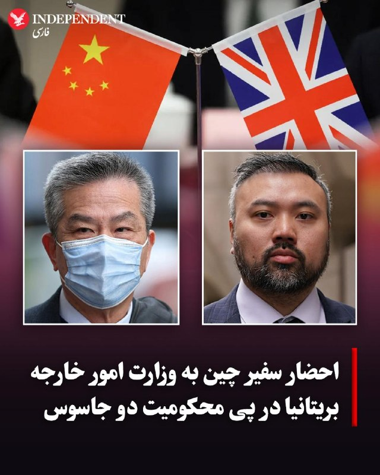
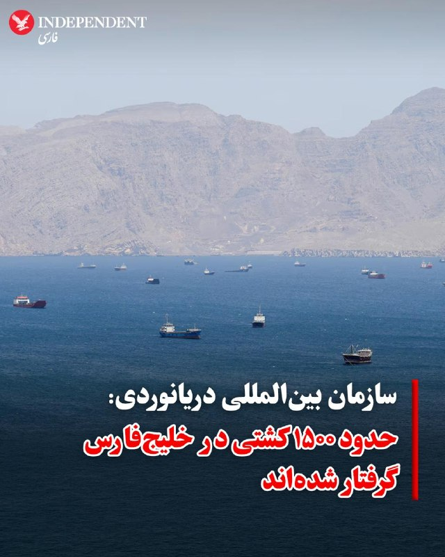

# خواننده تلگرام

<!-- MSG START -->

---
📅 بروزرسانی: 1405/02/17 22:22
---

## VahidOOnLine — post 238713

  

♦️دن جارویس، وزیر امنیت بریتانیا، روز پنجشنبه ۱۷ اردیبهشت در بیانیه‌ای اعلام کرد که در پی محکومیت دو مرد به اتهام جاسوسی برای هنگ‌کنگ و در نهایت برای دولت چین، سفیر این کشور به وزارت امور خارجه احضار خواهد شد.

جارویس در این باره گفت: «فعالیت‌های انجام شده توسط این افراد به نیابت از چین، نقض حاکمیت ملی ماست و هرگز تحمل نخواهد شد.»

او افزود: «ما به پاسخگو کردن چین ادامه می‌دهیم و به‌طور مستقیم با اقداماتی که امنیت مردم کشورمان را به خطر می‌اندازد، مقابله خواهیم کرد. به همین دلیل، وزارت امور خارجه سفیر چین را احضار می‌کند تا به روشنی اعلام کند که چنین فعالیت‌هایی در خاک بریتانیا غیرقابل قبول بوده است و همیشه نیز خواهد بود.»

محکومیت این دو مرد هنگ‌کنگی که به نیابت از دولت چین، مخالفان هنگ‌کنگی در بریتانیا را تهدید کرده و اطلاعاتی درباره آن‌ها به پکن می‌دادند، اولین مورد از محکومیت جاسوسان چین در تاریخ بریتانیا است.
‌🇸🇦 Indypersian

🤖 @VahidOOnLine

## VahidOOnLine — post 238712

  

♦️دبیرکل سازمان بین‌المللی دریانوردی (IMO) روز پنجشنبه، ۱۷ اردیبهشت در پاناما اعلام کرد که در پی مسدود شدن تنگه هرمز توسط جمهوری اسلامی، حدود ۱۵۰۰ کشتی و خدمه آن‌ها در خلیج‌فارس گرفتار شده‌اند.

آرسنیو دومینگز در جریان کنفرانس دریانوردی قاره آمریکا گفت: «در حال حاضر تقریبا ۲۰ هزار دریانورد و حدود ۱۵۰۰ کشتی در منطقه گرفتار هستند.»

دومینگز در جمع مدیران صنعت دریانوردی و نمایندگان این سازمان تاکید کرد که خدمه این کشتی‌ها «افراد بی‌گناهی هستند که هر روز برای منافع کشورهای دیگر تلاش می‌کنند، اما اکنون در دام موقعیت‌های ژئوپلیتیکی افتاده‌اند که خارج از کنترل آن‌هاست.»
‌🇸🇦 Indypersian

🤖 @VahidOOnLine

## pm_afshaa — post 90302

🔴شبکه 14 اسرائیل: بعد از اینکه ایران پیشنهاد آمریکا رو رد کنه، ترامپ دوباره پروژه «آزادی» رو راه میندازه

💧 Rainbet.com the #1 Non-KYC Crypto Casino & Sportsbook @rainbetcom

😁 @Pm_Afshaa

## DEJradio — post 4478

  <a href="telegram/content/DEJradio_4478_1778179936.jpg">🎬 Download video</a>

⭕️
🚨 منابع محلی و گزارش‌های داخلی از وقوع چندین انفجار در منطقه بندرعباس حکایت دارند.

#انفجار #بندرعباس
@DEJradio

## VahidOnline — post 75302

هرمزگان
پیام‌های دریافتی با جزئیات تایید نشده از ساعت ۹:۲۵:
درود
ما غرب جزیره قشمیم. از ساعت ۹:۲۵ به فاصله چند دقیقه ۴ بار صدای انفجار اومد و موجش شیشه ها رو لرزوند.
ساعت ۹:۴۸ یه صدای انفجار و ۱۰:۰۲ صدای دو انفجار دیگه. صدای جنگنده نیومده ولی

صدای چندین انفجار پیاپی قشم همین الان

بندرعباس همین الان صدای انفجار اومد مثل صدای برخورد بمب بود

بندرعباس صدای انفجار اومد حدود ساعت ۹ و نیم شب

سلام، ساعت 21:30 بندر خمیر استان هرمزگان انفجارهای پیاپی و شدید

سلام وحید جان قشم صدای پنج انفجار

سلام وحید جان بندر کنگ ساعت 21:50 صدای چندین لانچ موشک شنیده شد

ساعت 22:01 شهر قشم در محدوده [محله‌های] دوحه و چابهار صدای دو انفجار پشت هم شنیده شد
ظاهرا انفجار ها از سمت اسکله بهمن شهر قشم بوده
خودم حاضر بودم و شنیدم
صدا بسیار بلند بود و موج انفجار هم حس شد
امروز ۱۷ اردیبهشت ۱۴۰۵

سلام داداش
قشم دقیقا الان ساعت ۱۰
دوتا موشک زدن اسکله دوحه
خیلی وحشتناک بود کل آسمون قرمز شد

همین الان بندرعباس صدای دوتا انفجار پشت سر هم از سمت دریا اومد نمیدونم لانچ بود یا برخورد ولی هم صدا داشت هم پنجره ها لرزید

درود بر آقا وحید گل
بندرعباس ، الان ساعت ده و دو دقیقه شب صدای دو انفجار پشت سر هم آمد
ساعات پایانی روز پنجشنبه

سلام آقا وحید. قشم همین چند دقیقه پیش ساعت ۱۰ شب دوتا صدای انفجار اومد همراه یا نور روی دریا. چیزی رو توی دریا زدن

همین الان ۲۲:۰۴ دقیقه
صدای سه تا انفجار سمت دریا میاد
سمت سیریک استان هزمزگان
یه موشک هم بلند شد
با فاصله نورش دیده میشد
به سمت دریا رفت

الان سمت میناب دوبار صدای انفجار اومد
با شهر فاصله داره

📡 @VahidOnline

## kianmeli1 — post 87219

🔴خبرهایی از هدف قرار گرفتن اسکله بهمن قشم است!
https://t.me/kianmeli1

## kianmeli1 — post 87218

  <a href="telegram/content/kianmeli1_87218_1778179936.mp4">🎬 Download video</a>

⚠️فوری-بر اساس این گزارش‌ها

در غرب جزیره قشم، چندین صدای انفجار در فاصله‌های کوتاه (حدود ساعت ۹:۲۵ تا ۱۰:۰۲ شب) شنیده شده که برخی ساکنان از لرزش شیشه‌ها و احساس موج انفجار خبر داده‌اند.
در بندرعباس، چند مورد صدای انفجار در حوالی ساعت ۲۱:۳۰ تا ۲۲:۰۴ گزارش شده است.
در بندر خمیر نیز انفجارهای پیاپی و نسبتاً شدید در حدود ساعت ۲۱:۳۰ گزارش شده است.
در بندر کنگ، برخی افراد از شنیدن صداهای متعدد و احتمال پرتاب یا لانچ شئ ناشناس در حوالی ساعت ۲۱:۵۰ خبر داده‌اند.
در محدوده‌های ساحلی قشم (از جمله حوالی اسکله‌ها)، گزارش‌هایی از شنیده شدن چند صدای انفجار و مشاهده نور در آسمان منتشر شده است.
در مناطق سیریک و میناب نیز صداهای انفجار و مشاهده نور یا حرکت جسم نورانی در آسمان گزارش شده است
https://t.me/kianmeli1

## kianmeli1 — post 87217

🔴دقایقی پیش صدای چندین انفجار در بندرعباس شنیده شد

دلیل اصلی مشخص نیست
https://t.me/kianmeli1

## IranIntlTV — post 336015

  

عبدالعزیز بن محمد الواصل، نماینده عربستان سعودی در سازمان ملل در نشست شورای امنیت گفت تنگه هرمز همچنان شریان حیاتی تجارت جهانی است و هرگونه اختلال در امنیت آن موجب نگرانی جدی بین‌المللی می‌شود. او افزود تحولات اخیر در این تنگه تنش‌ها را افزایش داده و خطر پیامدهای انسانی، اقتصادی و امنیتی قابل توجهی را به همراه داشته است.

نماینده عربستان سعودی گفت اختلال در عبور و مرور دریایی بازارهای جهانی انرژی را تحت تاثیر قرار داده و روند تحویل کالاهای اساسی از جمله مواد غذایی، تجهیزات پزشکی و کمک‌های بشردوستانه را با مشکل مواجه کرده است. به گفته او، این وضعیت پیامدهای سنگینی برای کشورهای آسیب‌پذیر و وابسته به واردات دارد.

او تاکید کرد این تحولات ضرورت فوری جلوگیری از تشدید تنش‌ها و حفاظت از ثبات و امنیت این آبراه راهبردی را نشان می‌دهد. به گفته نماینده عربستان، پیش‌نویس قطعنامه خواستار اقدام فوری و هماهنگ بین‌المللی برای تضمین جریان آزاد و ایمن تجارت دریایی، انتقال کمک‌های بشردوستانه و بازگرداندن ثبات به بازارهای جهانی است.
https://iranintl.com/202605079251

## Iliaen — post 4426

ساعت ۲۲:۱۴ پنجشنبه؛ انفجار بسیار مهیب در سیریک هرمزگان گزارش می‌شود.

@iliaen

## Iliaen — post 4425

  <a href="telegram/content/Iliaen_4425_1778179937.mp4">🎬 Download video</a>

تهرانپارس؛ یک شی نورانی مانند پهپاد در فاصله‌ی چند صدمتری از سطح زمین پرواز می‌کند.

@iliaen

## FarsiVOA — post 217130

  <a href="telegram/content/FarsiVOA_217130_1778179939.mp4">🎬 Download video</a>

یکی از مخاطبان صدای آمریکا با ارسال ویدئویی از یک سوپرمارکت در ایران، از گرانی، کمبود کالا و فشار اقتصادی گلایه می‌کند و می‌گوید: مردم به خاطر جنگ و جدال سپاه پاسداران بیکارند. خودشان هر چی پول هست را زدند به جیب‌شان و ما اینجا برای یک تیکه نان خشک می‌میریم.

🔴ویدئوی ارسالی یکی از مخاطبان صدای آمریکا (صدا تغییر داده شده است)

## FarsiVOA — post 217129

انتخابات محلی و شورای شهر در بریتانیا، آزمون سیاسی سخت برای دولت حزب کارگر

## Persian_Trend_Official — post 13613

چندین انفجار با فاصله کم در بندر سیریک استان هرمزگان گزارش شده است.

☆Phantom☆

📌 @persian_trend_official
پرشین ترند | متفاوت‌ترین کانال نظامی

## IranianMinds — post 19705

🔴شبکه ۱۴ اسرائیل:

بعد از اینکه ایران پیشنهاد آمریکا را رد کند، ترامپ مجددأ پروژه آزادی تنگه هرمز را راه می‌اندازد .

@IranianMinds

## Dirty_Kids — post 389051

دوست دخترم چهار روز خونمون بود فهمیدم چرا همه ازدواج میکنن، یبار هم دو هفته با هم زندگی کردیم فهمیدم چرا همه طلاق میگیرن❤️

@Dirty_Kids 👻

## Dirty_Kids — post 389050

  

آیا انقدری پیر هستی که به اینا بگی شلوار دمپا گشاد؟

@Dirty_Kids 👻

<!-- MSG END -->
<!-- NAV START -->
*پایان پیام‌ها*
<!-- NAV END -->
